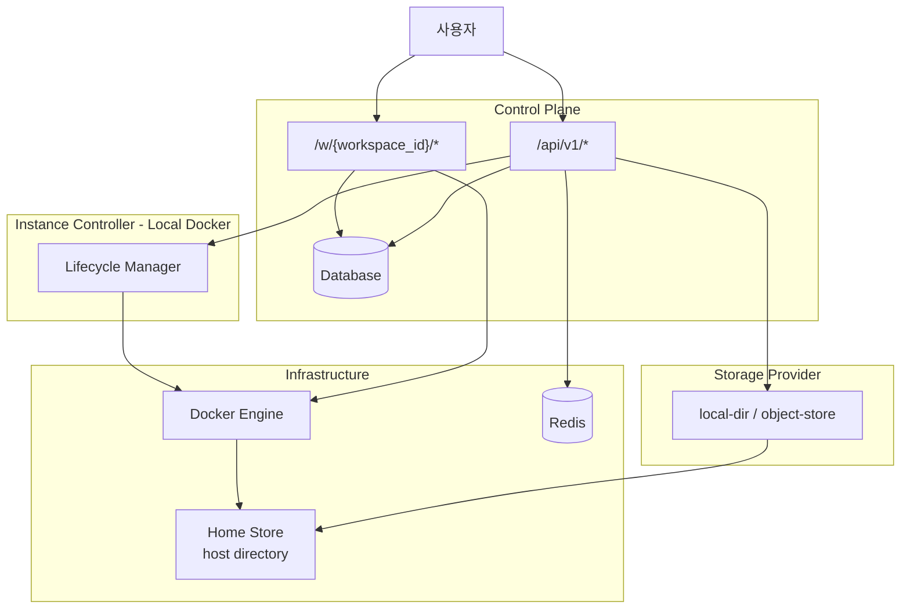

# Architecture

> 용어 정의는 [glossary.md](../glossary.md), 상세 스펙은 [spec/](../spec/)  참조

---

## 문서 구조

| 파일 | 내용 |
|------|------|
| [flows.md](./flows.md) | 요청 흐름 (시퀀스 다이어그램) |
| [states.md](./states.md) | Workspace 상태 머신 |
| [components.md](./components.md) | 컴포넌트 구조 |
| [data-flow.md](./data-flow.md) | 데이터 흐름 |
| [recovery.md](./recovery.md) | Startup Recovery + Reconciler |
| [events.md](./events.md) | Real-time Events |

---

## 시스템 개요

