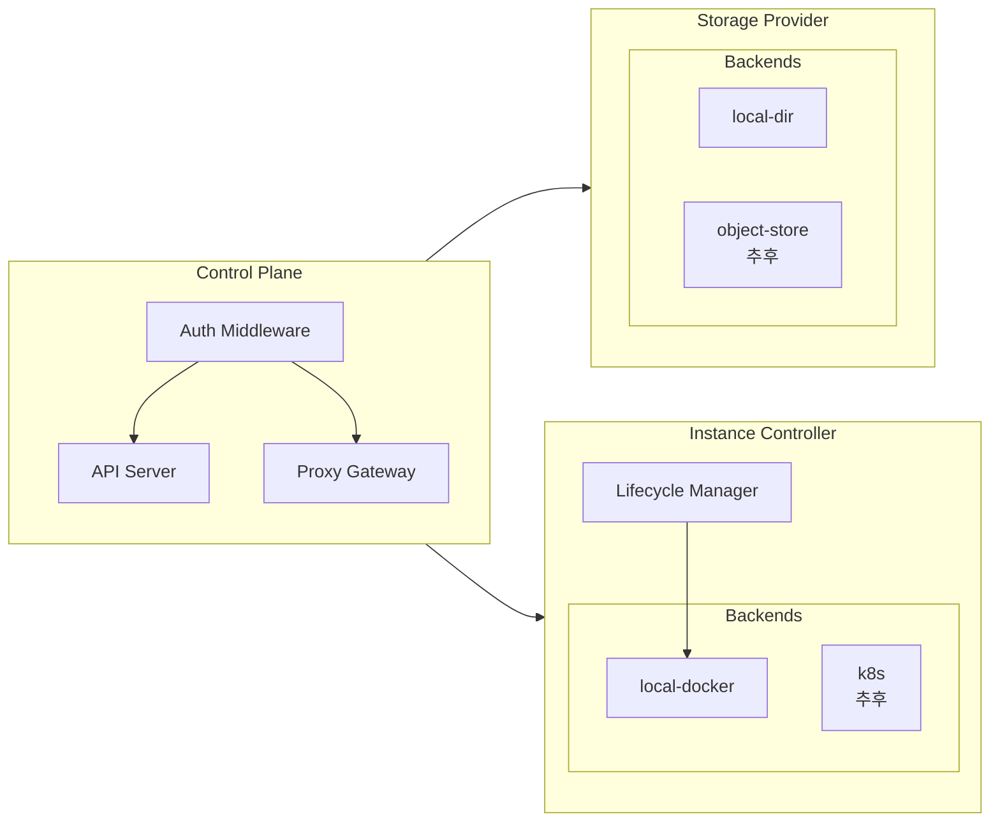

# 컴포넌트 구조

> [README.md](./README.md)로 돌아가기

---

## 전체 구조

```mermaid
graph LR
    subgraph ControlPlane[Control Plane]
        direction TB
        Auth[Auth Middleware]
        API[API Server]
        ProxyGW[Proxy Gateway]

        Auth --> API
        Auth --> ProxyGW
    end

    subgraph StorageProvider[Storage Provider]
        direction TB
        subgraph StorageBackends[Backends]
            LocalDir[local-dir]
            ObjectStore[object-store<br/>추후]
        end
    end

    subgraph InstanceController[Instance Controller]
        direction TB
        LM[Lifecycle Manager]

        subgraph InstanceBackends[Backends]
            LocalDocker[local-docker]
            K8s[k8s<br/>추후]
        end

        LM --> LocalDocker
    end

    ControlPlane --> StorageProvider
    ControlPlane --> InstanceController
```

> Instance Controller는 컨테이너 lifecycle 담당 (시작 시 home_mount를 /home/coder에 마운트), Storage Provider는 스토리지 프로비저닝 담당
