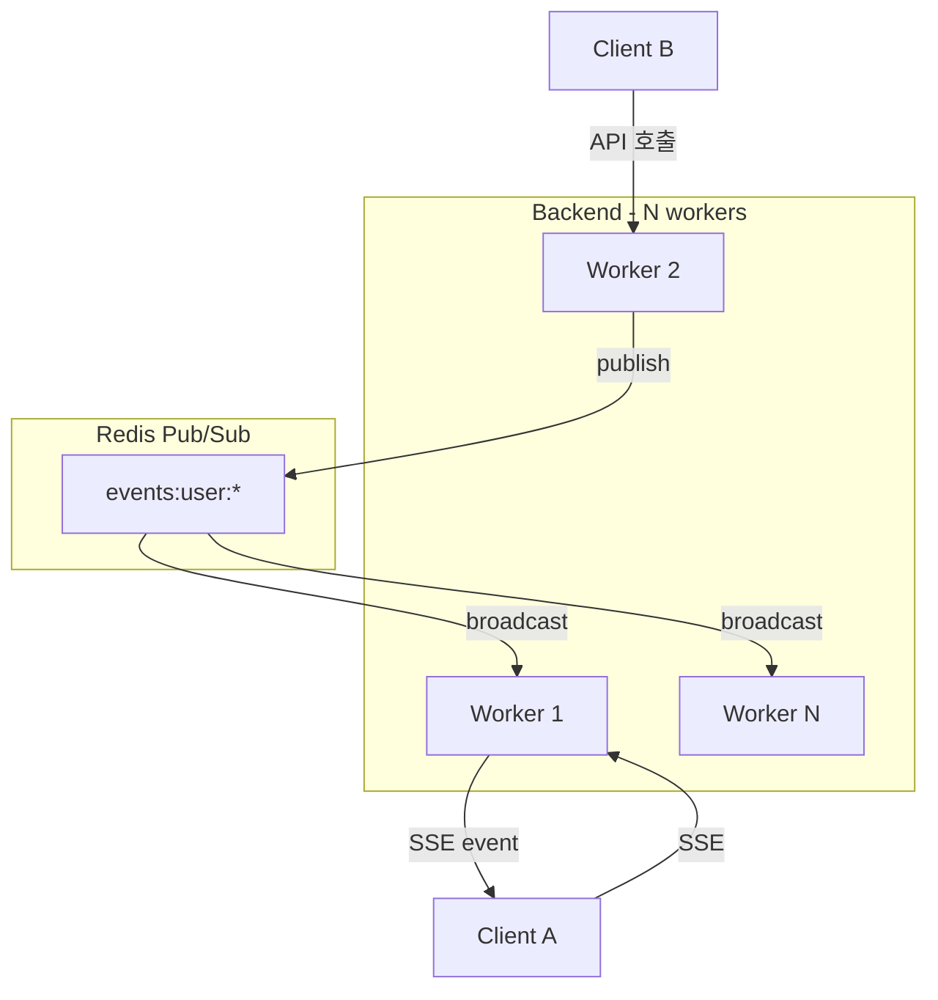

# Real-time Events

> [README.md](./README.md)로 돌아가기

워크스페이스 상태 변경을 SSE(Server-Sent Events)로 클라이언트에게 실시간 전달합니다.

---

## 멀티 워커 환경에서의 이벤트 전파

---

## 동작 흐름

1. Client A가 Worker 1에 SSE 연결 → Redis `subscribe("events:user:{user_id}")`
2. Client B가 다른 Worker에서 워크스페이스 시작 요청
3. 해당 Worker가 Redis에 이벤트 발행 → `publish("events:user:{user_id}", event)`
4. Redis가 모든 subscriber에게 브로드캐스트
5. Worker 1이 메시지 수신 → Client A에게 SSE 전송

> 각 Worker는 독립적인 프로세스이므로 in-memory 큐로는 이벤트 공유 불가. Redis Pub/Sub으로 해결.

---

## 관련 문서

- [ADR-005: Redis Pub/Sub for Multi-Worker SSE](../adr/005-redis-pubsub.md)
- [spec/events.md](../spec/events.md) - 이벤트 타입 및 페이로드 상세
