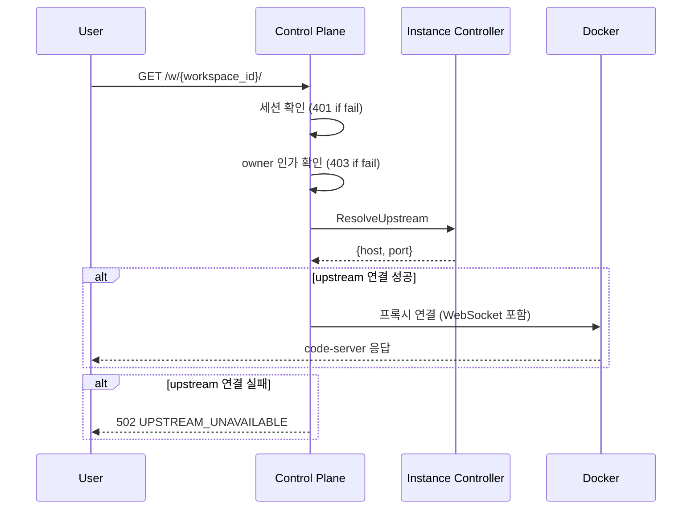
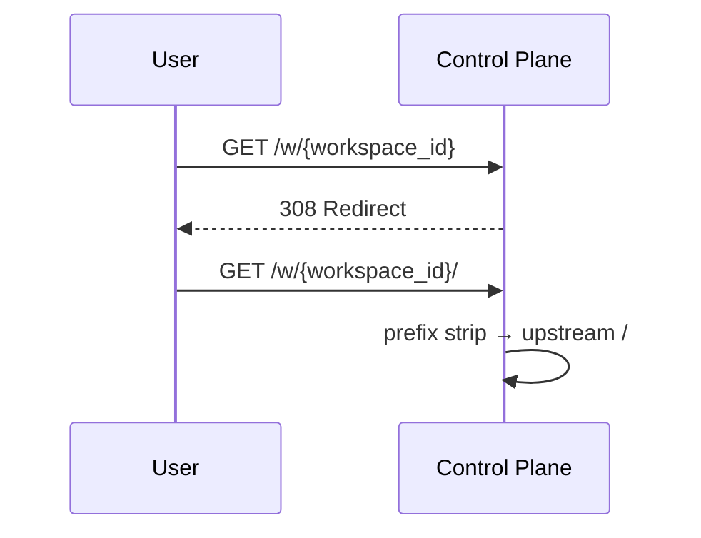
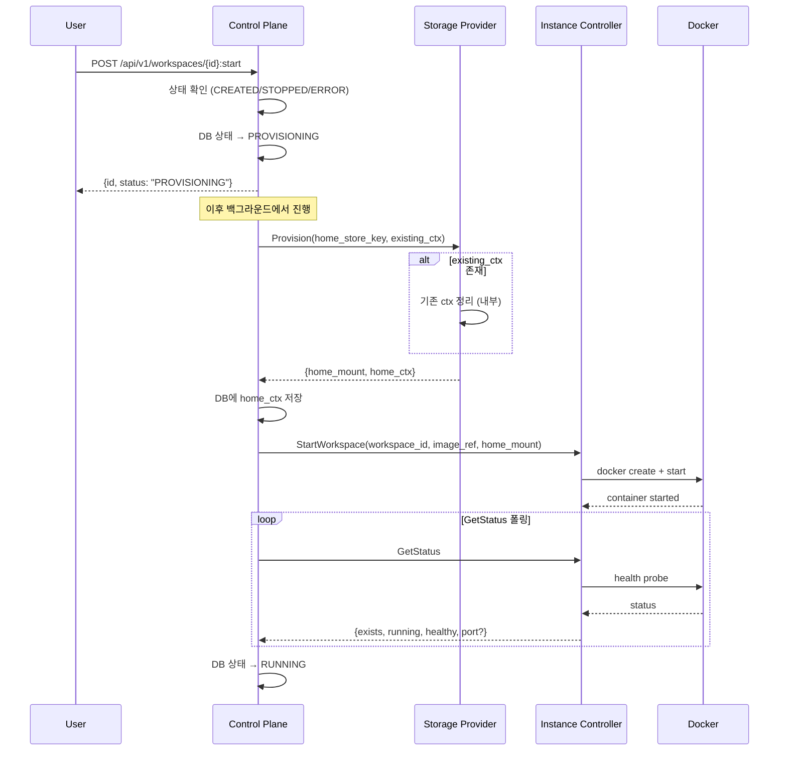
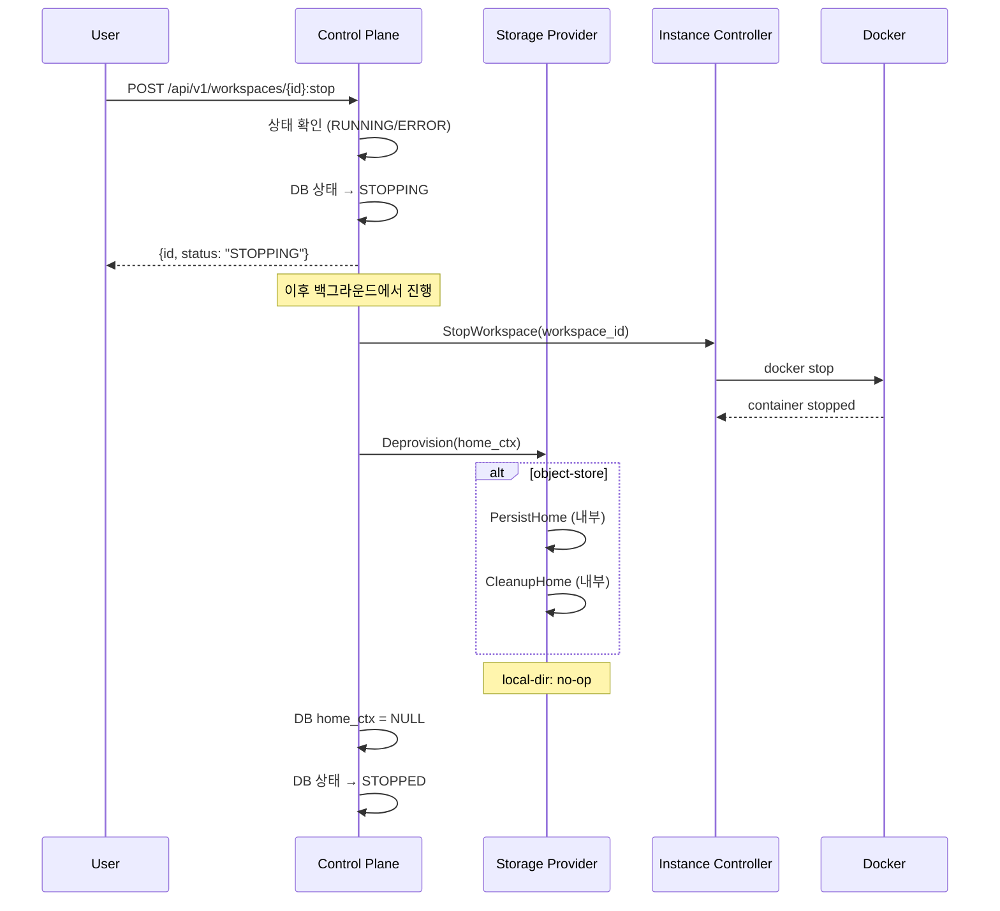
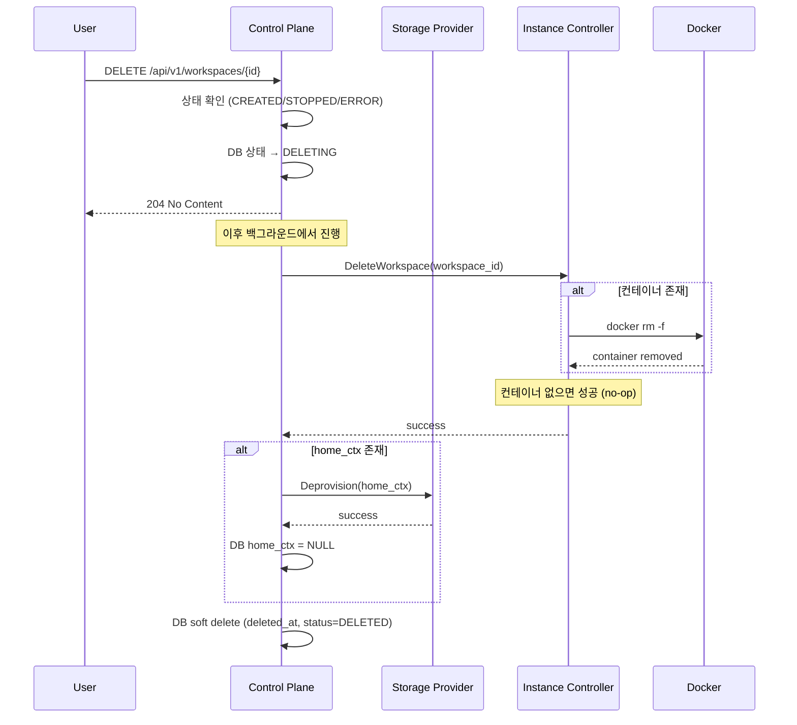

# 요청 흐름

> [README.md](./README.md)로 돌아가기

---

## Workspace 접속 (`/w/{workspace_id}/`)

> 프록시에서 상태 확인 안 함. 사용자는 대시보드(API)에서 start 후 접속.

---

## Trailing Slash 규칙

---

## StartWorkspace (`POST /api/v1/workspaces/{id}:start`)

> API는 PROVISIONING 상태를 즉시 반환. 클라이언트는 폴링으로 최종 상태 확인.
> Control Plane이 Storage Provider.Provision 호출 → home_mount 획득 → Instance Controller에 전달
> existing_ctx가 있으면 Provision 내부에서 자동 정리 (리소스 누수 방지)

---

## StopWorkspace (`POST /api/v1/workspaces/{id}:stop`)

> API는 STOPPING 상태를 즉시 반환. 클라이언트는 폴링으로 최종 상태 확인.
> 백엔드 분기 없이 항상 Deprovision 호출. 백엔드 내부에서 적절히 처리.

---

## DeleteWorkspace (`DELETE /api/v1/workspaces/{id}`)

> API는 DELETING 상태 전환 후 즉시 204 반환. 클라이언트는 폴링으로 최종 상태 확인.
> 컨테이너 삭제 후 스토리지 해제 (생성의 역순)
> MVP에서는 Home Store 데이터 삭제 안 함 (Purge 호출 X)
