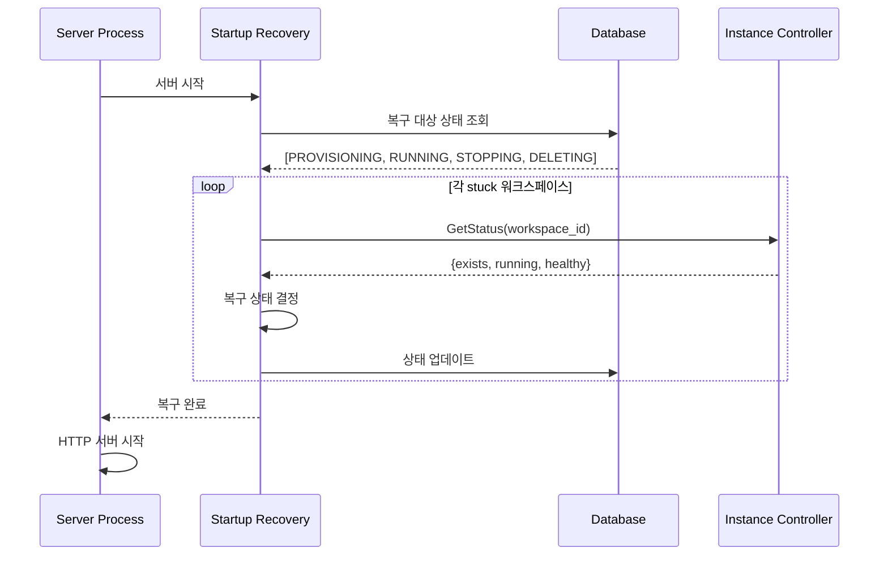
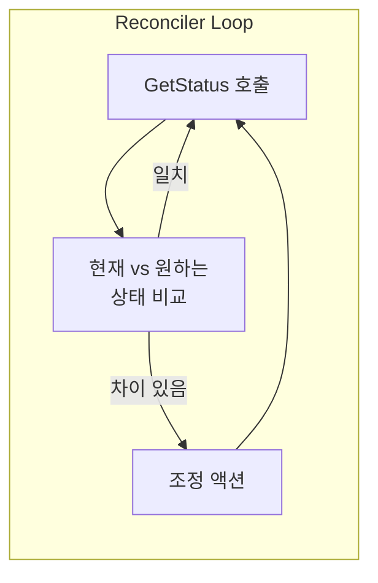

# Startup Recovery + Reconciler

> [README.md](./README.md)로 돌아가기

---

## Startup Recovery (MVP)

서버 크래시로 인한 stuck 상태를 서버 시작 시 자동 복구합니다.

### 동작 흐름



### 복구 매트릭스

| DB 상태 | Instance 상태 | 복구 결과 |
|---------|--------------|----------|
| PROVISIONING | running + healthy | RUNNING |
| PROVISIONING | 그 외 | ERROR |
| RUNNING | running + healthy | (변경 없음) |
| RUNNING | 그 외 | ERROR |
| STOPPING | not running | STOPPED |
| STOPPING | running | RUNNING |
| DELETING | not exists | DELETED |
| DELETING | exists | ERROR |

> ⚠️ Startup Recovery는 상태 전이가 아닌 "DB 보정"입니다. 서버 크래시로 인해 DB 상태와 실제 컨테이너 상태가 불일치할 때, DB를 현실에 맞춰 수정합니다. 따라서 상태 다이어그램에는 표현되지 않습니다.

> MVP에서는 Startup Recovery로 크래시 복구. 프로덕션 규모에서 주기적 복구가 필요하면 Reconciler 도입.

---

## (추후) Reconciler 패턴 도입

현재는 명령적(Imperative) 방식으로 동작하지만, GetStatus 메서드를 통해 Reconciler 패턴으로 확장 가능하도록 설계되어 있습니다.

### 현재 방식 (명령적)

```
API 호출 → Storage Provider.Provision → Instance Controller.Start → 완료
```

- Control Plane이 순차적으로 호출
- 중간 실패 시 부분 완료 상태 발생 가능
- 롤백 로직이 복잡해질 수 있음

### Reconciler 방식 (선언적)



**Reconciler 도입 시:**
1. 백그라운드 워커가 주기적으로 모든 워크스페이스 순회
2. `GetStatus`로 현재 상태 조회 (Storage Provider, Instance Controller)
3. DB의 desired_status와 비교
4. 차이 있으면 기존 메서드(Provision/Start 등)로 조정
5. 상태 불일치 자동 복구

### 설계 원칙

| 원칙 | 설명 |
|------|------|
| **멱등성** | 모든 조정 메서드는 여러 번 호출해도 안전 |
| **상태 조회 분리** | GetStatus는 부수효과 없이 현재 상태만 반환 |
| **점진적 확장** | MVP는 명령적, 추후 Reconciler로 감싸기 가능 |

> MVP에서는 명령적 방식으로 충분하며, 프로덕션 규모에서 상태 불일치 문제가 발생하면 Reconciler 도입 검토

### 관련 ADR

- [ADR-006: 선언적 Reconciler 패턴 채택](../adr/006-reconciler-pattern.md)
- [ADR-007: Reconciler 구현 전략](../adr/007-reconciler-implementation.md)
