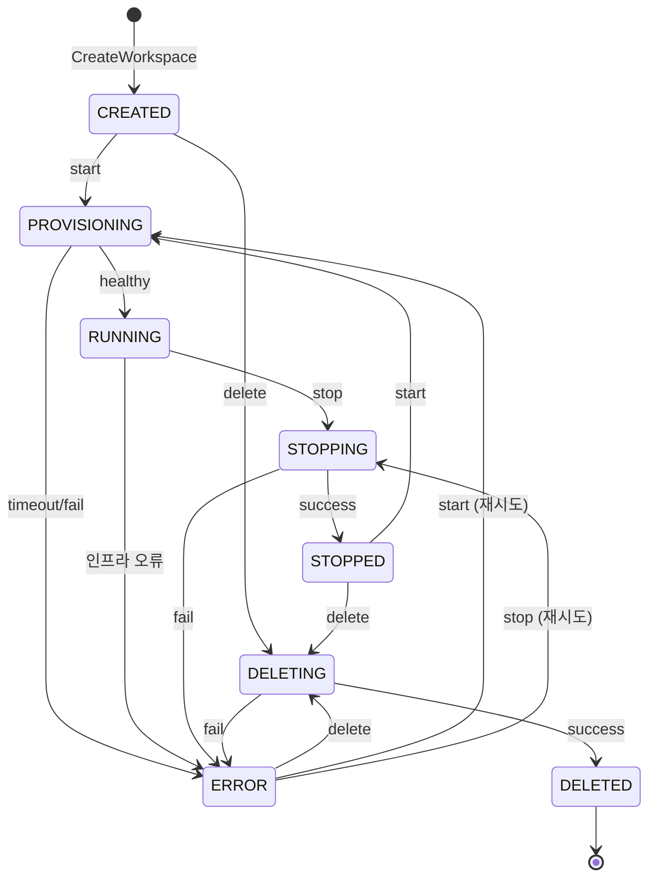

# Workspace 상태

> [README.md](./README.md)로 돌아가기

---

## 상태 다이어그램

> 프록시는 상태 확인 없이 바로 연결 시도. 컨테이너 미실행 시 502 에러. 사용자는 대시보드에서 Start API 호출 후 접속.

---

## 상태 × 액션 매트릭스

| 현재 상태 | Start | Stop | Delete | 프록시 접속 |
|-----------|-------|------|--------|------------|
| CREATED | → PROVISIONING | 409 | → DELETING | 502 |
| PROVISIONING | 409 | 409 | 409 | 502 |
| RUNNING | 409 | → STOPPING | 409 | ✓ 연결 |
| STOPPING | 409 | 409 | 409 | 502 |
| STOPPED | → PROVISIONING | 409 | → DELETING | 502 |
| DELETING | 409 | 409 | 409 | 502 |
| ERROR | → PROVISIONING | → STOPPING | → DELETING | 502 |
| DELETED | 404 | 404 | 404 | 404 |

> 409 = INVALID_STATE, 404 = WORKSPACE_NOT_FOUND, 502 = UPSTREAM_UNAVAILABLE
