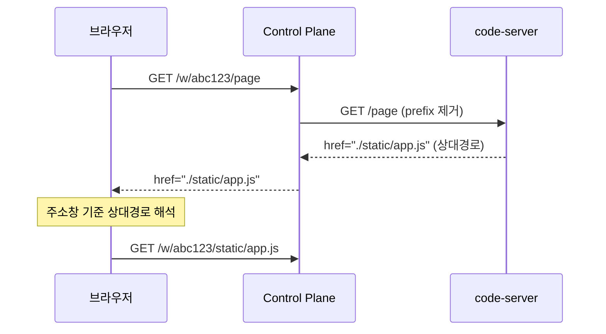

# Workspace 프록시

> [README.md](./README.md)로 돌아가기

---

## 개요

Control Plane은 `/w/{workspace_id}/*` 경로로 들어오는 요청을 해당 workspace의 code-server 컨테이너로 프록시합니다.

---

## URL 패턴

| 용도 | 패턴 | 예시 |
|------|------|------|
| Workspace 접속 | `/w/{workspace_id}/*` | `/w/01JFXYZ.../` |
| Trailing Slash 정규화 | `/w/{workspace_id}` → 308 Redirect | `/w/01JFXYZ...` → `/w/01JFXYZ.../` |

---

## 동작 원리

### 요청 흐름

### 상대경로 메커니즘

1. **프록시**: `/w/{workspace_id}/` prefix를 제거하고 code-server에 전달
2. **code-server**: 상대경로(`./`, `./../`)로 리소스 응답
3. **브라우저**: 주소창 URL 기준으로 상대경로 해석 → prefix 자동 복원

---

## 알려진 한계

code-server는 대부분 상대경로를 사용하지만, 일부 절대경로가 존재합니다.

### 미지원 기능

| 기능 | 원인 | 비고 |
|------|------|------|
| PWA 설치 | `/manifest.json` 절대경로 | error.html에서 하드코딩 |
| 오프라인 모드 | `Service-Worker-Allowed: "/"` 고정 | 스코프 불일치로 등록 실패 |
| 절대경로 프록시 | `/absproxy/:port` 패턴 | 해당 기능 자체 미지원 |

### 정상 동작 기능

| 기능 | 상태 |
|------|------|
| IDE 에디터 | 정상 |
| 터미널 | 정상 |
| 파일 탐색기 | 정상 |
| 확장 프로그램 | 정상 |
| 로그인/세션 | 정상 |
| WebSocket | 정상 |

### 수용 근거

- 핵심 IDE 기능에 영향 없음
- PWA/오프라인은 CDE 핵심 가치가 아님
- 복잡도 대비 이점이 낮음

> 이 한계는 영구적으로 수용함. 개선 계획 없음.
