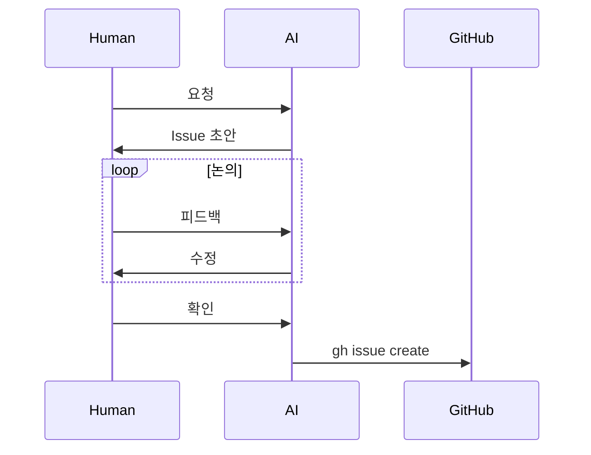
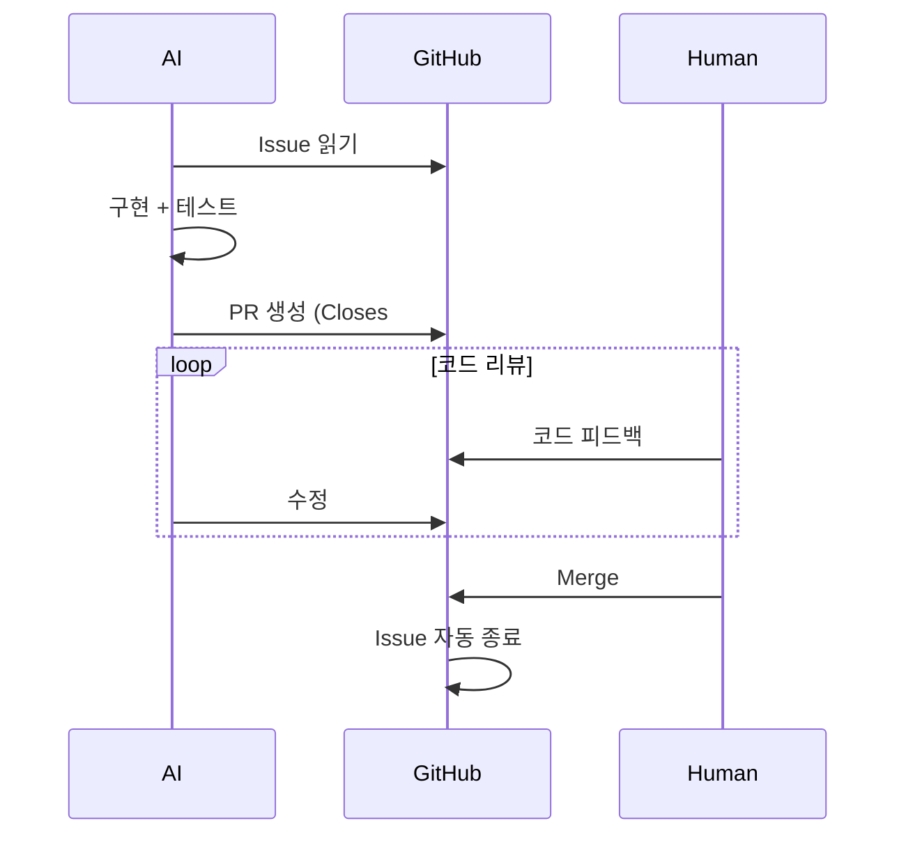

# Contributing

> Issue는 생각이고, PR은 제안이며, Merge는 결정이다.

## 원칙

| 구분 | 역할 |
|------|------|
| Issue | Why - 왜 해야 하는가 |
| PR | How - 어떻게 했는가 |
| Merge | Decision - 채택 |

- 논의는 Issue에서 끝낸다
- PR은 조용하고 작게
- 1 PR = 1 변경

---

## Phase 1: Issue (Why)

**Phase 1 완료 조건**: 논의 끝, 구현 방향 확정

---

## Phase 2: PR (How)

**PR 규칙**: 코드 피드백만, "왜?"는 묻지 않음
