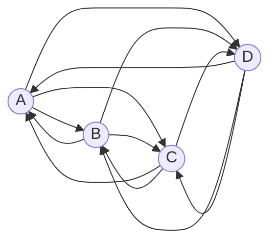
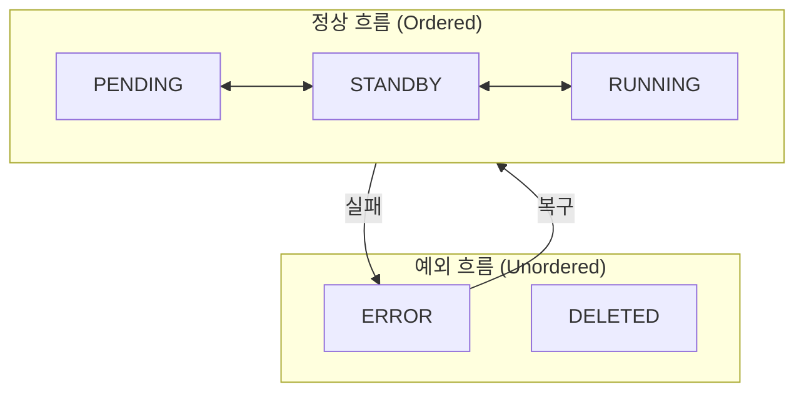
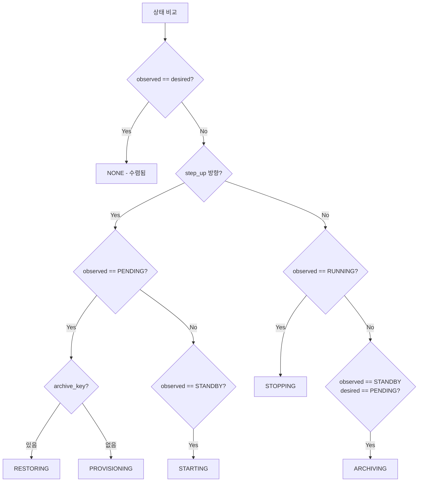
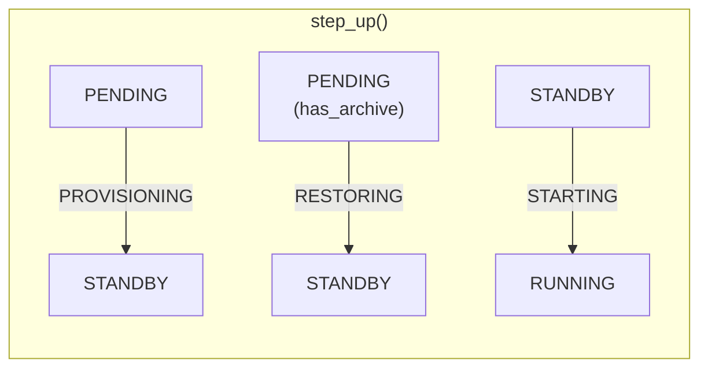
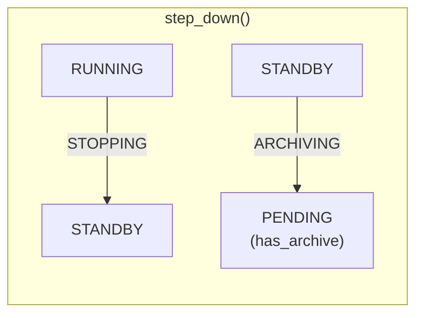
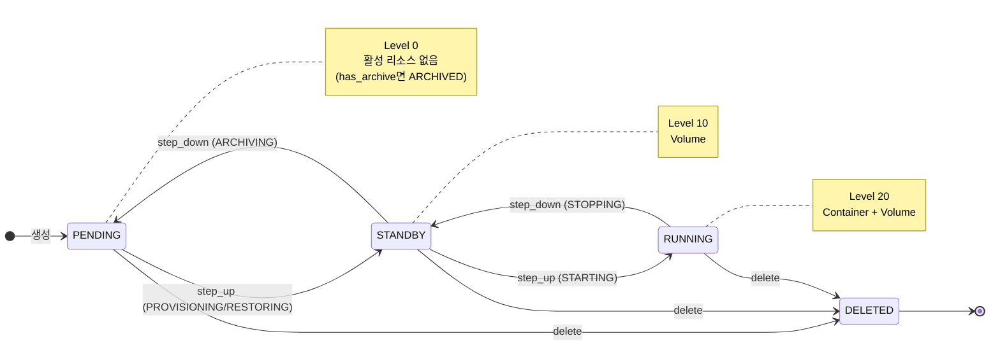
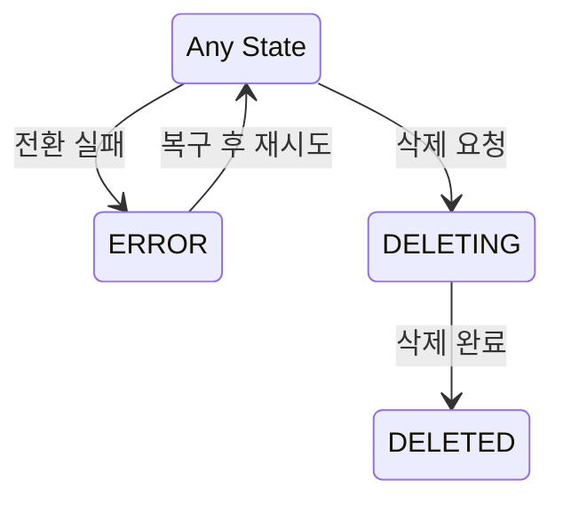

# ADR-008: Ordered State Machine 패턴 채택

## 상태
Accepted

## 컨텍스트

### 배경
- M2에서 STANDBY/ARCHIVED 상태 추가로 상태 모델 확장 필요
- Reconciler 패턴 (ADR-006) 도입으로 상태 전환 로직 설계 필요
- 다양한 상태 간 전환 경로 관리 복잡도 증가

### 기존 모델 문제점 (직접 전환 방식)

모든 상태 쌍에 대해 전환 로직을 개별 구현하는 방식:

```
상태 A ───────────→ 상태 B
      직접 전환
```

| 문제 | 설명 |
|------|------|
| **조합 폭발** | N개 상태 → N×(N-1) 전환 조합 |
| **코드 중복** | 유사한 동작이 여러 전환에 반복 |
| **중간 실패** | 복합 전환 중 실패 시 상태 불일치 |
| **확장 어려움** | 상태 1개 추가 시 2×(N-1) 조합 추가 |

예시 (4개 상태, 12개 전환 조합):



### 요구사항
- 상태 전환 로직 단순화
- 중간 실패 시 안전한 복구
- 새로운 상태 추가 용이
- Reconciler와 자연스러운 통합

## 결정

### Ordered State Machine + Active/Archive 분리

상태를 **Active (활성 리소스)**와 **Archive (아카이브 존재)**로 분리합니다.

```
Active (Ordered):
  PENDING(0) < STANDBY(10) < RUNNING(20)

Archive (Flag):
  has_archive: bool (archive_key != NULL)

Display (파생):
  ARCHIVED = PENDING + has_archive
```

### 왜 분리인가?

기존 모델의 모순:

```
기존: COLD는 status (레벨 10)
  → PENDING(Lv0) → COLD(Lv10)로 step_up 필요
  → INITIALIZING 작업이 Archive를 생성해야 함
  → 하지만 새 워크스페이스는 Archive가 없음
  → 모순! (COLD에 도달 불가)

신규: ARCHIVED는 파생 상태 (PENDING + has_archive)
  → Archive는 ARCHIVING 작업으로만 생성
  → PENDING → STANDBY는 PROVISIONING (Archive 불필요)
  → 모순 해결!
```

### 핵심 원칙

1. **순서 기반 전환**: Active 상태는 정수 레벨을 가짐
2. **인접 전환만 허용**: 한 번에 한 칸씩만 이동
3. **Archive는 별도 축**: status와 독립적으로 존재
4. **순차 실행**: 목표까지 step-by-step 이동

### 상태 정의

#### Active 상태 (Ordered)

| 상태 | 레벨 | Container | Volume | 설명 |
|------|------|-----------|--------|------|
| PENDING | 0 | - | - | 활성 리소스 없음 |
| STANDBY | 10 | - | ✅ | Volume만 존재 |
| RUNNING | 20 | ✅ | ✅ | 컨테이너 실행 중 |

```
레벨:    0           10         20
       PENDING → STANDBY → RUNNING
               ←         ←
```

#### Archive 속성 (별도 축)

| 속성 | 판단 기준 | 설명 |
|------|----------|------|
| `has_archive` | `archive_key != NULL` | Object Storage에 아카이브 존재 |

#### 파생 상태 (Display)

| 조건 | Display | 설명 |
|------|---------|------|
| status=PENDING, has_archive=True | **ARCHIVED** | 아카이브됨 |
| status=PENDING, has_archive=False | PENDING | 새 워크스페이스 |
| status=STANDBY | STANDBY | Volume 준비됨 |
| status=RUNNING | RUNNING | 실행 중 |

#### 전이 상태 (Operations)

| Operation | 전환 | 설명 |
|-----------|------|------|
| PROVISIONING | PENDING → STANDBY | 빈 Volume 생성 |
| RESTORING | PENDING(has_archive) → STANDBY | Archive → Volume |
| STARTING | STANDBY → RUNNING | 컨테이너 시작 |
| STOPPING | RUNNING → STANDBY | 컨테이너 정지 |
| ARCHIVING | STANDBY → PENDING + has_archive | Volume → Archive |
| DELETING | * → DELETED | 전체 삭제 |

#### 최종/예외 상태

| 상태 | 설명 |
|------|------|
| DELETED | 소프트 삭제됨 |
| ERROR | 오류 발생, 복구 필요 |

### 레벨 0과 UNKNOWN에 대한 결정

#### Protobuf/gRPC 컨벤션

많은 시스템에서 레벨 0을 UNKNOWN으로 사용:

```
UNKNOWN = 0      // 기본값 (미설정)
PENDING = 1
CREATING = 2
...
```

| 이유 | 설명 |
|------|------|
| **기본값 구분** | 필드 미설정 시 자동으로 0 → "의도적 설정"과 "미설정" 구분 |
| **역직렬화 안전** | 알 수 없는 enum 값이 들어오면 0으로 처리 |
| **버전 호환성** | 새 상태 추가해도 구버전 클라이언트가 UNKNOWN으로 처리 |

#### 우리의 선택: UNKNOWN 미사용

| 결정 | 이유 |
|------|------|
| **PENDING = 0** | Python + PostgreSQL 환경에서 Protobuf 규칙 불필요 |
| **DB NOT NULL** | 상태 컬럼은 항상 값이 있어야 함 |
| **명시적 초기 상태** | PENDING이 명확한 의미를 가짐 (활성 리소스 없음) |
| **레벨 간격 10** | 향후 중간 상태 추가 대비 (0, 10, 20) |

### ERROR 상태의 특수성

ERROR는 순서 체계(Ordered) 밖에서 별도 처리:



| 특성 | 설명 |
|------|------|
| **레벨 없음** | 순서 비교 대상이 아님 |
| **어디서든 진입** | 모든 상태에서 ERROR로 전환 가능 |
| **원래 상태로 복구** | ERROR 해제 시 이전 상태로 돌아감 |
| **Reconciler 스킵** | ERROR 상태에서는 자동 전환 중단 |

### 전환 알고리즘

#### choose_next_operation()



#### Step Up (활성화 방향)



| 전환 | Operation | 동작 |
|------|-----------|------|
| PENDING → STANDBY | PROVISIONING | 빈 Volume 생성 |
| PENDING(has_archive) → STANDBY | RESTORING | Archive → Volume 복원 |
| STANDBY → RUNNING | STARTING | 컨테이너 시작 |

#### Step Down (비활성화 방향)



| 전환 | Operation | 동작 |
|------|-----------|------|
| RUNNING → STANDBY | STOPPING | 컨테이너 정지 |
| STANDBY → PENDING | ARCHIVING | Volume → Archive |

### 상태 다이어그램



#### 예외 상태



## 결과

### 장점

| 장점 | 설명 |
|------|------|
| **복잡도 선형화** | N개 상태 → 2×(N-1) 전환 함수 (vs N×(N-1)) |
| **코드 재사용** | 각 동작이 정확히 한 곳에만 존재 |
| **중간 실패 안전** | 실패 시 현재 상태에서 멈춤, 다음 reconcile에서 재시도 |
| **확장 용이** | 새 상태 추가 시 2개 함수만 추가 |
| **디버깅 용이** | 단계별 상태 추적 가능 |
| **테스트 단순화** | operation별 단위 테스트 |
| **모순 해결** | Active/Archive 분리로 COLD 도달 불가 문제 해결 |

### 단점

| 단점 | 설명 | 대응 |
|------|------|------|
| **건너뛰기 불가** | ARCHIVED→RUNNING 직접 전환 불가 | 순차 실행으로 자연스럽게 처리 |
| **전환 시간 증가** | 여러 단계 거쳐야 함 | 각 단계가 빠르면 무시 가능 |
| **중간 상태 노출** | ARCHIVED→RUNNING 중 STANDBY 상태 노출 | operation으로 표현 |

### 업계 사례

| 시스템 | 상태 모델 | 패턴 |
|--------|----------|------|
| **Kubernetes** | Pending → Running → Succeeded/Failed | Ordered |
| **Gitpod** | Pending → Creating → Initializing → Running → Stopping → Stopped | Ordered |
| **AWS EC2** | pending → running → stopping → stopped → terminated | Ordered |
| **Docker** | created → running → paused → exited | Ordered |

## 대안 (고려했으나 선택 안 함)

| 대안 | 미선택 이유 |
|------|------------|
| **직접 전환** | 조합 폭발, 중간 실패 복구 복잡 |
| **이벤트 기반 FSM** | 이벤트 유실 시 상태 불일치 |
| **그래프 기반 FSM** | 복잡한 경로 탐색 필요 |
| **COLD를 별도 status로** | PENDING → COLD 전환 시 Archive 생성 모순 |

## 변경 이력

| 날짜 | 변경 내용 |
|------|----------|
| 초기 | Proposed |
| 2025-01 | Active + Archive 분리 모델로 수정, COLD→ARCHIVED(파생), WARM→STANDBY, INITIALIZING→PROVISIONING |

## 참고 자료
- [Kubernetes Pod Lifecycle](https://kubernetes.io/docs/concepts/workloads/pods/pod-lifecycle/)
- [Finite State Machine](https://en.wikipedia.org/wiki/Finite-state_machine)
- [Gitpod Workspace Phases](https://github.com/gitpod-io/gitpod/blob/main/components/ws-manager-api/go/crd/v1/workspace_types.go)
- [ADR-009: Status와 Operation 분리](./009-status-operation-separation.md)
