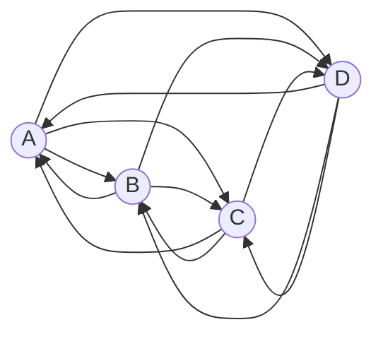
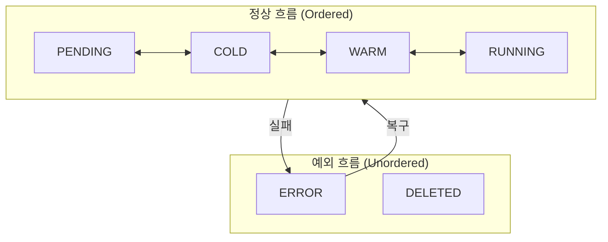
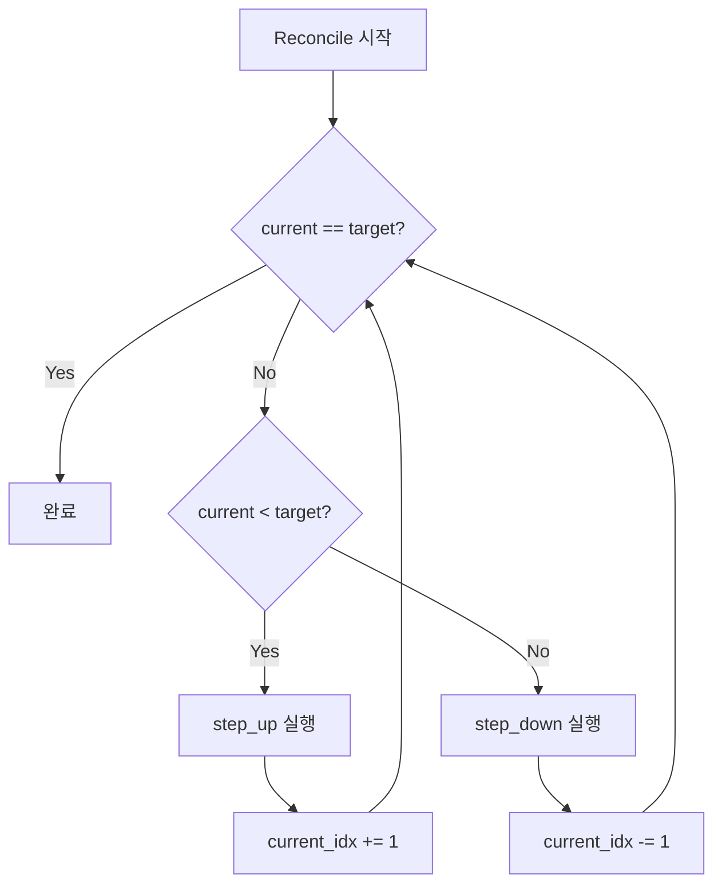
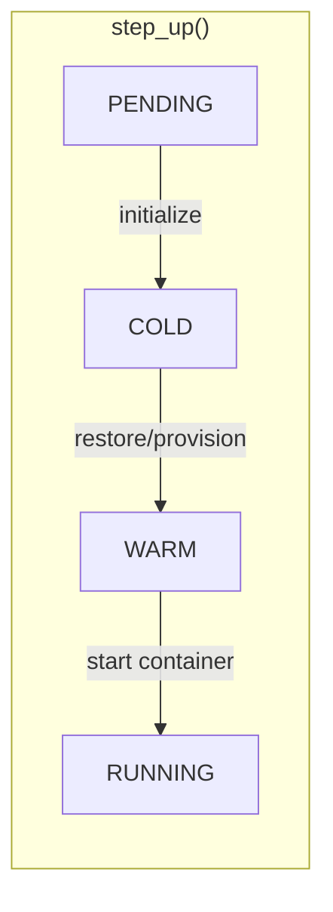
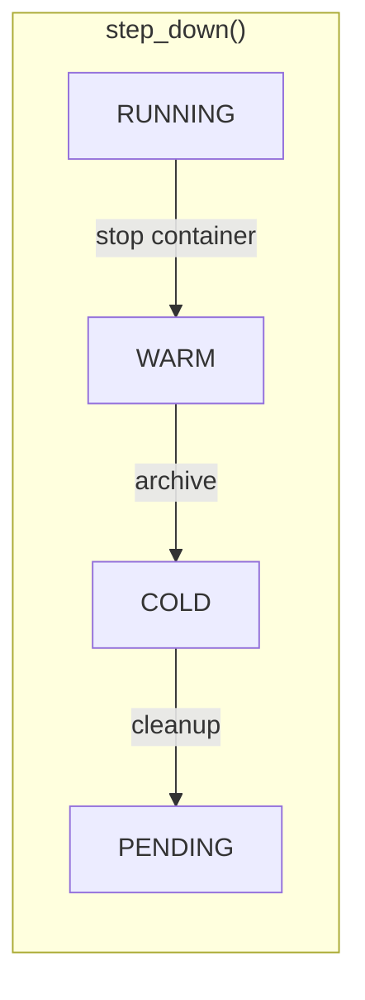
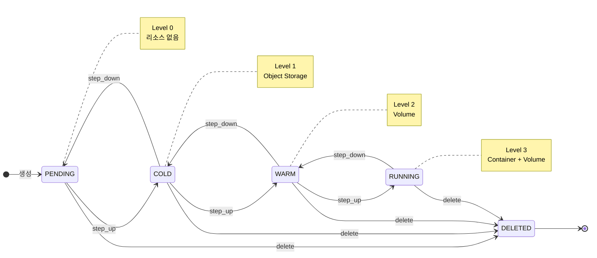
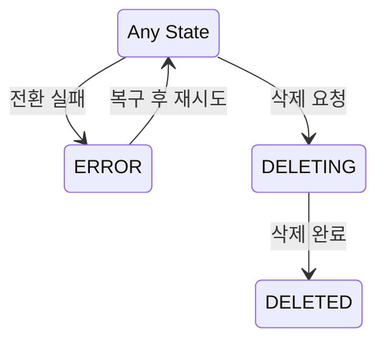

# ADR-008: Ordered State Machine 패턴 채택

## 상태
Proposed

## 컨텍스트

### 배경
- M2에서 WARM/COLD 상태 추가로 상태 모델 확장 필요
- Reconciler 패턴 (ADR-006) 도입으로 상태 전환 로직 설계 필요
- 다양한 상태 간 전환 경로 관리 복잡도 증가

### 기존 모델 문제점 (직접 전환 방식)

모든 상태 쌍에 대해 전환 로직을 개별 구현하는 방식:

```
상태 A ───────────→ 상태 B
      직접 전환
```

| 문제 | 설명 |
|------|------|
| **조합 폭발** | N개 상태 → N×(N-1) 전환 조합 |
| **코드 중복** | 유사한 동작이 여러 전환에 반복 |
| **중간 실패** | 복합 전환 중 실패 시 상태 불일치 |
| **확장 어려움** | 상태 1개 추가 시 2×(N-1) 조합 추가 |

예시 (4개 상태, 12개 전환 조합):



### 요구사항
- 상태 전환 로직 단순화
- 중간 실패 시 안전한 복구
- 새로운 상태 추가 용이
- Reconciler와 자연스러운 통합

## 결정

### Ordered State Machine 패턴 채택

상태에 순서(레벨)를 부여하고, 인접 상태로만 전환하는 방식:

```
레벨:    0         1         2         3
       PENDING → COLD → WARM → RUNNING
               ←      ←      ←
```

### 핵심 원칙

1. **순서 기반 전환**: 상태는 정수 레벨을 가짐
2. **인접 전환만 허용**: 한 번에 한 칸씩만 이동
3. **방향 판단 단순화**: `target_level - current_level`로 방향 결정
4. **순차 실행**: 목표까지 step-by-step 이동

### 상태 정의

#### 안정 상태 (Stable States)
Reconciler의 `desired_state`로 설정 가능한 상태

| 상태 | 레벨 | Container | Volume | Object Storage | 설명 |
|------|------|-----------|--------|----------------|------|
| PENDING | 0 | - | - | - | 최초 생성, 리소스 없음 |
| COLD | 1 | - | - | ✅ (또는 없음) | 아카이브됨 |
| WARM | 2 | - | ✅ | - | Volume만 존재 |
| RUNNING | 3 | ✅ | ✅ | - | 실행 중 |

#### 전이 상태 (Transitional States)
전환 진행 중을 나타내는 상태

| 상태 | 전환 | 설명 |
|------|------|------|
| INITIALIZING | PENDING → COLD | 최초 리소스 준비 |
| RESTORING | COLD → WARM | 아카이브에서 복원 중 |
| STARTING | WARM → RUNNING | 컨테이너 시작 중 |
| STOPPING | RUNNING → WARM | 컨테이너 정지 중 |
| ARCHIVING | WARM → COLD | 아카이브 생성 중 |
| DELETING | * → DELETED | 삭제 진행 중 |

#### 최종/예외 상태
| 상태 | 설명 |
|------|------|
| DELETED | 소프트 삭제됨 |
| ERROR | 오류 발생, 복구 필요 |

### 레벨 0과 UNKNOWN에 대한 결정

#### Protobuf/gRPC 컨벤션

많은 시스템에서 레벨 0을 UNKNOWN으로 사용:

```
UNKNOWN = 0      // 기본값 (미설정)
PENDING = 1
CREATING = 2
...
```

| 이유 | 설명 |
|------|------|
| **기본값 구분** | 필드 미설정 시 자동으로 0 → "의도적 설정"과 "미설정" 구분 |
| **역직렬화 안전** | 알 수 없는 enum 값이 들어오면 0으로 처리 |
| **버전 호환성** | 새 상태 추가해도 구버전 클라이언트가 UNKNOWN으로 처리 |

#### 우리의 선택: UNKNOWN 미사용

| 결정 | 이유 |
|------|------|
| **PENDING = 0** | Python + PostgreSQL 환경에서 Protobuf 규칙 불필요 |
| **DB NOT NULL** | 상태 컬럼은 항상 값이 있어야 함 |
| **명시적 초기 상태** | PENDING이 명확한 의미를 가짐 (리소스 없음) |

### ERROR 상태의 특수성

ERROR는 순서 체계(Ordered) 밖에서 별도 처리:



| 특성 | 설명 |
|------|------|
| **레벨 없음** | 순서 비교 대상이 아님 |
| **어디서든 진입** | 모든 상태에서 ERROR로 전환 가능 |
| **원래 상태로 복구** | ERROR 해제 시 이전 상태로 돌아감 |
| **Reconciler 스킵** | ERROR 상태에서는 자동 전환 중단 |

### 전환 알고리즘

#### Reconcile 루프



#### Step Up (활성화 방향)



| 전환 | 동작 |
|------|------|
| PENDING → COLD | 초기화 (메타데이터 생성) |
| COLD → WARM | archive_key 있으면 restore, 없으면 provision |
| WARM → RUNNING | 컨테이너 시작 |

#### Step Down (비활성화 방향)



| 전환 | 동작 |
|------|------|
| RUNNING → WARM | 컨테이너 정지 |
| WARM → COLD | Volume을 Object Storage에 아카이브 |
| COLD → PENDING | 일반적으로 사용 안 함 |

### 상태 다이어그램



#### 예외 상태



## 결과

### 장점

| 장점 | 설명 |
|------|------|
| **복잡도 선형화** | N개 상태 → 2×(N-1) 전환 함수 (vs N×(N-1)) |
| **코드 재사용** | 각 동작이 정확히 한 곳에만 존재 |
| **중간 실패 안전** | 실패 시 현재 상태에서 멈춤, 다음 reconcile에서 재시도 |
| **확장 용이** | 새 상태 추가 시 2개 함수만 추가 |
| **디버깅 용이** | 단계별 상태 추적 가능 |
| **테스트 단순화** | step_up/step_down 각각 단위 테스트 |

### 단점

| 단점 | 설명 | 대응 |
|------|------|------|
| **건너뛰기 불가** | COLD→RUNNING 직접 전환 불가 | 순차 실행으로 자연스럽게 처리 |
| **전환 시간 증가** | 여러 단계 거쳐야 함 | 각 단계가 빠르면 무시 가능 |
| **중간 상태 노출** | COLD→RUNNING 중 WARM 상태 노출 | 전이 상태로 표현 |

### 업계 사례

| 시스템 | 상태 모델 | 패턴 |
|--------|----------|------|
| **Kubernetes** | Pending → Running → Succeeded/Failed | Ordered |
| **Gitpod** | Pending → Creating → Initializing → Running → Stopping → Stopped | Ordered |
| **AWS EC2** | pending → running → stopping → stopped → terminated | Ordered |
| **Docker** | created → running → paused → exited | Ordered |

## 대안 (고려했으나 선택 안 함)

| 대안 | 미선택 이유 |
|------|------------|
| **직접 전환** | 조합 폭발, 중간 실패 복구 복잡 |
| **이벤트 기반 FSM** | 이벤트 유실 시 상태 불일치 |
| **그래프 기반 FSM** | 복잡한 경로 탐색 필요 |

## 참고 자료
- [Kubernetes Pod Lifecycle](https://kubernetes.io/docs/concepts/workloads/pods/pod-lifecycle/)
- [Finite State Machine](https://en.wikipedia.org/wiki/Finite-state_machine)
- [Gitpod Workspace Phases](https://github.com/gitpod-io/gitpod/blob/main/components/ws-manager-api/go/crd/v1/workspace_types.go)
