# Architecture

> 용어 정의는 [glossary.md](./glossary.md), 상세 스펙은 [spec.md](./spec.md) 참조

---

## 1. 시스템 개요

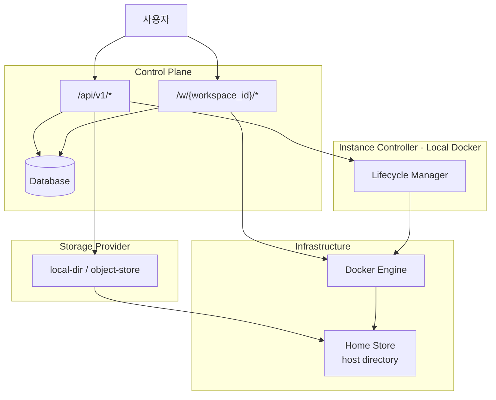

---

## 2. 요청 흐름

### Workspace 접속 (`/w/{workspace_id}/`)

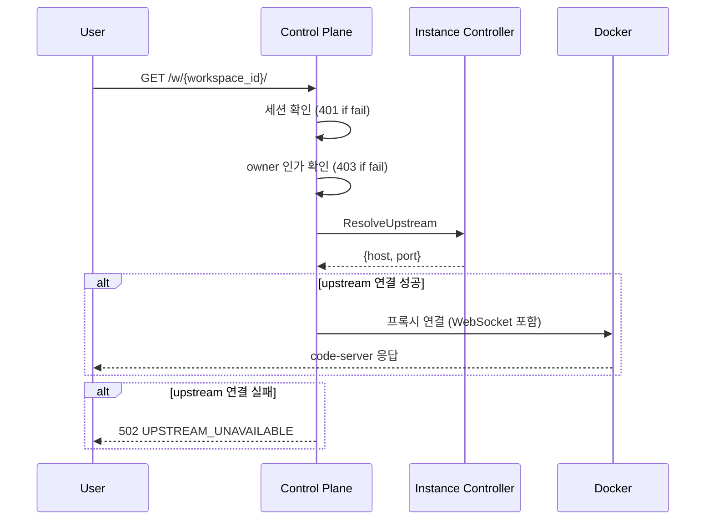

> 프록시에서 상태 확인 안 함. 사용자는 대시보드(API)에서 start 후 접속.

### Trailing Slash 규칙

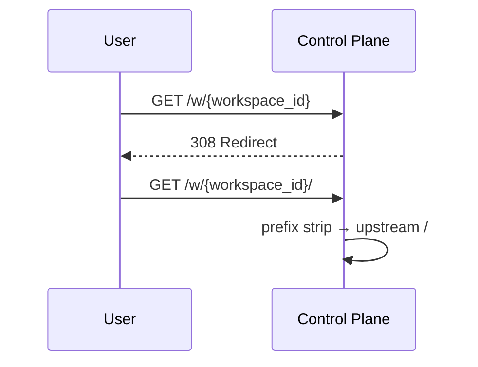

### StartWorkspace (`POST /api/v1/workspaces/{id}:start`)

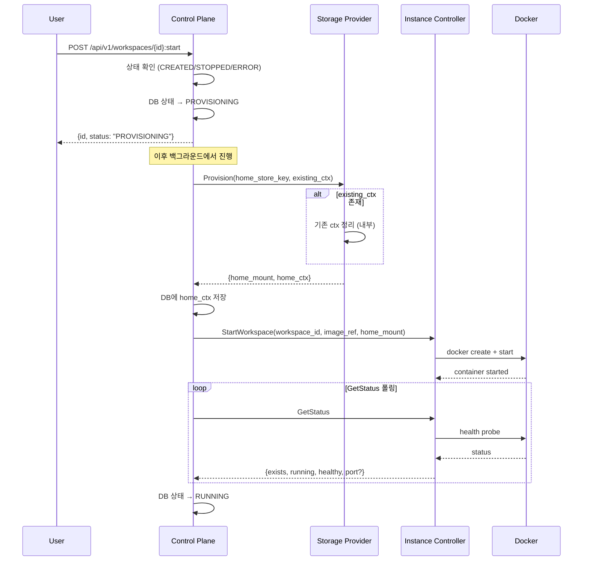

> API는 PROVISIONING 상태를 즉시 반환. 클라이언트는 폴링으로 최종 상태 확인.
> Control Plane이 Storage Provider.Provision 호출 → home_mount 획득 → Instance Controller에 전달
> existing_ctx가 있으면 Provision 내부에서 자동 정리 (리소스 누수 방지)

### StopWorkspace (`POST /api/v1/workspaces/{id}:stop`)

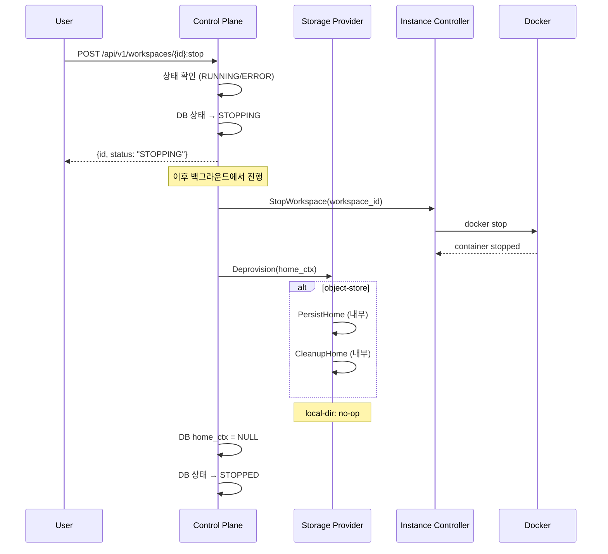

> API는 STOPPING 상태를 즉시 반환. 클라이언트는 폴링으로 최종 상태 확인.
> 백엔드 분기 없이 항상 Deprovision 호출. 백엔드 내부에서 적절히 처리.

### DeleteWorkspace (`DELETE /api/v1/workspaces/{id}`)

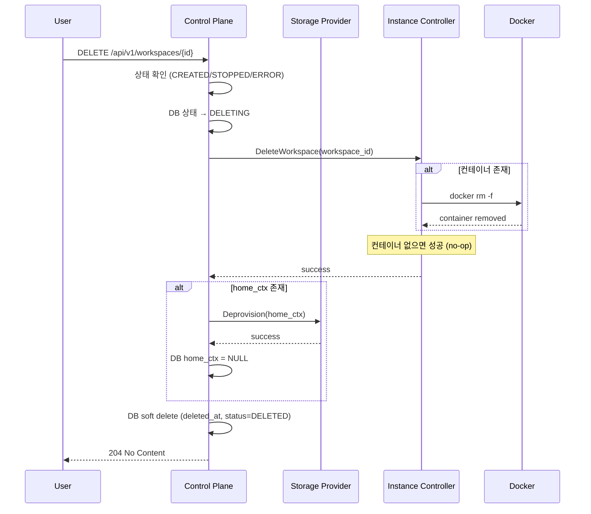

> 컨테이너 삭제 후 스토리지 해제 (생성의 역순)
> MVP에서는 Home Store 데이터 삭제 안 함 (Purge 호출 X)

---

## 3. Workspace 상태

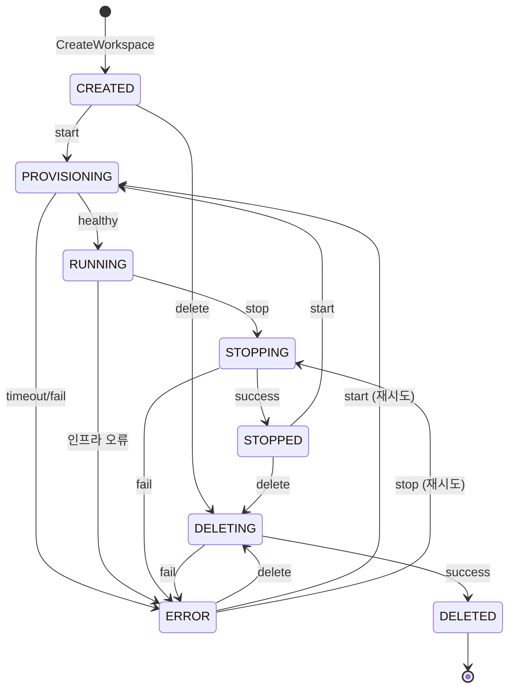

> 프록시는 상태 확인 없이 바로 연결 시도. 컨테이너 미실행 시 502 에러. 사용자는 대시보드에서 Start API 호출 후 접속.

### 상태 × 액션 매트릭스

| 현재 상태 | Start | Stop | Delete | 프록시 접속 |
|-----------|-------|------|--------|------------|
| CREATED | → PROVISIONING | 409 | → DELETING | 502 |
| PROVISIONING | 409 | 409 | 409 | 502 |
| RUNNING | 409 | → STOPPING | 409 | ✓ 연결 |
| STOPPING | 409 | 409 | 409 | 502 |
| STOPPED | → PROVISIONING | 409 | → DELETING | 502 |
| DELETING | 409 | 409 | 409 | 502 |
| ERROR | → PROVISIONING | → STOPPING | → DELETING | 502 |
| DELETED | 404 | 404 | 404 | 404 |

> 409 = INVALID_STATE, 404 = WORKSPACE_NOT_FOUND, 502 = UPSTREAM_UNAVAILABLE

---

## 4. 컴포넌트 구조

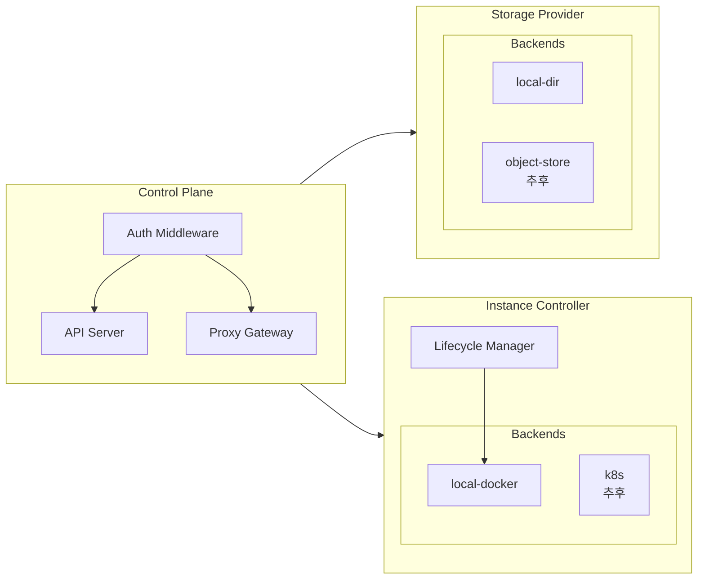

> Instance Controller는 컨테이너 lifecycle 담당 (시작 시 home_mount를 /home/coder에 마운트), Storage Provider는 스토리지 프로비저닝 담당

---

## 5. 데이터 흐름

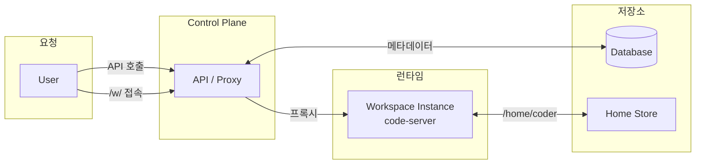

> User는 항상 Control Plane을 통해 접근. API 호출 시 DB 조회/수정, 프록시 접속 시 Workspace Instance로 연결.

---

## 6. Startup Recovery (MVP)

서버 크래시로 인한 stuck 상태를 서버 시작 시 자동 복구합니다.

### 동작 흐름

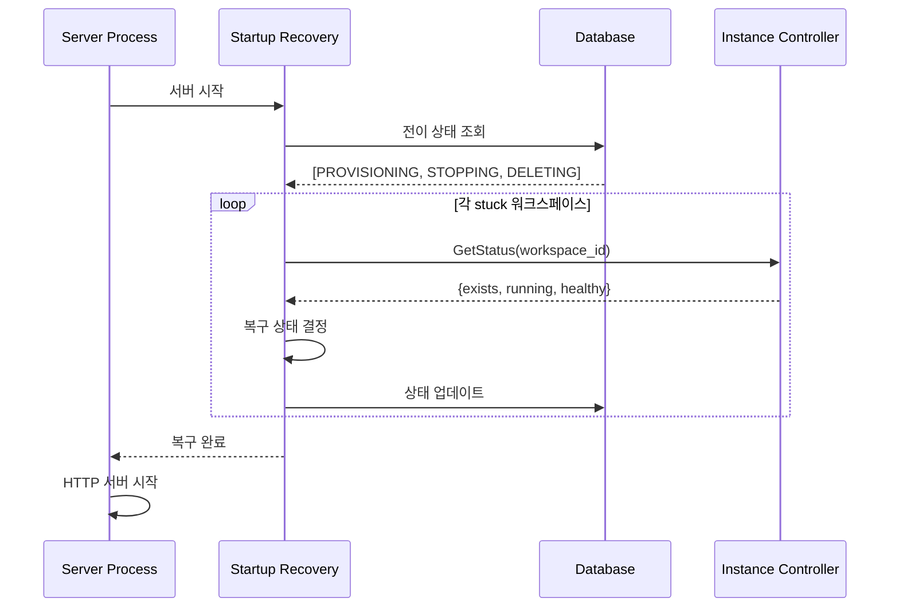

### 복구 매트릭스

| DB 상태 | Instance 상태 | 복구 결과 |
|---------|--------------|----------|
| PROVISIONING | running + healthy | RUNNING |
| PROVISIONING | 그 외 | ERROR |
| STOPPING | not running | STOPPED |
| STOPPING | running | RUNNING |
| DELETING | not exists | DELETED |
| DELETING | exists | ERROR |

> ⚠️ Startup Recovery는 상태 전이가 아닌 "DB 보정"입니다. 서버 크래시로 인해 DB 상태와 실제 컨테이너 상태가 불일치할 때, DB를 현실에 맞춰 수정합니다. 따라서 상태 다이어그램에는 표현되지 않습니다.

> MVP에서는 Startup Recovery로 크래시 복구. 프로덕션 규모에서 주기적 복구가 필요하면 Reconciler 도입.

---

## 7. (추후) Reconciler 패턴 도입

현재는 명령적(Imperative) 방식으로 동작하지만, GetStatus 메서드를 통해 Reconciler 패턴으로 확장 가능하도록 설계되어 있습니다.

### 현재 방식 (명령적)

```
API 호출 → Storage Provider.Provision → Instance Controller.Start → 완료
```

- Control Plane이 순차적으로 호출
- 중간 실패 시 부분 완료 상태 발생 가능
- 롤백 로직이 복잡해질 수 있음

### Reconciler 방식 (선언적)

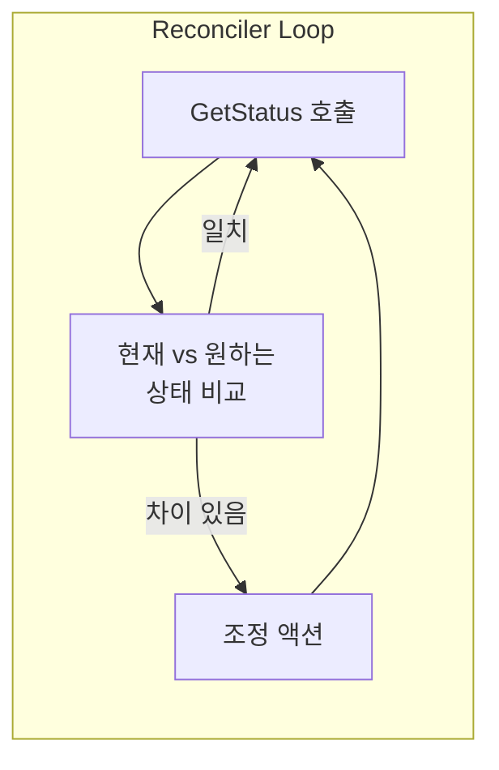

**Reconciler 도입 시:**
1. 백그라운드 워커가 주기적으로 모든 워크스페이스 순회
2. `GetStatus`로 현재 상태 조회 (Storage Provider, Instance Controller)
3. DB의 desired_status와 비교
4. 차이 있으면 기존 메서드(Provision/Start 등)로 조정
5. 상태 불일치 자동 복구

### 설계 원칙

| 원칙 | 설명 |
|------|------|
| **멱등성** | 모든 조정 메서드는 여러 번 호출해도 안전 |
| **상태 조회 분리** | GetStatus는 부수효과 없이 현재 상태만 반환 |
| **점진적 확장** | MVP는 명령적, 추후 Reconciler로 감싸기 가능 |

> MVP에서는 명령적 방식으로 충분하며, 프로덕션 규모에서 상태 불일치 문제가 발생하면 Reconciler 도입 검토
