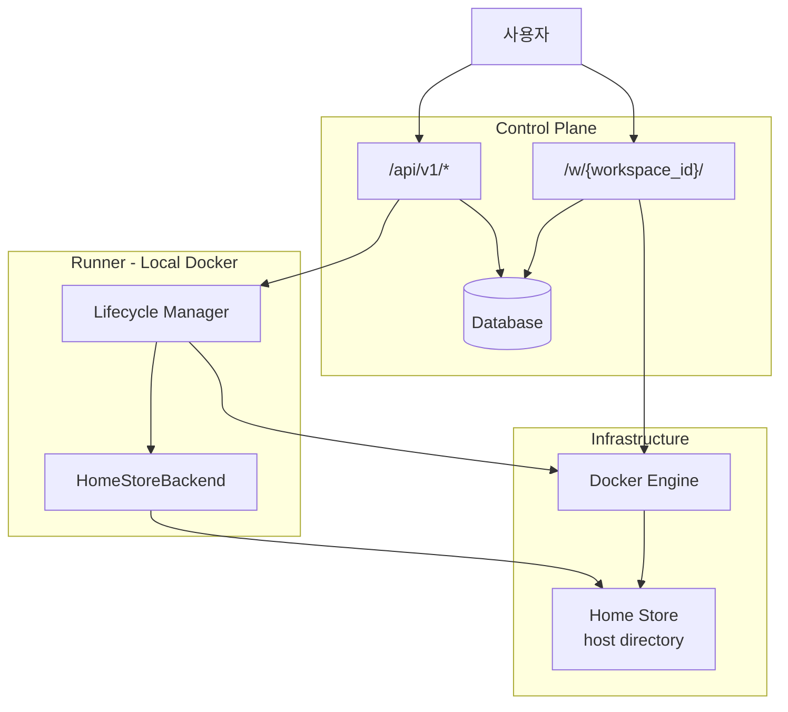
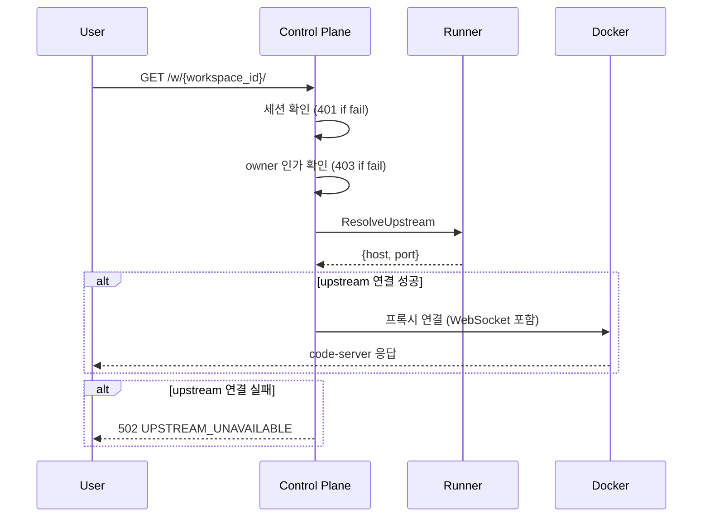
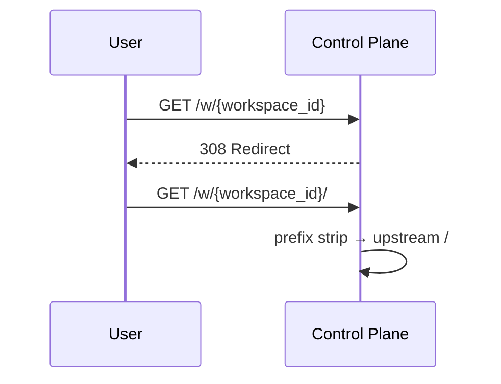
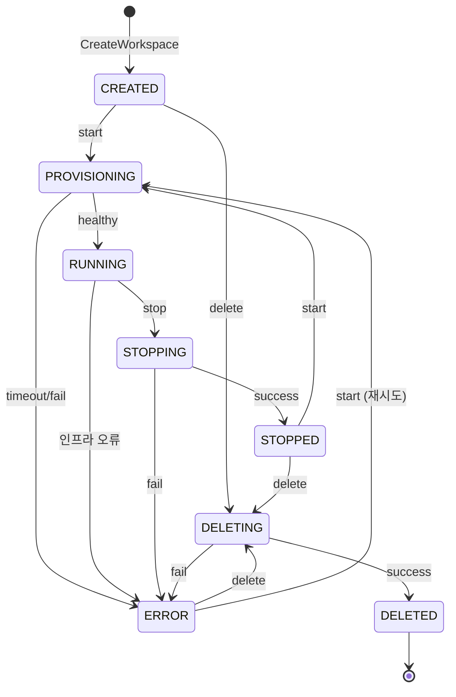
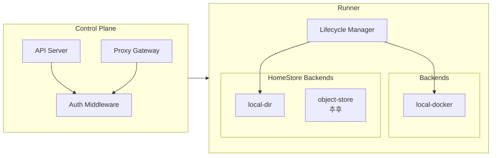
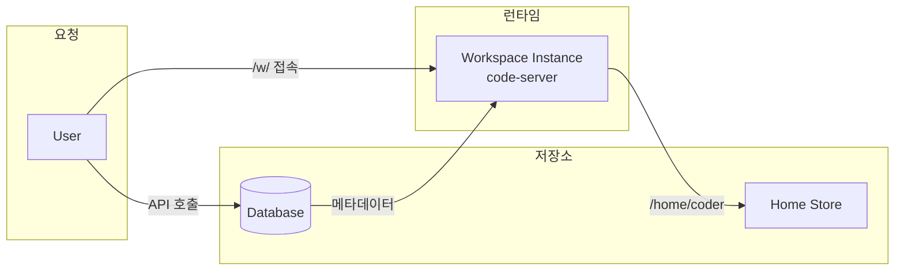

# Architecture

> 용어 정의는 [glossary.md](./glossary.md), 상세 스펙은 [spec.md](./spec.md) 참조

---

## 1. 시스템 개요

---

## 2. 요청 흐름

### Workspace 접속 (`/w/{workspace_id}/`)

> 프록시에서 상태 확인 안 함. 사용자는 대시보드(API)에서 start 후 접속.

### Trailing Slash 규칙

---

## 3. Workspace 상태

> 프록시는 상태 확인 없이 바로 연결 시도. 컨테이너 미실행 시 502 에러. 사용자는 대시보드에서 Start API 호출 후 접속.

---

## 4. 컴포넌트 구조

---

## 5. 데이터 흐름

