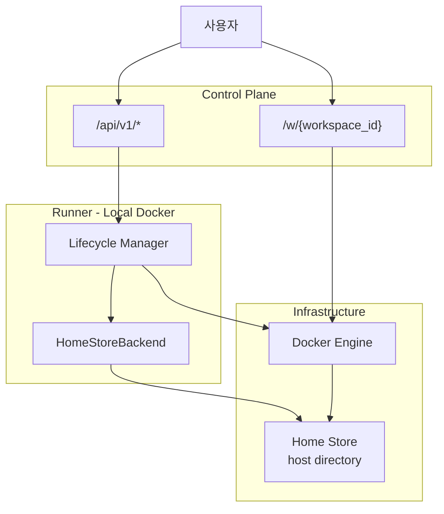
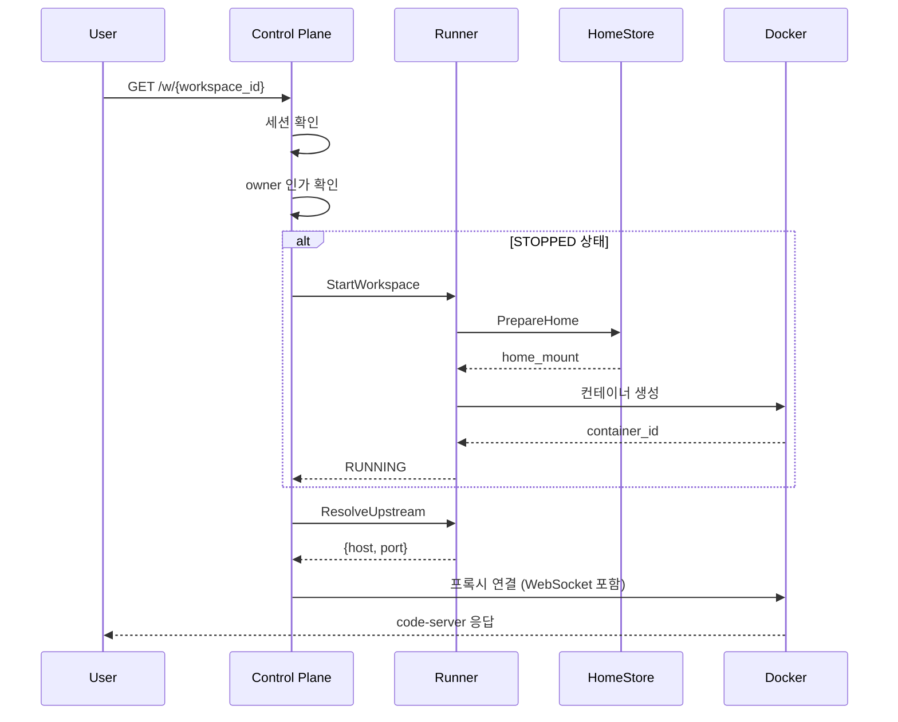
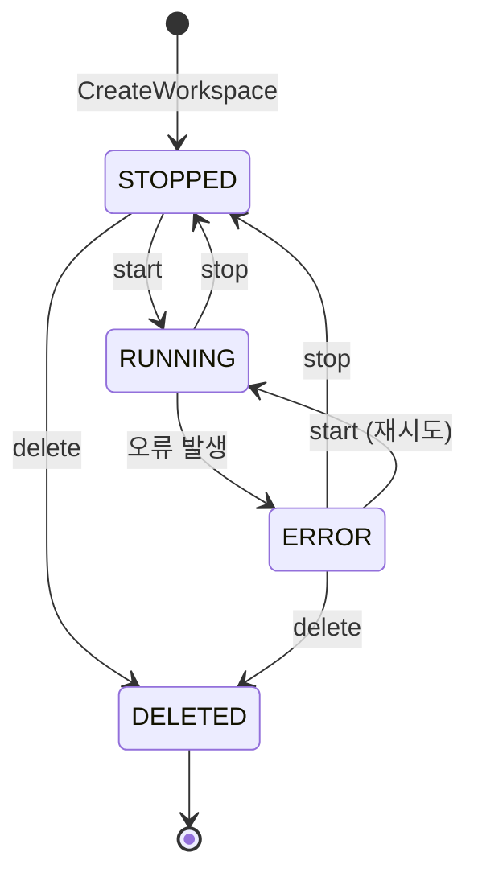
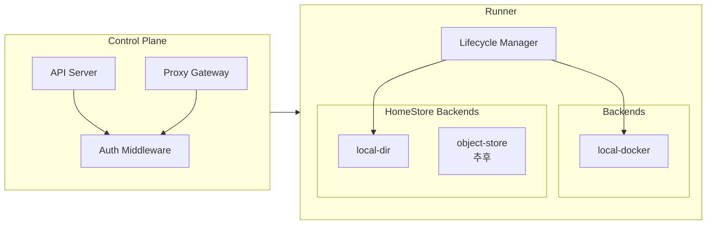
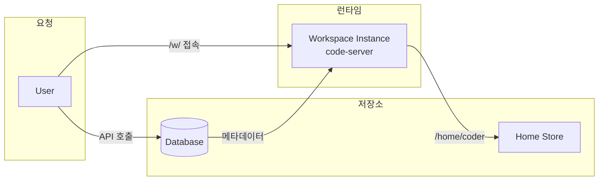

# Architecture

> 용어 정의는 [glossary.md](./glossary.md), 상세 스펙은 [spec.md](./spec.md) 참조

---

## 1. 시스템 개요

---

## 2. 요청 흐름

### Workspace 접속 (`/w/{workspace_id}`)

---

## 3. Workspace 상태

---

## 4. 컴포넌트 구조

---

## 5. 데이터 흐름

