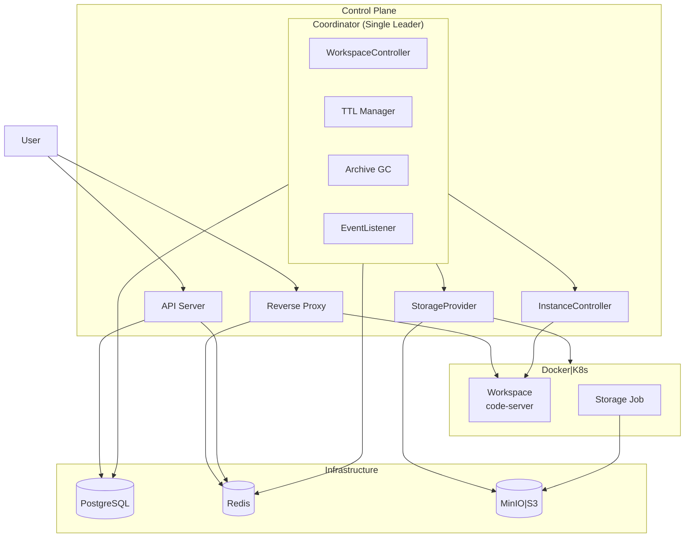
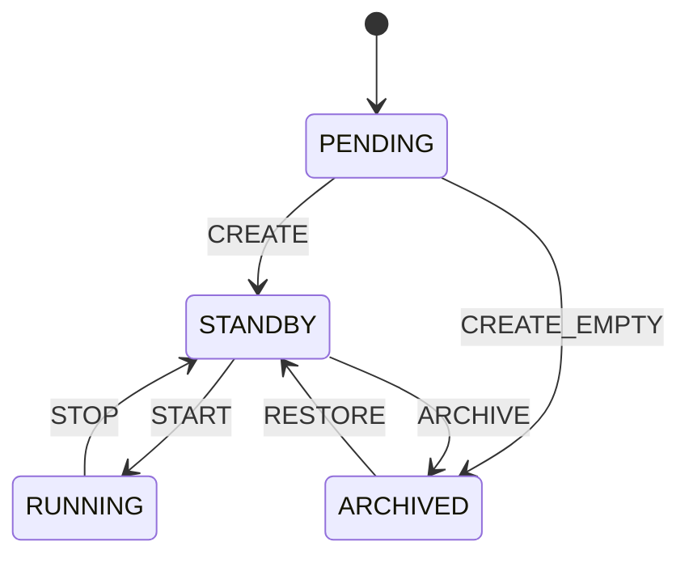

# Architecture v2

> M2 구현을 위한 아키텍처 설계 문서

---

## 개요

이 폴더는 M2 마일스톤의 **구현 설계** 문서를 포함합니다.
"What"은 `spec/`에, "How"는 여기에 정의됩니다.

---

## 시스템 구조



---

## 프로세스 구조

| 프로세스 | 역할 | 특성 |
|---------|------|------|
| **API Server** | HTTP 요청 처리, CRUD, SSE | Stateless, 수평 확장 가능 |
| **Reverse Proxy** | 트래픽 라우팅, 활동 추적 | Stateless, 수평 확장 가능 |
| **Coordinator** | 백그라운드 작업 관리 | Single Leader (pg_advisory_lock) |

### Coordinator 내부 컴포넌트

| 컴포넌트 | 주기 | 역할 |
|---------|------|------|
| WorkspaceController | 10s (진행 중 2s) | 리소스 관측 → 상태 수렴 |
| TTL Manager | 1m | 비활성 워크스페이스 강등 |
| Archive GC | 1h | orphan archive 정리 |
| EventListener | 실시간 | PG NOTIFY → Redis PUBLISH |

> **Note**: InstanceController, StorageProvider는 Coordinator가 호출하는 내부 모듈 (별도 프로세스 아님)

---

## 인프라 스택 (M2)

| 구성요소 | 선택 | 비고 |
|---------|------|------|
| **Container Runtime** | Docker\|K8s | M2: local-docker |
| **Object Storage** | MinIO\|S3 | M2: MinIO (S3 호환) |
| **Database** | PostgreSQL | 상태 저장, Leader Election |
| **Cache/Pub-Sub** | Redis | TTL hints, SSE 이벤트 |

---

## 상태 모델

### 핵심 흐름



### 전체 전이

| From | To | Operation | 비고 |
|------|-----|-----------|------|
| PENDING | STANDBY | PROVISIONING | 볼륨 생성 |
| PENDING | ARCHIVED | CREATE_EMPTY_ARCHIVE | 빈 아카이브 |
| STANDBY | RUNNING | STARTING | 컨테이너 시작 |
| RUNNING | STANDBY | STOPPING | 컨테이너 정지 |
| STANDBY | ARCHIVED | ARCHIVING | 아카이빙 |
| ARCHIVED | STANDBY | RESTORING | 복원 |
| STANDBY | DELETED | DELETING | 볼륨 삭제 |
| ARCHIVED | DELETED | - | 리소스 없음 |
| * | ERROR | - | 장애 발생 |
| ERROR | STANDBY | RECOVER | 수동 개입 필요 |
| ERROR | DELETED | DELETING | 삭제 허용 |

### Phase 순서 (Ordered State Machine)

```
PENDING(0) < ARCHIVED(5) < STANDBY(10) < RUNNING(20)
```

> **Note**: ERROR는 Ordered SM 외부. 수동 개입(error_reason, error_count 리셋) 후 복구.

---

## 핵심 컴포넌트

### Control Plane

| 컴포넌트 | 역할 | 상세 문서 |
|---------|------|----------|
| **API Server** | REST API, SSE 스트리밍 | [spec/04-control-plane.md](../spec/04-control-plane.md) |
| **Reverse Proxy** | 워크스페이스 라우팅, 활동 추적 | [spec/05-data-plane.md](../spec/05-data-plane.md) |
| **InstanceController** | 컨테이너 생명주기 관리 | [spec/05-data-plane.md](../spec/05-data-plane.md) |
| **StorageProvider** | 볼륨/아카이브 관리 | [spec/05-data-plane.md](../spec/05-data-plane.md) |

### Coordinator 내부

| 컴포넌트 | 역할 | 상세 문서 |
|---------|------|----------|
| **WorkspaceController** | Reconcile 루프, 상태 수렴 | [reconciler.md](./reconciler.md) |
| **TTL Manager** | desired_state 자동 강등 | [spec/04-control-plane.md](../spec/04-control-plane.md) |
| **Archive GC** | orphan archive 정리 | [spec/05-data-plane.md](../spec/05-data-plane.md) |
| **EventListener** | CDC (PG → Redis) | [spec/04-control-plane.md](../spec/04-control-plane.md) |

### Container Runtime (Docker|K8s)

| 컴포넌트 | 역할 | 상세 문서 |
|---------|------|----------|
| **Workspace** | 사용자 개발 환경 (code-server) | - |
| **Storage Job** | Volume↔Archive 데이터 이동 | [spec/05-data-plane.md](../spec/05-data-plane.md) |

