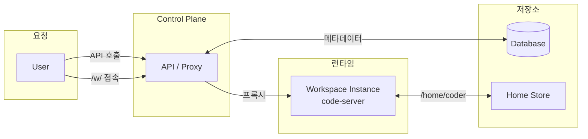

# 데이터 흐름

> [README.md](./README.md)로 돌아가기

---

## 전체 데이터 흐름

```mermaid
graph LR
    subgraph Request[요청]
        U[User]
    end

    subgraph ControlPlane[Control Plane]
        CP[API / Proxy]
    end

    subgraph Storage[저장소]
        DB[(Database)]
        HS[Home Store]
    end

    subgraph Runtime[런타임]
        WI[Workspace Instance<br/>code-server]
    end

    U -->|API 호출| CP
    U -->|/w/ 접속| CP
    CP <-->|메타데이터| DB
    CP -->|프록시| WI
    WI <-->|/home/coder| HS
```

> User는 항상 Control Plane을 통해 접근. API 호출 시 DB 조회/수정, 프록시 접속 시 Workspace Instance로 연결.
