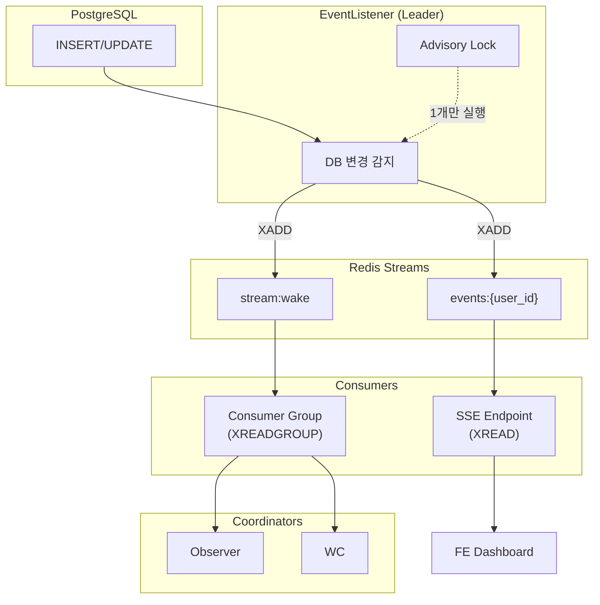
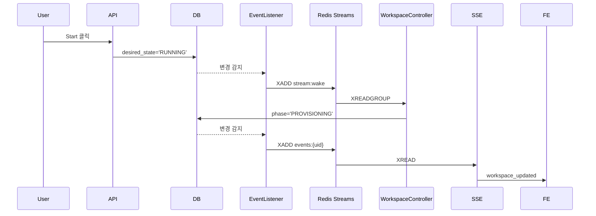
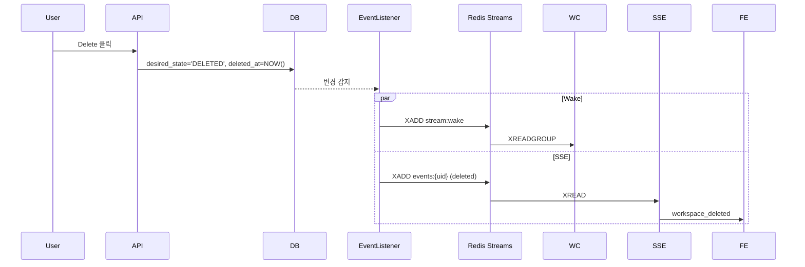

# Event Listener

> DB 변경 감지 (CDC) 및 SSE 스트리밍 - Redis Streams 기반

---

## 개요

EventListener는 DB 변경사항을 감지하고, Redis Streams를 통해 SSE 클라이언트와 Coordinator에게 실시간으로 전달합니다.

---

## 아키텍처



---

## 이벤트 분리

| 구분 | 트리거 조건 | 목적 | Redis Stream |
|------|------------|------|-------------|
| **SSE** | phase, operation, error_reason 변경 | UI 실시간 업데이트 | events:{user_id} |
| **Wake** | desired_state 변경 | Coordinator 즉시 깨우기 | stream:wake |
| **삭제** | deleted_at 설정 | 삭제 알림 | events:{user_id} |

### 무한루프 방지

- **SSE**: phase/operation 변경 시에만 발행
- **Wake**: desired_state 변경 시에만 발행
- Coordinator가 phase/operation을 변경해도 Wake는 발행되지 않음

---

## EventListener 컴포넌트

| 항목 | 값 |
|------|------|
| 리더 선출 | 필요 (PostgreSQL Advisory Lock) |
| DB 연결 | psycopg3 AsyncConnection (SQLAlchemy와 별도) |
| 실행 위치 | FastAPI lifespan 내 background task |
| Redis 명령 | XADD (maxlen=1000) |

### 리더 선출

```
┌─────────────────────────────────────────────────────────────┐
│                    EventListener                             │
├─────────────────────────────────────────────────────────────┤
│                                                              │
│  pg_try_advisory_lock(hashtext('event_listener'))           │
│         │                                                    │
│         ├── 성공 → Leader로 동작                             │
│         └── 실패 → 5초마다 재시도                            │
│                                                              │
│  [Leader Only]                                               │
│         │                                                    │
│         ▼                                                    │
│  LISTEN ws_sse, ws_wake, ws_deleted                         │
│         │                                                    │
│         ▼                                                    │
│  async for notify in aconn.notifies():                      │
│         │                                                    │
│         ├── channel: ws_sse → XADD events:{user_id}         │
│         ├── channel: ws_wake → XADD stream:wake             │
│         └── channel: ws_deleted → XADD events:{user_id}     │
│                                                              │
└─────────────────────────────────────────────────────────────┘
```

---

## SSE 엔드포인트

```
GET /api/v1/events
Accept: text/event-stream
Cookie: session=xxx
```

### 이벤트 타입

| 이벤트 | 발행 시점 | 페이로드 |
|--------|----------|---------|
| workspace_updated | phase/operation 변경 | 전체 workspace 객체 |
| workspace_deleted | soft delete | `{id: string}` |
| heartbeat | 30초마다 | `{}` |

### 메시지 수신 방식

- **이전**: SUBSCRIBE (fire-and-forget, 연결 끊기면 유실)
- **현재**: XREAD (스트림 읽기, last_id로 위치 추적)

### 유실 방지

- `last_id` 추적으로 재연결 시 놓친 메시지 수신 가능
- 스트림은 최근 1000개 메시지 유지 (maxlen)

### 사용자 격리

- Redis Stream: `events:{user_id}`
- 각 사용자는 자신의 workspace 이벤트만 수신

---

## Coordinator Wake

### Consumer Group

| 항목 | 값 |
|------|------|
| 그룹명 | coordinators |
| 스트림 | stream:wake |
| 소비자 | {coordinator_type}-{pid} |

### 동작 방식

1. EventListener가 `stream:wake`에 `{target: "ob"}` 또는 `{target: "wc"}` XADD
2. Coordinator가 XREADGROUP으로 자신의 target 메시지 수신
3. 수신 후 XACK으로 처리 완료 표시
4. 각 메시지는 1개 Coordinator만 처리 (Consumer Group 특성)

---

## 시나리오별 흐름

### Start 버튼 클릭



### 워크스페이스 삭제



---

## Before/After 비교

| 항목 | Before (PUB/SUB) | After (Streams) |
|------|-----------------|-----------------|
| 트리거 방식 | DB 변경 시 자동 | DB 변경 시 자동 |
| 리더 선출 | 불필요 (PUBLISH 멱등) | 필요 (중복 방지) |
| 메시지 유실 | 가능 (fire-and-forget) | 방지 (last_id 추적) |
| 중복 이벤트 | 발생 (worker 수만큼) | 방지 (1개 Leader) |
| Coordinator wake | SUBSCRIBE 브로드캐스트 | Consumer Group 1회 처리 |

---

## 구현 파일

| 파일 | 역할 |
|------|------|
| `control/coordinator/event_listener.py` | DB 변경 감지 → Redis XADD |
| `app/api/events.py` | SSE 엔드포인트 (XREAD) |
| `control/coordinator/base.py` | NotifySubscriber (XREADGROUP) |
