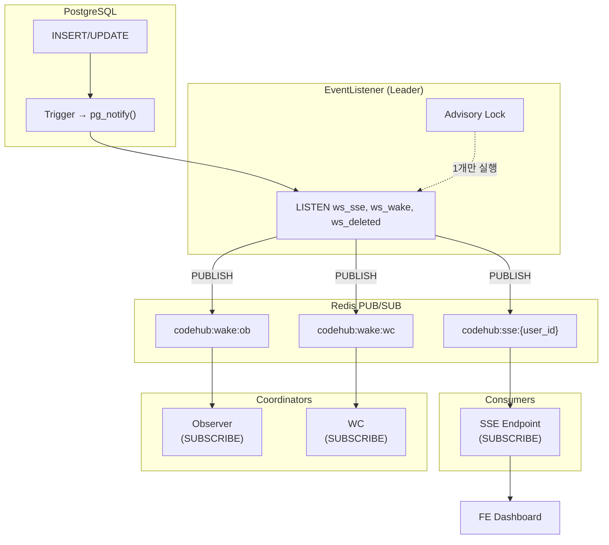
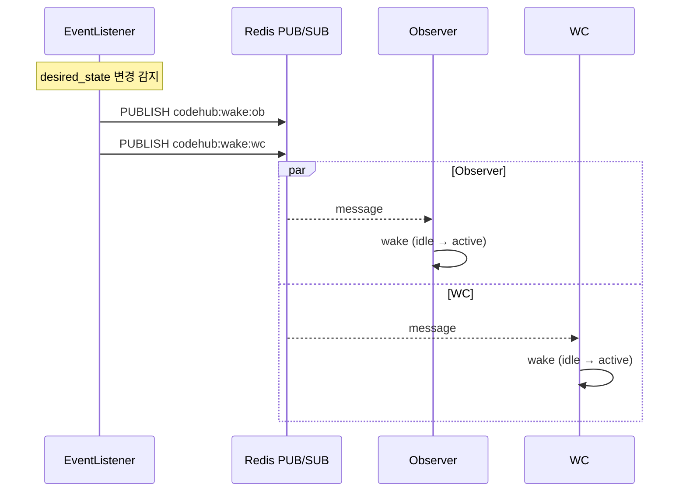
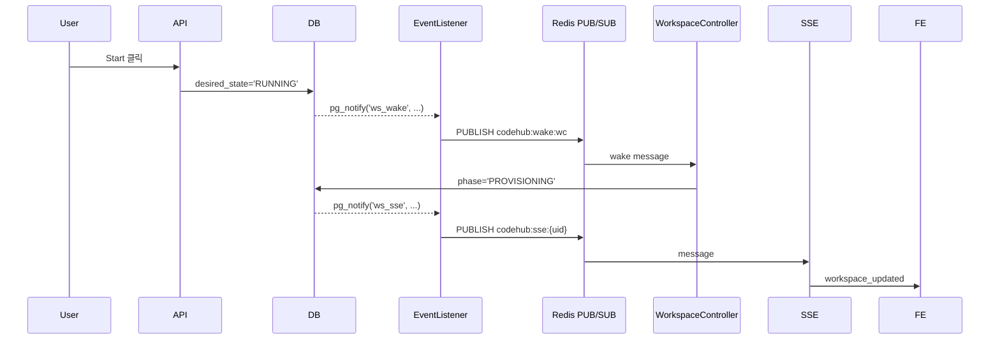
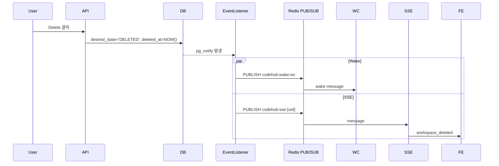

# Event Listener

> DB 변경 감지 (CDC) 및 SSE 스트리밍 - Redis PUB/SUB 기반

---

## 개요

EventListener는 DB 변경사항을 감지하고, Redis PUB/SUB를 통해 SSE 클라이언트와 Coordinator에게 실시간으로 전달합니다.

---

## 아키텍처



---

## 이벤트 분리

| 구분 | PG 채널 | 트리거 조건 | 목적 | Redis 채널 |
|------|---------|------------|------|-----------|
| **SSE** | ws_sse | phase, operation, error_reason, name, description, memo 변경 | UI 실시간 업데이트 | codehub:sse:{user_id} |
| **Wake** | ws_wake | desired_state 변경 | Coordinator 즉시 깨우기 | codehub:wake:ob, codehub:wake:wc |
| **삭제** | ws_deleted | deleted_at 설정 | 삭제 알림 | codehub:sse:{user_id} |

### 무한루프 방지

- **SSE**: phase/operation/metadata 변경 시에만 발행
- **Wake**: desired_state 변경 시에만 발행
- Coordinator가 phase/operation을 변경해도 Wake는 발행되지 않음

---

## EventListener 컴포넌트

| 항목 | 값 |
|------|------|
| 리더 선출 | 필요 (PostgreSQL Advisory Lock) |
| DB 연결 | psycopg3 AsyncConnection (SQLAlchemy와 별도) |
| 실행 위치 | FastAPI lifespan 내 background task |
| Redis 명령 | PUBLISH |

### 리더 선출

```
┌─────────────────────────────────────────────────────────────┐
│                    EventListener                             │
├─────────────────────────────────────────────────────────────┤
│                                                              │
│  pg_try_advisory_lock(hashtext('event_listener'))           │
│         │                                                    │
│         ├── 성공 → Leader로 동작                             │
│         └── 실패 → 5초마다 재시도                            │
│                                                              │
│  [Leader Only]                                               │
│         │                                                    │
│         ▼                                                    │
│  LISTEN ws_sse, ws_wake, ws_deleted                         │
│         │                                                    │
│         ▼                                                    │
│  async for notify in aconn.notifies():                      │
│         │                                                    │
│         ├── channel: ws_sse → PUBLISH codehub:sse:{user_id} │
│         ├── channel: ws_wake → PUBLISH codehub:wake:ob/wc   │
│         └── channel: ws_deleted → PUBLISH codehub:sse:{uid} │
│                                                              │
└─────────────────────────────────────────────────────────────┘
```

---

## SSE 엔드포인트

```
GET /api/v1/events
Accept: text/event-stream
Cookie: session=xxx
```

### 이벤트 타입

| 이벤트 | 발행 시점 | 페이로드 |
|--------|----------|---------|
| workspace_updated | phase/operation/metadata 변경 | 전체 workspace 객체 |
| workspace_deleted | soft delete | `{id: string}` |
| heartbeat | 30초마다 | `{}` |

### 메시지 수신 방식

```python
pubsub = redis.pubsub()
await pubsub.subscribe(f"codehub:sse:{user_id}")

async for message in pubsub.listen():
    if message["type"] == "message":
        yield format_sse_event(message["data"])
```

### 사용자 격리

- Redis 채널: `codehub:sse:{user_id}`
- 각 사용자는 자신의 workspace 이벤트만 구독

### PUB/SUB 특성

| 특성 | 설명 |
|------|------|
| Fire-and-forget | 구독자 없으면 메시지 유실 |
| 브로드캐스트 | 모든 구독자가 동일 메시지 수신 |
| 재연결 처리 | 클라이언트 재연결 시 초기 상태 로드 필요 |

> **재연결 시**: SSE 엔드포인트가 현재 workspace 목록을 초기 이벤트로 전송

---

## Coordinator Wake

### 동작 방식



### 채널 분리

| 채널 | 구독자 | 용도 |
|------|--------|------|
| codehub:wake:ob | Observer | 리소스 관측 즉시 시작 |
| codehub:wake:wc | WC | Reconcile 즉시 시작 |

### Coordinator 구독

```python
class NotifySubscriber:
    async def subscribe(self, target: str):
        channel = f"{wake_prefix}:{target}"  # codehub:wake:ob 또는 codehub:wake:wc
        await self.pubsub.subscribe(channel)

    async def wait_for_wake(self, timeout: float) -> bool:
        try:
            async with asyncio.timeout(timeout):
                message = await self.pubsub.get_message(ignore_subscribe_messages=True)
                return message is not None
        except asyncio.TimeoutError:
            return False
```

---

## 시나리오별 흐름

### Start 버튼 클릭



### 워크스페이스 삭제



---

## 설정

| 환경변수 | 기본값 | 설명 |
|----------|--------|------|
| `REDIS_CHANNEL_SSE_PREFIX` | codehub:sse | SSE 채널 prefix |
| `REDIS_CHANNEL_WAKE_PREFIX` | codehub:wake | Wake 채널 prefix |
| `SSE_HEARTBEAT_INTERVAL` | 30초 | Heartbeat 주기 |

> **설정 클래스**: `RedisChannelConfig`, `SSEConfig` (config.py)

---

## 구현 파일

| 파일 | 역할 |
|------|------|
| `control/coordinator/event_listener.py` | DB 변경 감지 → Redis PUBLISH |
| `app/api/v1/events.py` | SSE 엔드포인트 (SUBSCRIBE) |
| `control/coordinator/base.py` | NotifySubscriber (SUBSCRIBE) |
| `infra/redis_pubsub.py` | Redis PUB/SUB 유틸리티 |
