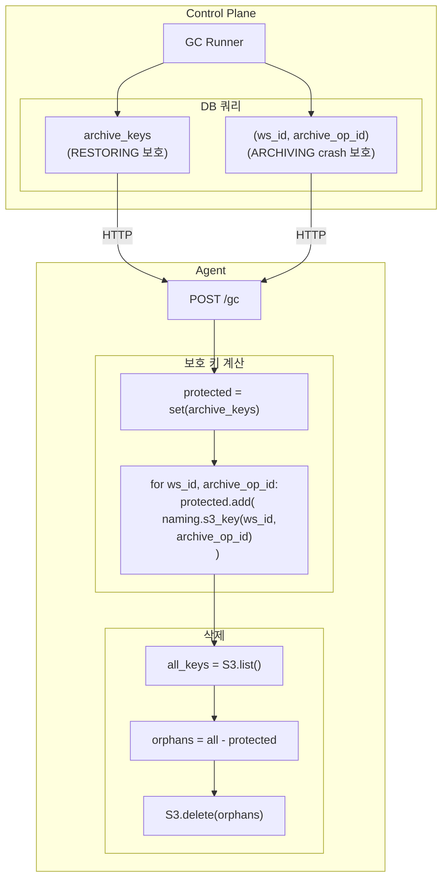
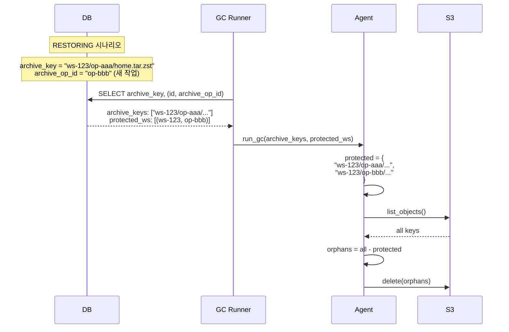

# GC Runner

> orphan archive 정리

---

## 개요

GC Runner는 S3에서 orphan archive를 탐지하고 삭제합니다.

| 항목 | 설명 |
|------|------|
| 역할 | orphan archive 정리 |
| 주기 | 4시간 |
| 보호 대상 | archive_key + archive_op_id 경로 |

---

## 아키텍처



---

## 두 가지 보호 유형

| 보호 대상 | 목적 | 시나리오 |
|----------|------|---------|
| `archive_key` | 실제 존재하는 아카이브 보호 | RESTORING 중 복원 대상 파일 |
| `archive_op_id` 경로 | ARCHIVING crash 대비 | archive → delete → crash → persist 안 됨 |

### 보호 로직

```python
# Control Plane (scheduler_gc.py)
# 1. archive_key 조회 (RESTORING 대상 보호)
archive_keys = SELECT archive_key FROM workspaces
               WHERE archive_key IS NOT NULL AND deleted_at IS NULL

# 2. (ws_id, archive_op_id) 조회 (ARCHIVING crash 대비)
protected_workspaces = SELECT id, archive_op_id FROM workspaces
                       WHERE archive_op_id IS NOT NULL AND deleted_at IS NULL

# Agent (storage.py)
# 보호 키 계산
protected_keys = set(archive_keys)
for ws_id, archive_op_id in protected_workspaces:
    protected_keys.add(naming.archive_s3_key(ws_id, archive_op_id))

# 삭제
all_keys = S3.list_objects(prefix)
orphans = all_keys - protected_keys
S3.delete_objects(orphans)
```

---

## 보호 시나리오



### 시나리오별 보호

| 시나리오 | DB 상태 | 보호 키 |
|---------|--------|---------|
| RESTORING | archive_key="ws/op-aaa/...", archive_op_id="op-bbb" | archive_key 값 + archive_op_id 경로 |
| ARCHIVING 완료 | archive_key="ws/op-ccc/...", archive_op_id="op-ccc" | 둘 다 같은 경로 |
| ARCHIVING crash | archive_key=NULL, archive_op_id="op-ddd" | archive_op_id 경로만 |

---

## 참조

- [00-contracts.md](../spec/00-contracts.md#9-gc-separation--protection) - GC 계약
- [05-data-plane.md](../spec/05-data-plane.md#gc-runner) - GC Runner 스펙
