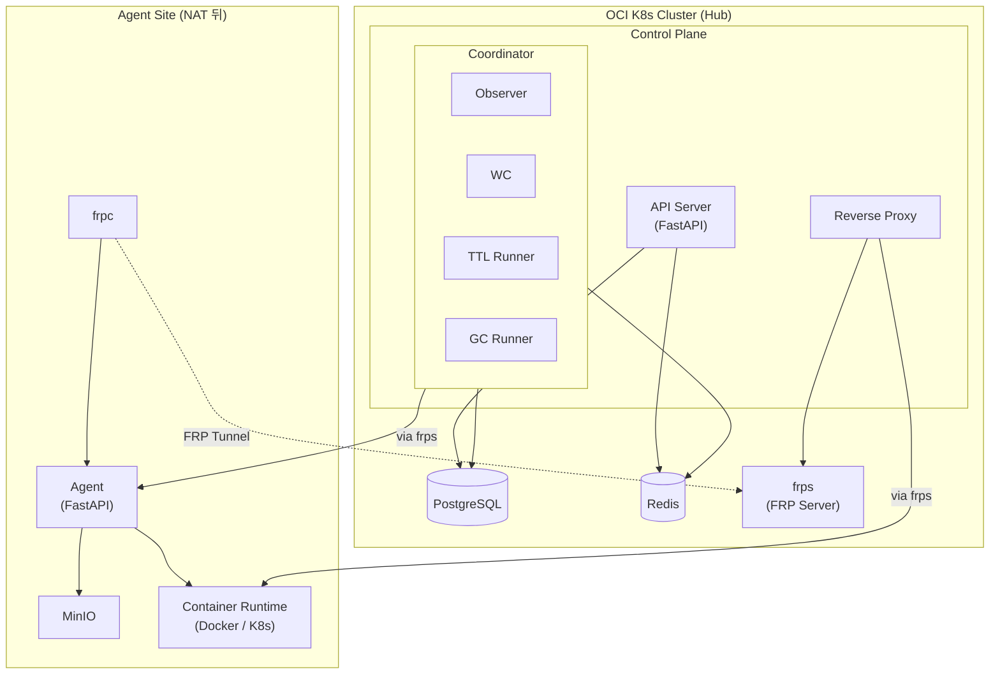

# Hub-Spoke Architecture

> Hub(Control Plane) + Spoke(Agent) 분산 아키텍처 설계

**ADR**: [ADR-014](../adr/014-hub-spoke-architecture.md)

---

## 전체 구조



---

## 통신 구조

### 현재 (v0.2.x): 직접 HTTP

```
CP ──HTTP──▶ Agent (같은 네트워크 필수)
```

### 변경 후 (v0.3.0): FRP 터널 경유

```
                    ┌─────────────┐
CP ──HTTP──▶ frps ◀──frpc── Agent (NAT 뒤 어디서든)
                    └─────────────┘
```

**핵심**: CP의 코드 변경 없음. `agent_client.py`의 `base_url`만 `frps`가 노출하는 프록시 주소로 변경.

### 트래픽 종류

| 트래픽 | 방향 | 경로 | 데이터 크기 |
|--------|------|------|------------|
| 제어 명령 (observe, start, stop...) | Hub → Agent (via frps) | CP → frps → frpc → Agent API | 수 KB (JSON) |
| Workspace 프록시 (code-server) | User → Agent (via frps) | Browser → frps → frpc → Container | 실시간 스트림 |
| S3 Archive/Restore | Agent 내부 | Agent → MinIO (로컬) | 수 GB |

**대역폭 설계**: FRP 터널은 메타데이터(JSON)와 IDE 스트림만 전달. 볼륨 데이터(GB)는 Agent 로컬의 MinIO에서 처리되므로 터널 병목 없음.

---

## FRP 터널 설계

### OCI 환경 (이미 운영 중)

```
Namespace: frp
Service:   frp-server (ClusterIP 10.152.183.63)
Ports:     7000/TCP (frps 메인)
           7500/TCP (frps dashboard)
           8080/TCP (frps vhost HTTP)
```

### frps 설정 (Hub 측)

```toml
[common]
bind_port = 7000
vhost_http_port = 8080
dashboard_port = 7500
authentication_method = token
token = "<shared-secret>"
```

### frpc 설정 (Agent 측)

```toml
[common]
server_addr = hub.example.com
server_port = 7000
authentication_method = token
token = "<shared-secret>"

# Agent API 터널 (CP → Agent 제어 명령)
[[proxies]]
name = "agent-api"
type = "tcp"
local_ip = "127.0.0.1"
local_port = 8080
remote_port = 6100

# Workspace 프록시 터널 (User → code-server)
[[proxies]]
name = "workspace-proxy"
type = "http"
local_ip = "127.0.0.1"
local_port = 8080
custom_domains = ["ws.hub.example.com"]
```

### 연결 흐름

```
1. Agent 시작 → frpc가 frps에 연결 (Agent → Hub 방향, NAT 투과)
2. frps가 remote_port(6100)를 열어 CP가 접근 가능
3. CP의 agent_client.base_url = "http://frps:6100"
4. CP → frps:6100 → frpc → Agent:8080 (투명 프록시)
```

---

## 컴포넌트별 변경사항

### Hub (Control Plane)

| 컴포넌트 | 변경 | 상세 |
|---------|------|------|
| API Server | 변경 없음 | REST API 그대로 유지 |
| Observer | 변경 없음 | `agent_client.observe()` → frps 경유 |
| WC | 변경 없음 | `agent_client.start/stop/archive()` → frps 경유 |
| GC Runner | 변경 없음 | `agent_client.run_gc()` → frps 경유 |
| Reverse Proxy | 라우팅 변경 | workspace → frps vhost로 프록시 |
| agent_client | base_url 변경 | 직접 URL → frps 프록시 URL |

**CP에서 제거하는 것**:
- `S3_*` 환경변수 (MinIO 접근 불필요)
- `DOCKER_HOST` 환경변수 (Docker 접근 불필요)
- `depends_on: agent` (네트워크 분리)

### Agent (Data Plane)

| 컴포넌트 | 변경 | 상세 |
|---------|------|------|
| Agent API | 변경 없음 | REST API 그대로 유지 |
| Docker Runtime | 변경 없음 | 로컬 Docker 그대로 |
| StorageManager | 변경 없음 | 로컬 MinIO 접근 |
| frpc | **신규** | Hub frps에 연결, 터널 유지 |
| MinIO | **이동** | Hub에서 Agent로 이동 |

### 인프라 배치

| 컴포넌트 | Hub (OCI K8s) | Agent (NAT 뒤) |
|---------|---------------|----------------|
| PostgreSQL | ✅ | - |
| Redis | ✅ | - |
| frps | ✅ | - |
| frpc | - | ✅ |
| MinIO | - | ✅ |
| Docker/K8s Runtime | - | ✅ |

---

## MinIO 이동 설계

### 왜 Agent 쪽인가

코드 분석 결과, CP는 MinIO에 직접 접근하지 않음:

```python
# CP가 하는 것: archive_key 문자열만 DB에 저장
workspace.archive_key = "ws-123/op-456/home.tar.zst"

# Agent가 하는 것: 실제 S3 I/O 전부
storage_manager.archive(workspace_id, archive_op_id)  # → MinIO upload
storage_manager.restore(workspace_id, archive_key)     # → MinIO download
gc_runner.run_gc(protected_keys)                       # → MinIO delete
```

### 변경 전

```
Hub: CP + PostgreSQL + Redis + MinIO
Agent: Docker Runtime
```

### 변경 후

```
Hub: CP + PostgreSQL + Redis + frps
Agent: Docker Runtime + MinIO + frpc
```

### 영향 범위

| 코드 | 변경 필요 | 이유 |
|------|----------|------|
| `src/codehub/app/config.py` | S3Config 제거 | CP는 S3 접근 불필요 |
| `src/codehub_agent/config.py` | S3Config 유지 | Agent가 직접 MinIO 접근 |
| `src/codehub/infra/agent_client.py` | base_url 변경 | frps 프록시 URL 사용 |
| `docker-compose.yml` | 네트워크 분리 | cp-net / dp-net |

---

## docker-compose 네트워크 분리

### Phase 0 목표

CP와 Agent의 네트워크를 분리하여 Hub-Spoke 구조를 로컬에서 검증.

```yaml
networks:
  cp-net:    # Hub: CP + PostgreSQL + Redis
  dp-net:    # Agent: Agent + MinIO + Docker Proxy

services:
  # Hub
  control-plane:
    networks: [cp-net]
  postgresql:
    networks: [cp-net]
  redis:
    networks: [cp-net]

  # Agent
  agent:
    networks: [dp-net]
  minio:
    networks: [dp-net]
  docker-proxy:
    networks: [dp-net]
```

### 검증 기준

| 검증 | 기대 결과 |
|------|----------|
| CP → MinIO | ❌ 연결 실패 (분리됨) |
| CP → Docker Proxy | ❌ 연결 실패 (분리됨) |
| Agent → PostgreSQL | ❌ 연결 실패 (분리됨) |
| Agent → MinIO | ✅ 연결 성공 (같은 dp-net) |
| CP → Agent (via frps) | ✅ FRP 터널 경유 |

---

## Workspace 프록시 라우팅

### 현재 (v0.2.x)

```
User → Reverse Proxy → Docker Container (같은 네트워크)
```

### 변경 후 (v0.3.0)

```
User → Hub Ingress → frps (vhost) → frpc → Docker Container
```

### 라우팅 규칙

```
https://ws.hub.example.com/w/{workspace_id}/
  → frps vhost → frpc → container:{port}
```

Hub의 Reverse Proxy가 workspace_id를 기반으로 올바른 frps vhost 프록시로 라우팅.

---

## 기존 아키텍처 보존

Hub-Spoke 전환 시 변경하지 않는 핵심 계약:

| 계약 | 보존 여부 | 이유 |
|------|----------|------|
| Ordered State Machine | ✅ 보존 | 상태 전이 로직 변경 없음 |
| Level-Triggered Reconciliation | ✅ 보존 | Observer/WC 로직 변경 없음 |
| Single Writer Principle | ✅ 보존 | 컬럼 소유권 변경 없음 |
| Non-preemptive Operation | ✅ 보존 | 동시성 제어 변경 없음 |
| Crash-Only Design | ✅ 보존 | Storage Job 로직 변경 없음 |
| Archive/Restore Contract | ✅ 보존 | archive_op_id 멱등성 변경 없음 |
| GC Protection | ✅ 보존 | 보호 규칙 변경 없음 |

**변경되는 것은 연결 경로뿐**. 비즈니스 로직은 전부 보존.

---

## 스케일 한계

### v0.3.0 기준 (단일 Agent)

| 항목 | 한계 | 근거 |
|------|------|------|
| frps 동시 연결 | ~50 workspace | FRP 벤치마크 기준 |
| FRP 터널 대역폭 | 제어 명령에 충분 | JSON 메타데이터만 전달 |
| Observer 폴링 지연 | +수 ms | FRP 터널 경유 |

### 향후 확장 (v0.4.0+)

- 멀티 Agent 등록 시스템
- Agent별 frpc 프록시 이름 분리
- Workspace → Agent 라우팅 (DB 기반)
- frps 고가용성 (replica)

---

## 참조

| 문서 | 설명 |
|------|------|
| [ADR-014](../adr/014-hub-spoke-architecture.md) | Hub-Spoke 결정 근거 |
| [overview.md](./overview.md) | 현재 아키텍처 (v0.2.x) |
| [coordinator-runtime.md](./coordinator-runtime.md) | Coordinator 인프라 |
| [spec/05-data-plane.md](../spec/05-data-plane.md) | Data Plane 스펙 |
