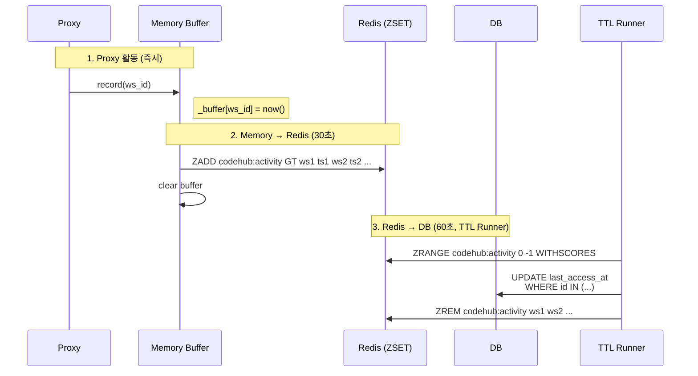
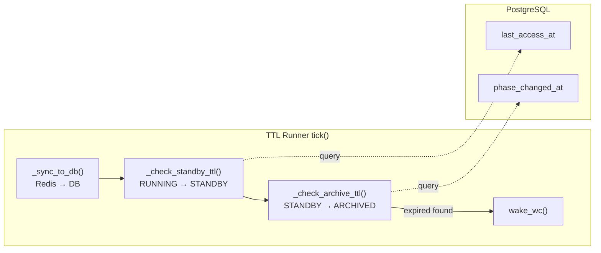
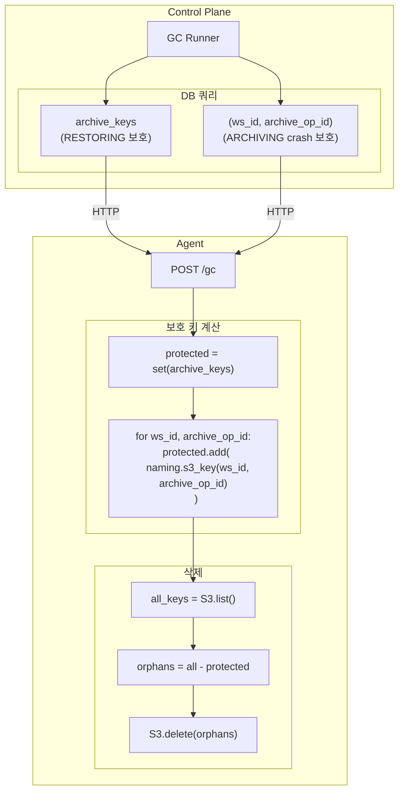

# Lifecycle Management (TTL + GC)

> 워크스페이스 생명주기 관리: TTL 기반 상태 전환 및 orphan archive 정리
>
> **관련**: [wc.md](./wc.md) (WorkspaceController), [coordinator-runtime.md](./coordinator-runtime.md)

---

## 개요

Lifecycle 관리는 두 가지 Runner로 구성됩니다:

| Runner | 역할 | 주기 |
|--------|------|------|
| **TTL Runner** | 활동 기반 STANDBY 전환, 시간 기반 ARCHIVE 전환 | 60초 |
| **GC Runner** | orphan archive 정리 | 4시간 |

---

# TTL Runner

## TTL 유형

| TTL 유형 | 트리거 상태 | 기준 컬럼 | 의미 |
|----------|-------------|-----------|------|
| standby_ttl | RUNNING | `last_access_at` | 마지막 활동 후 N분 → STANDBY |
| archive_ttl | STANDBY | `phase_changed_at` | STANDBY 전환 후 N시간 → ARCHIVED |

---

## 스토리지 역할 분리

| 스토리지 | 역할 | 용도 |
|----------|------|------|
| 메모리 | 쓰기 버퍼 | Proxy 활동 즉시 기록 |
| Redis | 쓰기 버퍼 | 메모리 → Redis 벌크 전송 |
| **DB** | **TTL 판단 기준** | 모든 TTL 체크 (Single Source of Truth) |

> **핵심**: Redis는 쓰기 버퍼일 뿐, TTL 체크는 항상 DB 기준

---

## 데이터 흐름

### Activity Tracking (3단계 버퍼링)



> **ZSET 패턴**: score=timestamp로 자동 정렬, 동일 ws_id는 최신 timestamp로 덮어쓰기

### TTL Check Flow



---

## TTL 판단 기준

### standby_ttl (RUNNING → STANDBY)

```sql
UPDATE workspaces
SET desired_state = 'STANDBY'
WHERE phase = 'RUNNING'
  AND operation = 'NONE'
  AND desired_state = 'RUNNING'  -- CAS 보호: 사용자 의도 덮어쓰기 방지
  AND deleted_at IS NULL
  AND last_access_at IS NOT NULL
  AND NOW() - last_access_at > make_interval(secs := :ttl_standby_seconds)
RETURNING id
```

| 필드 | 설명 |
|------|------|
| `last_access_at` | 마지막 활동 시점 (Proxy → Buffer → DB) |
| `TTL_STANDBY_SECONDS` | 환경변수 (기본: 600초 = 10분) |

### archive_ttl (STANDBY → ARCHIVED)

```sql
UPDATE workspaces
SET desired_state = 'ARCHIVED'
WHERE phase = 'STANDBY'
  AND operation = 'NONE'
  AND desired_state = 'STANDBY'  -- CAS 보호: 사용자 의도 덮어쓰기 방지
  AND deleted_at IS NULL
  AND phase_changed_at IS NOT NULL
  AND NOW() - phase_changed_at > make_interval(secs := :ttl_archive_seconds)
RETURNING id
```

| 필드 | 설명 |
|------|------|
| `phase_changed_at` | STANDBY 전환 시점 (WC 소유) |
| `TTL_ARCHIVE_SECONDS` | 환경변수 (기본: 1800초 = 30분) |

---

## 컬럼 소유자

| 컬럼 | 소유자 | 업데이트 시점 |
|------|--------|---------------|
| `last_access_at` | TTL Runner | Redis → DB 동기화 시 |
| `phase_changed_at` | WC | phase 변경 시 (CASE WHEN) |
| `desired_state` | TTL Runner | TTL 만료 시 |

---

## Activity 정의

`last_access_at`는 사용자가 워크스페이스에서 **실제 작업**을 할 때 업데이트됩니다.

| 행동 | 감지 여부 | 설명 |
|------|:--------:|------|
| 코드 타이핑 | O | WebSocket 메시지 (키 입력) |
| 터미널 출력 | O | WebSocket 메시지 (stdout/stderr) |
| 파일 저장 | O | WebSocket 메시지 또는 HTTP 요청 |
| 파일 탐색 | O | HTTP 요청 (파일 목록 조회) |
| 탭만 열어둠 | X | 네트워크 트래픽 없음 |
| 브라우저 최소화 | X | 네트워크 트래픽 없음 |

---

## 주기 및 타이밍

| 컴포넌트 | 환경변수 | 기본값 | 설명 |
|----------|----------|--------|------|
| Memory → Redis flush | `ACTIVITY_FLUSH_INTERVAL` | 30초 | Proxy 인스턴스별 |
| TTL Runner tick | `COORDINATOR_TTL_INTERVAL` | 60초 | Redis → DB + TTL 체크 |

### 최악의 경우 지연

| 시나리오 | 최대 지연 |
|----------|----------|
| 활동 → DB 반영 | 30초(flush) + 60초(sync) = 90초 |
| TTL 만료 → desired_state 변경 | 60초 (tick 주기) |

---

# GC Runner

## 개요

GC Runner는 S3에서 orphan archive를 탐지하고 삭제합니다.

| 항목 | 설명 |
|------|------|
| 역할 | orphan archive 정리 |
| 주기 | 4시간 |
| 보호 대상 | archive_key + archive_op_id 경로 |

---

## 아키텍처



---

## 두 가지 보호 유형

| 보호 대상 | 목적 | 시나리오 |
|----------|------|---------|
| `archive_key` | 실제 존재하는 아카이브 보호 | RESTORING 중 복원 대상 파일 |
| `archive_op_id` 경로 | ARCHIVING crash 대비 | archive → delete → crash → persist 안 됨 |

### 보호 로직

```python
# Control Plane (scheduler_gc.py)
# 1. archive_key 조회 (RESTORING 대상 보호)
archive_keys = SELECT archive_key FROM workspaces
               WHERE archive_key IS NOT NULL AND deleted_at IS NULL

# 2. (ws_id, archive_op_id) 조회 (ARCHIVING crash 대비)
protected_workspaces = SELECT id, archive_op_id FROM workspaces
                       WHERE archive_op_id IS NOT NULL AND deleted_at IS NULL

# Agent (storage.py)
# 보호 키 계산
protected_keys = set(archive_keys)
for ws_id, archive_op_id in protected_workspaces:
    protected_keys.add(naming.archive_s3_key(ws_id, archive_op_id))

# 삭제
all_keys = S3.list_objects(prefix)
orphans = all_keys - protected_keys
S3.delete_objects(orphans)
```

### 시나리오별 보호

| 시나리오 | DB 상태 | 보호 키 |
|---------|--------|---------|
| RESTORING | archive_key="ws/op-aaa/...", archive_op_id="op-bbb" | archive_key 값 + archive_op_id 경로 |
| ARCHIVING 완료 | archive_key="ws/op-ccc/...", archive_op_id="op-ccc" | 둘 다 같은 경로 |
| ARCHIVING crash | archive_key=NULL, archive_op_id="op-ddd" | archive_op_id 경로만 |

---

## 참조

- [wc.md](./wc.md) - WorkspaceController (phase 변경 주체)
- [coordinator-runtime.md](./coordinator-runtime.md) - Coordinator 공통 인프라
- [04-control-plane.md](../spec/04-control-plane.md) - Control Plane 스펙
- [05-data-plane.md](../spec/05-data-plane.md#gc-runner) - GC Runner 스펙
- [00-contracts.md](../spec/00-contracts.md#9-gc-separation--protection) - GC 계약
