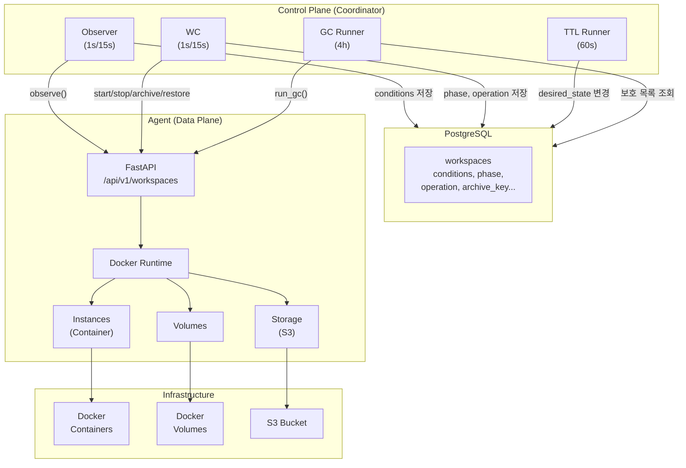
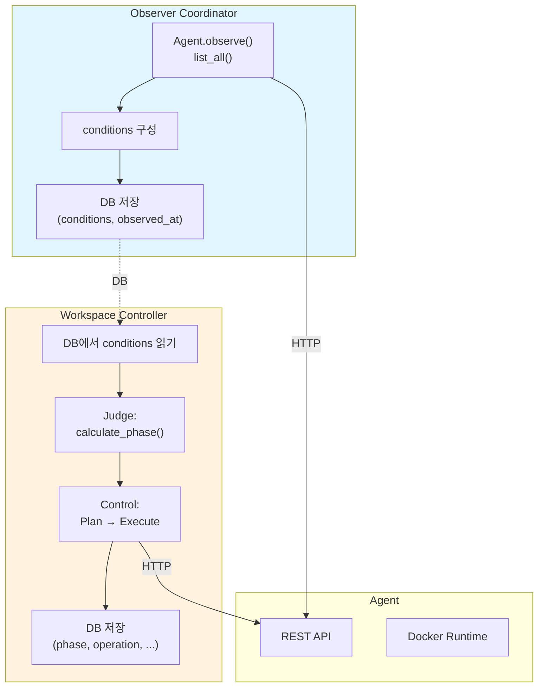

# Architecture Overview

> Control Plane + Data Plane 전체 아키텍처

---

## 전체 구조

---

## 컴포넌트 역할

| 컴포넌트 | 역할 | 주기 |
|----------|------|------|
| **Observer** | 리소스 관측 → conditions DB 저장 | 1s/15s |
| **WC** | phase 계산 + operation 실행 | 1s/15s |
| **TTL Runner** | 비활성 워크스페이스 상태 전환 | 60s |
| **GC Runner** | orphan archive 정리 | 4h |
| **Agent** | Docker/S3 실제 작업 수행 | on-demand |

---

## 컬럼 소유권 (Single Writer)

| Coordinator | 소유 컬럼 |
|-------------|----------|
| **Observer** | conditions, observed_at |
| **WC** | phase, operation, op_started_at, archive_op_id, archive_key, error_count, error_reason, home_ctx |
| **TTL Runner** | last_access_at (sync), desired_state (TTL 만료 시) |
| **API** | desired_state (사용자 요청) |

---

## Observer + WC 분리

---

## 참조

- [wc.md](./wc.md) - WorkspaceController 상세
- [wc-observer.md](./wc-observer.md) - Observer Coordinator
- [ttl-manager.md](./ttl-manager.md) - TTL Runner
- [gc-runner.md](./gc-runner.md) - GC Runner
