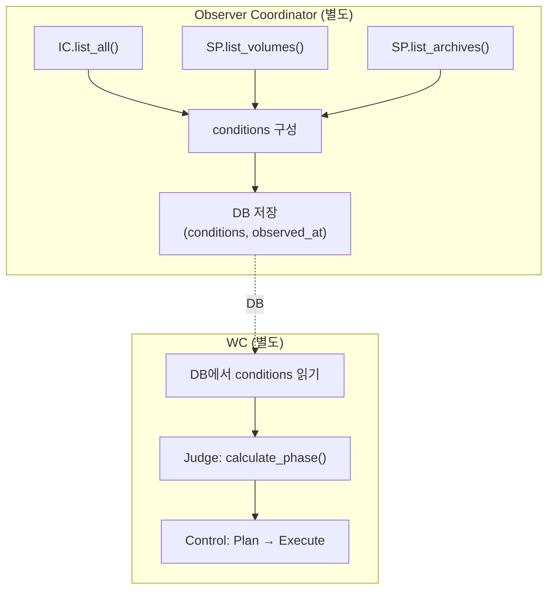

# Observer Coordinator

> 리소스 관측 → conditions DB 저장
>
> **관련**: [wc.md](./wc.md) (WorkspaceController)

---

## 개요

Observer Coordinator는 **별도 Coordinator**로, 리소스(Container, Volume, Archive)를 벌크 관측하여 DB에 저장합니다.

| 역할 | 입력 | 출력 |
|------|------|------|
| **Observe** | IC, SP | conditions |
| **Persist** | conditions | DB (workspaces.conditions) |

> **Single Writer**: Observer만 conditions, observed_at 소유

---

## 아키텍처

> **Level-Triggered**: Observer가 리소스 관측 → DB 저장, WC는 DB만 읽음

---

## 소유 컬럼 (Single Writer)

| Coordinator | 소유 컬럼 |
|-------------|----------|
| **Observer** | conditions, observed_at |
| **WC** | phase, operation, op_started_at, op_id, archive_key, error_count, error_reason, home_ctx |

---

## 성능

| 지표 | Before (개별) | After (벌크) |
|------|--------------|-------------|
| API 호출 | N회 | 3회 |
| 시간 (100 ws) | ~21s | ~500ms |
| 개선율 | - | **~40배** |

---

## 주기

| 모드 | 주기 | 조건 |
|------|------|------|
| Idle | 10s | - |
| Active | 2s | - |
| Hint | 즉시 | Redis `ob:wake` 수신 |

---

## Hint 가속화

| Channel | Publisher | Subscriber | 동작 |
|---------|-----------|------------|------|
| `ob:wake` | API, Proxy | Observer | 즉시 관측 |
| `wc:wake` | Observer | WC | conditions 저장 후 WC 깨움 |

---

## 인터페이스

### InstanceController

| 메서드 | 비고 |
|--------|------|
| `list_all(prefix)` | 벌크 컨테이너 조회 |

### StorageProvider

| 메서드 | 비고 |
|--------|------|
| `list_volumes(prefix)` | 벌크 볼륨 조회 |
| `list_archives(prefix)` | 벌크 아카이브 조회 |

---

## 참조

- [wc.md](./wc.md) - WC 전체 설계
- [00-contracts.md](../spec_v2/00-contracts.md) - 계약 #1 (Reality vs DB), #3 (Single Writer)
- [04-control-plane.md](../spec_v2/04-control-plane.md) - Coordinator 정의
