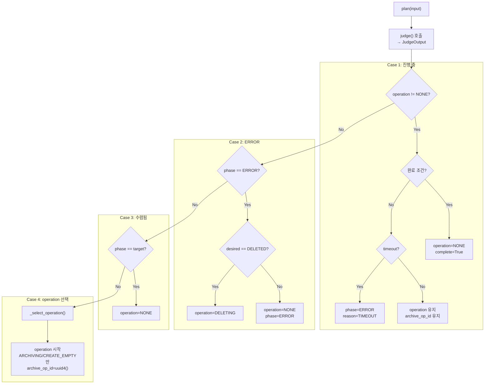
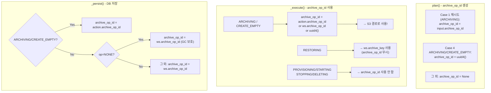
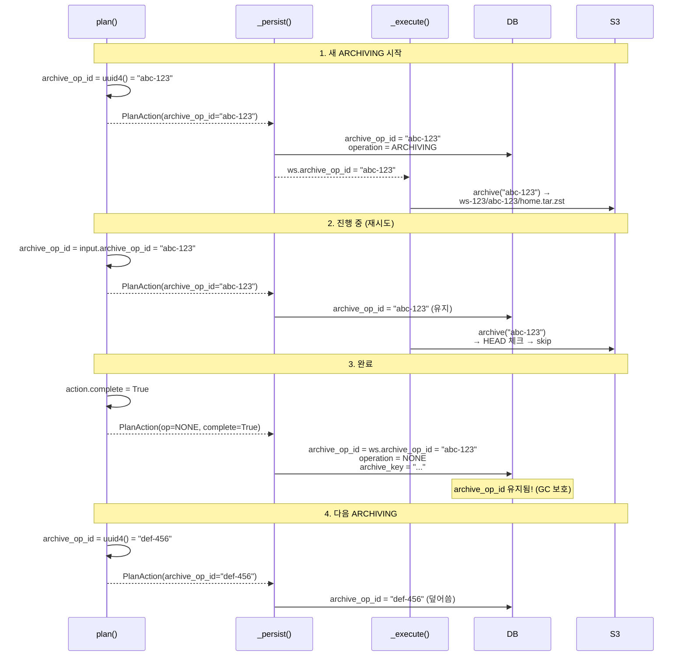

# WC Planner

> operation 결정 및 archive_op_id 관리

---

## 개요

WC Planner는 순수 함수로 operation을 결정합니다.

| 입력 | 출력 |
|------|------|
| PlanInput (phase, operation, desired_state, conditions, ...) | PlanAction (operation, phase, archive_op_id, ...) |

---

## Plan 로직

---

## archive_op_id 생성 vs 사용

---

## archive_op_id 실제 사용 여부

| Operation | plan() 생성 | _execute() 사용 | 용도 |
|-----------|-------------|----------------|------|
| PROVISIONING | - | - | - |
| RESTORING | - | - (archive_key 사용) | - |
| STARTING | - | - | - |
| STOPPING | - | - | - |
| **ARCHIVING** | **uuid4()** | **S3 경로** | 멱등성 |
| **CREATE_EMPTY** | **uuid4()** | **S3 경로** | 멱등성 |
| DELETING | - | - | - |

> **핵심**: `archive_op_id`는 ARCHIVING/CREATE_EMPTY_ARCHIVE에서만 생성/사용됨

---

## archive_op_id 생명주기

---

## archive_op_id 요약

| 시점 | archive_op_id 값 | 코드 위치 | 이유 |
|------|-----------------|----------|------|
| ARCHIVING/CREATE_EMPTY 시작 | `uuid4()` | wc_planner.py | 새 S3 경로 |
| 진행 중 (재시도) | 기존 값 | wc_planner.py | 멱등성 |
| **완료 시** | **기존 값** | wc.py | **GC 보호** |
| 다음 ARCHIVING | `uuid4()` | wc_planner.py | 새 S3 경로 |
| 다른 Operation | N/A | - | 사용 안 함 |

---

## 참조

- [wc.md](./wc.md) - WorkspaceController 전체
- [wc-judge.md](./wc-judge.md) - Judge 로직
- [gc-runner.md](./gc-runner.md) - GC 보호 로직
