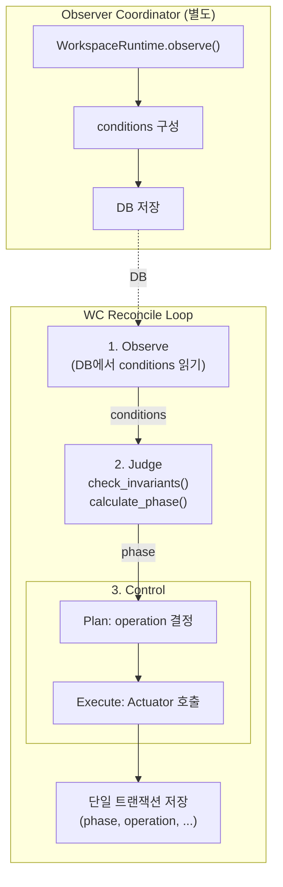
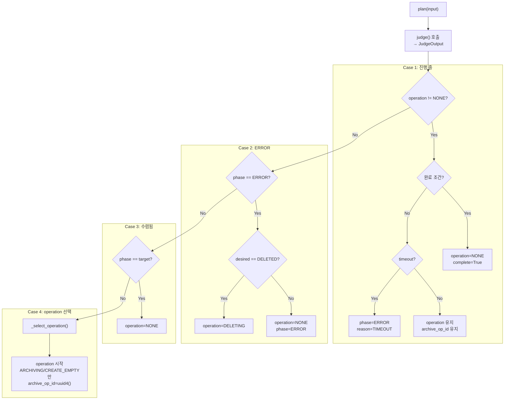
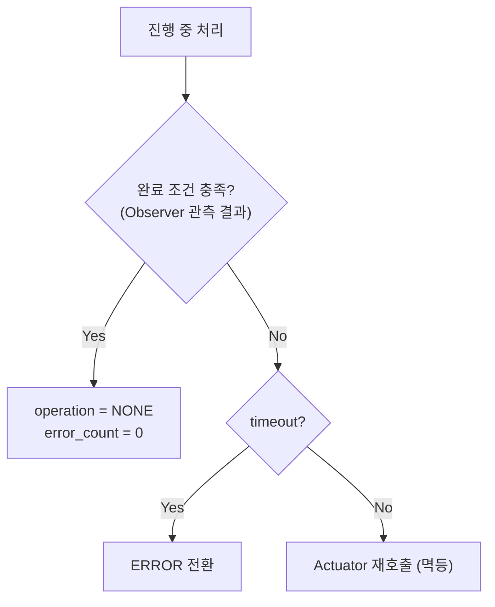

# WorkspaceController

> WorkspaceController의 Judge/Control 로직 설계
>
> **관련**: [wc-observer.md](./wc-observer.md) (Observer Coordinator)

---

## 개요

WC는 워크스페이스의 상태를 desired_state로 수렴시키는 컨트롤러입니다.

| 역할 | 입력 | 출력 |
|------|------|------|
| **Observe** | DB | conditions |
| **Judge** | conditions, deleted_at, archive_key | phase |
| **Controller** | phase, desired_state | operation 실행 |

> **Observer Coordinator**: [wc-observer.md](./wc-observer.md) (리소스 관측 → DB 저장)

---

## Reconcile Loop



> **분리**: Observer Coordinator가 리소스 관측, WC는 DB만 읽음 (Level-Triggered)

---

## Judge (판정)

Judge는 conditions를 읽어 phase를 계산하는 **순수 함수**입니다.

```
┌─────────────────────────────────────────────────────────────┐
│                         Judge                                │
├─────────────────────────────────────────────────────────────┤
│  [외부 입력]                    [내부 계산]                   │
│  ────────────                  ────────────                  │
│  • container_ready (Observer)   • policy.healthy ◀── 계산    │
│  • volume_ready (Observer)      • phase ◀── 계산             │
│  • archive_ready (Observer)                                  │
│  • deleted_at (API)                                          │
└─────────────────────────────────────────────────────────────┘
```

> **순수 함수**: 외부 I/O 없음, 같은 입력 → 같은 출력

### 판단 순서 (3단계)

Judge는 다음 순서로 phase를 결정합니다. **순서가 우선순위**입니다.

| 순서 | 이름 | 데이터 | 출처 | 역할 |
|------|------|--------|------|------|
| 1 | **사용자 의도** | deleted_at | API (DB) | 삭제 요청 (최우선) |
| 2 | **시스템 판단** | policy.healthy | Judge 계산 (tick 내) | 불변식 준수 여부 |
| 3 | **현실** | container_ready, volume_ready, archive_ready | Observer (DB) | 관측된 리소스 상태 |

> **핵심**: 사용자 의도(삭제) > 시스템 안전성(불변식) > 현재 상태

### 불변식 위반 조건 (check_invariants)

| 조건 | reason | 설명 |
|------|--------|------|
| container_ready ∧ !volume_ready | ContainerWithoutVolume | 계약 #6 위반 |

> **Spec 참조**: [03-schema.md#policy.healthy=false 조건](../spec/03-schema.md#policyhealthyfalse-조건)

### Phase 결정 테이블

| 순서 | 체크 | 조건 | 결과 Phase |
|------|------|------|------------|
| 1 | deleted_at | deleted_at ∧ resources | DELETING |
| 1 | deleted_at | deleted_at ∧ !resources | DELETED |
| 2 | healthy | !healthy | ERROR |
| 3 | resources | container ∧ volume | RUNNING |
| 3 | resources | volume | STANDBY |
| 3 | resources | archive | ARCHIVED |
| 4 | default | - | PENDING |

> **resources**: `container_ready ∨ volume_ready ∨ archive_ready`

### Phase 결정 흐름도

```
deleted_at? ──Yes──▶ resources? ──Yes──▶ DELETING
    │                    │
    │                   No
    │                    ▼
    │               DELETED
    │
   No
    ▼
healthy? ──No──▶ ERROR
    │
   Yes
    ▼
container ∧ volume? ──Yes──▶ RUNNING
    │
   No
    ▼
volume? ──Yes──▶ STANDBY
    │
   No
    ▼
archive? ──Yes──▶ ARCHIVED
    │
   No
    ▼
PENDING
```

---

## Control (제어 + 저장)

### 핵심 원칙

| 원칙 | 설명 |
|------|------|
| **Actuator 성공 ≠ 완료** | Actuator 반환값이 아닌 **Observer 관측 결과**로 완료 판정 |
| **단일 트랜잭션** | 관측/판정/제어 결과를 한 번에 저장 (원자성) |
| **멱등성** | 모든 Actuator는 멱등. 재시도해도 안전 |

> **계약 #1**: "실제 리소스가 진실, DB는 마지막 관측치"

### Plan (판단)

phase와 desired_state의 차이를 해소하기 위한 operation을 결정합니다.



#### 진행 중 처리



#### Operation 선택 (수렴)

| 현재 Phase | desired | Operation | 방향 |
|-----------|---------|-----------|------|
| PENDING | ARCHIVED | CREATE_EMPTY_ARCHIVE | step_up |
| PENDING | STANDBY+ | PROVISIONING | step_up |
| ARCHIVED | STANDBY+ | RESTORING | step_up |
| STANDBY | RUNNING | STARTING | step_up |
| RUNNING | STANDBY- | STOPPING | step_down |
| STANDBY | ARCHIVED | ARCHIVING | step_down |

> STANDBY+: STANDBY 또는 RUNNING
> STANDBY-: STANDBY 또는 ARCHIVED

### Execute (실행)

Plan에서 결정된 operation에 따라 Actuator를 호출합니다.

| Operation | Actuator | 완료 조건 (Observer 관측) |
|-----------|----------|-------------------------|
| PROVISIONING | `SP.provision()` | volume_ready == true |
| RESTORING | `SP.restore()` | volume_ready ∧ restore_marker == archive_key |
| STARTING | `IC.start()` | container_ready == true |
| STOPPING | `IC.delete()` | container_ready == false |
| ARCHIVING | `SP.archive()` → `SP.delete_volume()` | !volume_ready ∧ archive_ready ∧ archive_key |
| CREATE_EMPTY_ARCHIVE | `SP.create_empty_archive()` | archive_ready == true |
| DELETING | `IC.delete()` → `SP.delete_volume()` | !container_ready ∧ !volume_ready |

> **다단계 Operation**: ARCHIVING, DELETING은 2단계. 각 단계 멱등, 순서 보장 (계약 #8)

### archive_op_id 관리

archive_op_id는 ARCHIVING/CREATE_EMPTY_ARCHIVE에서만 사용됩니다.

| Operation | plan() 생성 | _execute() 사용 | 용도 |
|-----------|-------------|----------------|------|
| PROVISIONING | - | - | - |
| RESTORING | - | - (archive_key 사용) | - |
| STARTING | - | - | - |
| STOPPING | - | - | - |
| **ARCHIVING** | **uuid4()** | **S3 경로** | 멱등성 |
| **CREATE_EMPTY** | **uuid4()** | **S3 경로** | 멱등성 |
| DELETING | - | - | - |

| 시점 | archive_op_id 값 | 이유 |
|------|-----------------|------|
| ARCHIVING/CREATE_EMPTY 시작 | `uuid4()` | 새 S3 경로 |
| 진행 중 (재시도) | 기존 값 | 멱등성 |
| **완료 시** | **기존 값** | **GC 보호** |
| 다음 ARCHIVING | `uuid4()` | 새 S3 경로 |

### Persist (저장)

모든 변경사항을 **단일 트랜잭션**으로 DB에 저장합니다.

#### 저장 대상

| 단계 | 역할 |
|------|------|
| Observe | DB에서 conditions 읽기 (저장 없음) |
| Judge | phase 계산 |
| Control | phase, operation, op_started_at, archive_op_id, archive_key, error_count, error_reason, home_ctx 저장 |

> **Note**: conditions, observed_at은 Observer Coordinator가 저장

#### CAS 패턴

```sql
UPDATE workspaces
SET phase        = $phase,
    operation    = $operation,
    op_started_at = $op_started_at,
    archive_op_id = $archive_op_id,
    archive_key  = $archive_key,
    error_count  = $error_count,
    error_reason = $error_reason,
    home_ctx     = $home_ctx
WHERE id = $ws_id
  AND operation = $expected_op   -- CAS 조건
RETURNING id;
```

#### CAS 실패 시

| 상황 | 동작 |
|------|------|
| affected_rows == 0 | 이번 tick skip → 다음 tick 재시도 (Level-Triggered) |

> **안전망**: 파티셔닝 실패해도 CAS가 정합성 보장

---

## ERROR 처리

### ERROR 발생 경로

ERROR는 **두 경로**에서 발생합니다.

| 경로 | 주체 | 트리거 | 설정 필드 |
|------|------|--------|----------|
| 경로 1 | **Judge** | 불변식 위반 | policy.healthy.reason |
| 경로 2 | **Control** | 작업 실패 (Timeout, ActionFailed 등) | error_reason 컬럼 |

### ERROR 전환

WC가 에러 감지 시 단일 트랜잭션으로 원자적 전환:

| 필드 | 값 |
|------|---|
| phase | ERROR |
| operation | NONE |
| error_reason | ActionFailed, Timeout, ... |
| error_count | +1 |

> **불변식**: Phase=ERROR → operation=NONE

### ERROR 복구

관리자가 수동으로 리셋:

| 필드 | 리셋 값 |
|------|--------|
| error_reason | NULL |
| error_count | 0 |

> operation은 이미 NONE이므로 리셋 불필요
> 다음 reconcile에서 WC가 phase 재계산

---

## 주기

| 모드 | 주기 | 조건 |
|------|------|------|
| Idle | 15s | operation == NONE (`COORDINATOR_IDLE_INTERVAL`) |
| Active | 1s | operation != NONE (`COORDINATOR_ACTIVE_INTERVAL`) |
| Hint | 즉시 | Redis `codehub:wake:wc` 수신 |

---

## 인스턴스 분배 (Partitioning)

### 원칙

| 항목 | 값 |
|------|---|
| 정의 | workspace당 동시에 하나의 WC 인스턴스만 처리 |
| 목적 | Actuator 중복 호출 방지, CAS 충돌 최소화 |

### 분배 전략

| 방식 | 설명 | 비고 |
|------|------|------|
| Hash 파티셔닝 | `hash(workspace_id) % N` | 단순, 리밸런싱 시 재분배 |
| Consistent Hashing | 해시 링 기반 분배 | 노드 추가/제거 시 최소 재분배 |

> **단일 인스턴스**: 개발/소규모 배포 시 파티셔닝 불필요

### CAS와의 관계

| 상황 | 동작 |
|------|------|
| 파티셔닝 정상 | 충돌 없음 |
| 파티셔닝 실패 (동일 WS 중복 처리) | CAS가 한쪽 거부 → 다음 tick 재시도 |

> **안전망**: 파티셔닝은 최적화, CAS가 정합성 보장

---

## 소유 컬럼 (Single Writer)

| 컬럼 | 소유자 |
|------|--------|
| conditions | Observer |
| observed_at | Observer |
| phase | WC |
| operation | WC |
| op_started_at | WC |
| archive_op_id | WC (ARCHIVING/CREATE_EMPTY만 사용) |
| archive_key | WC |
| error_count | WC |
| error_reason | WC |
| home_ctx | WC |

---

## 테스트 케이스

### 기본 상태 계산

| ID | conditions | deleted_at | 기대 phase |
|----|------------|------------|-----------|
| JDG-001 | {c:F, v:F, a:F} | N | PENDING |
| JDG-002 | {c:F, v:F, a:T} | N | ARCHIVED |
| JDG-003 | {c:F, v:T, a:F} | N | STANDBY |
| JDG-004 | {c:T, v:T, a:F} | N | RUNNING |

### 불변식 위반

| ID | conditions | 기대 결과 |
|----|------------|----------|
| JDG-005 | {c:T, v:F, a:F} | ERROR (ContainerWithoutVolume) |

### 삭제 처리

| ID | conditions | deleted_at | 기대 phase |
|----|------------|------------|-----------|
| JDG-006 | {c:T, v:T} | Y | DELETING |
| JDG-007 | {c:F, v:F} | Y | DELETED |

---

## 참조

- [wc-observer.md](./wc-observer.md) - Observer Coordinator 설계
- [00-contracts.md](../spec/00-contracts.md) - 핵심 계약
- [02-states.md](../spec/02-states.md) - 상태 정의
- [04-control-plane.md](../spec/04-control-plane.md) - WC 스펙
- [lifecycle.md](./lifecycle.md) - TTL/GC (리소스 생명주기)
