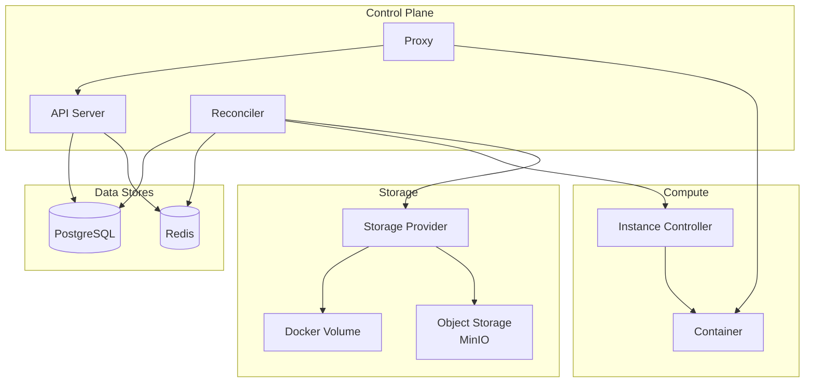

# M2 Architecture

> M2 마일스톤을 위한 아키텍처 문서

---

## 개요

M2는 완성형 아키텍처를 구축합니다. 핵심 변경사항:

- **Reconciler 도입**: 선언적 상태 관리
- **Ordered State Machine**: 순차적 상태 전환
- **Object Storage 연동**: COLD 상태 지원

---

## 구성요소

---

## 문서 목록

| 문서 | 설명 |
|------|------|
| [states.md](./states.md) | 상태 다이어그램 및 전환 규칙 |
| [package-design.md](./package-design.md) | 패키지 분리 설계 (Core/Control/Adapters) |
| [data-flow.md](./data-flow.md) | 데이터 흐름 (Container ↔ Storage) |
| [reconciler.md](./reconciler.md) | Reconciler 상세 설계 |

---

## 참조

- [spec_v2/](../spec_v2/) - M2 스펙
- [ADR-006: Reconciler 패턴](../adr/006-reconciler-pattern.md)
- [ADR-007: Reconciler 구현](../adr/007-reconciler-implementation.md)
- [ADR-008: Ordered State Machine](../adr/008-ordered-state-machine.md)
