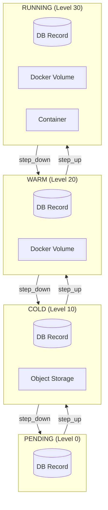
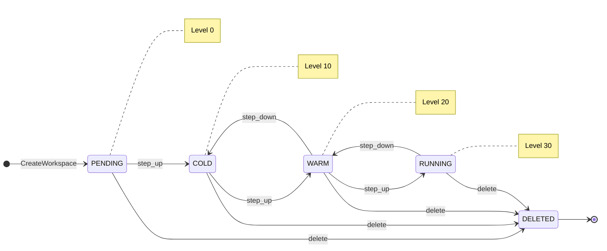
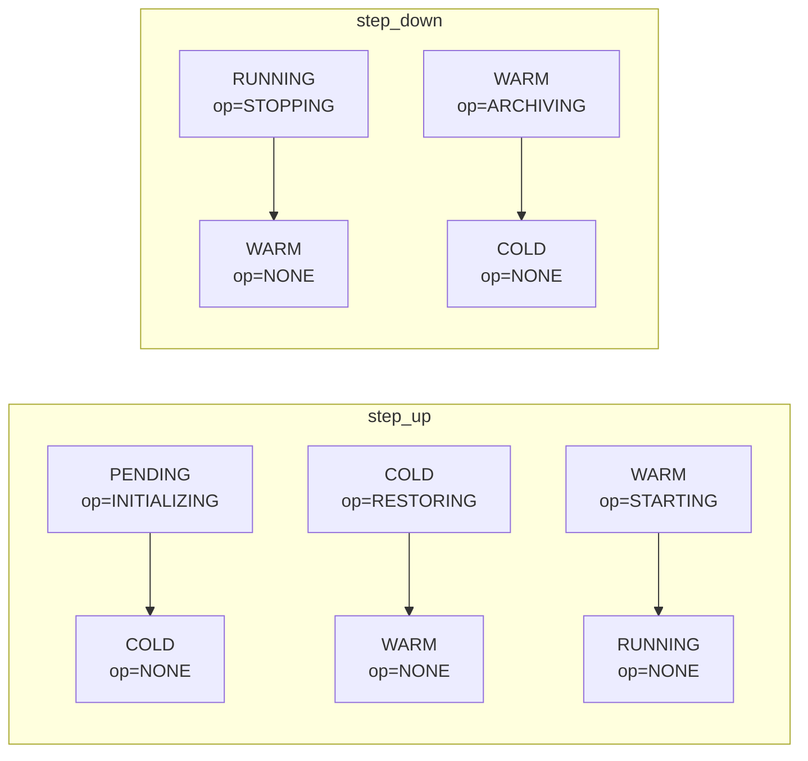
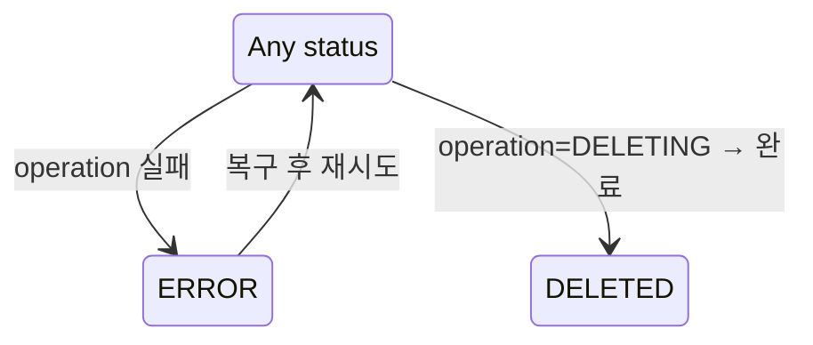
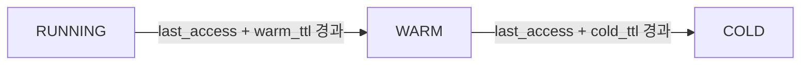
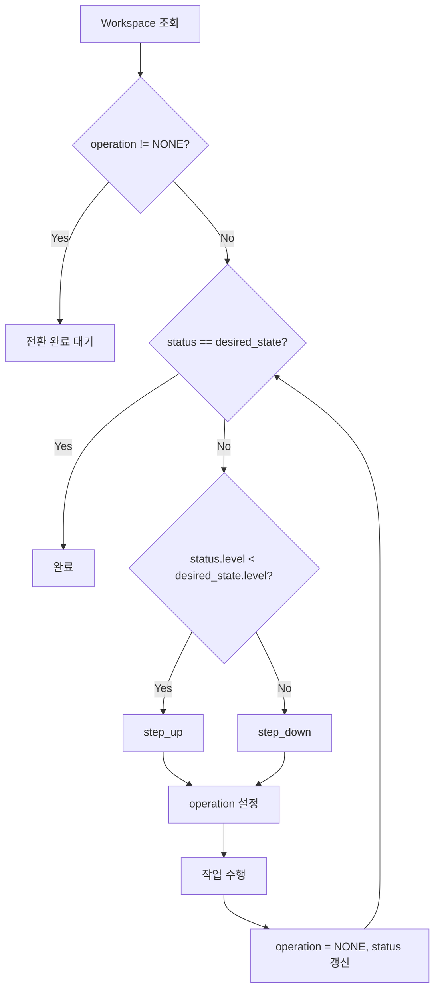

# Workspace 상태 아키텍처 (M2)

> [README.md](./README.md)로 돌아가기

---

## 상태 모델 개요

M2는 **Ordered State Machine** 패턴을 사용하며, **status + operation** 모델로 상태를 표현합니다.

### 핵심 상태 (status)

```
레벨:    0         10        20        30
       PENDING → COLD → WARM → RUNNING
               ←      ←      ←
```

| status | 레벨 | 리소스 |
|--------|------|--------|
| PENDING | 0 | DB Record만 |
| COLD | 10 | + Object Storage |
| WARM | 20 | + Docker Volume |
| RUNNING | 30 | + Container |
| ERROR | -1 | 예외 상태 |
| DELETED | -2 | 소프트 삭제 |

### 진행 중인 작업 (operation)

| operation | 전환 방향 |
|-----------|----------|
| NONE | 안정 상태 |
| INITIALIZING | PENDING → COLD |
| RESTORING | COLD → WARM |
| STARTING | WARM → RUNNING |
| STOPPING | RUNNING → WARM |
| ARCHIVING | WARM → COLD |
| DELETING | * → DELETED |

> 상세 스펙은 [spec_v2/states.md](../spec_v2/states.md) 참조

---

## 상태별 리소스



---

## 전체 상태 다이어그램

### status 전환 (단순화)



### 전환 중 상태 표현 (status + operation)



### 에러/삭제 흐름



---

## 상태 전환 규칙

### step_up (활성화 방향)

| status | operation | 완료 후 status | 동작 |
|--------|-----------|---------------|------|
| PENDING | INITIALIZING | COLD | 메타데이터 초기화 |
| COLD | RESTORING | WARM | archive_key → Volume |
| WARM | STARTING | RUNNING | Container 시작 |

### step_down (비활성화 방향)

| status | operation | 완료 후 status | 동작 |
|--------|-----------|---------------|------|
| RUNNING | STOPPING | WARM | Container 정지 |
| WARM | ARCHIVING | COLD | Volume → Object Storage |
| COLD | - | PENDING | (일반적으로 미사용) |

---

## TTL 기반 자동 전환



| 파라미터 | 기본값 | 설명 |
|----------|--------|------|
| warm_ttl_seconds | 1800 (30분) | RUNNING → WARM |
| cold_ttl_seconds | 604800 (7일) | WARM → COLD |

---

## Reconciler 수렴 동작



### 단순화된 레벨 비교

```python
# status.level로 직접 비교 (전이 상태 매핑 불필요)
current_level = status.level  # PENDING=0, COLD=10, WARM=20, RUNNING=30
is_transitioning = operation != NONE
```

### 예시: COLD → RUNNING

```
desired_state = RUNNING (Level 30)
status = COLD (Level 10), operation = NONE

1. operation == NONE → 비교 진행
2. COLD.level(10) < RUNNING.level(30) → step_up
3. operation = RESTORING, 작업 수행
4. status = WARM, operation = NONE
5. WARM.level(20) < RUNNING.level(30) → step_up
6. operation = STARTING, 작업 수행
7. status = RUNNING, operation = NONE
8. RUNNING == RUNNING → 완료
```

---

## 참조

- [ADR-008: Ordered State Machine](../adr/008-ordered-state-machine.md)
- [spec_v2/states.md](../spec_v2/states.md)
- [reconciler.md](./reconciler.md)
