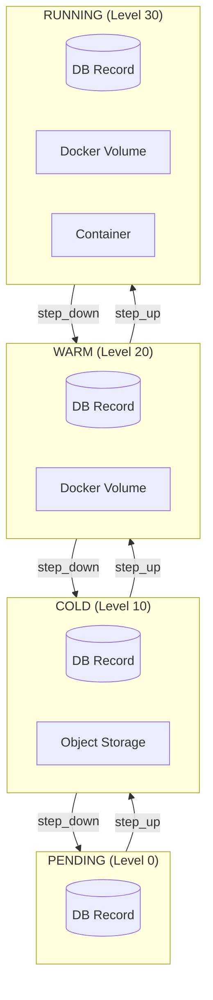
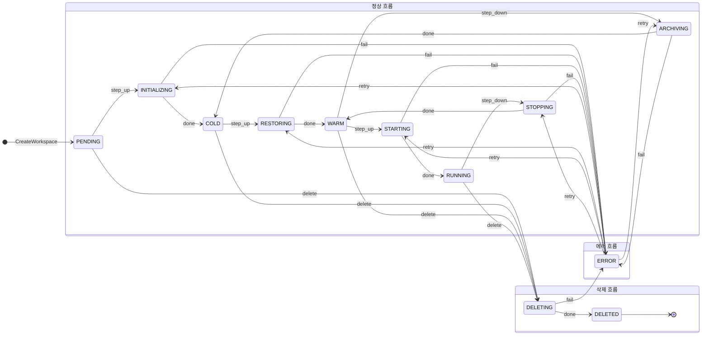
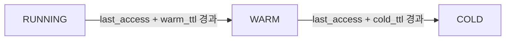
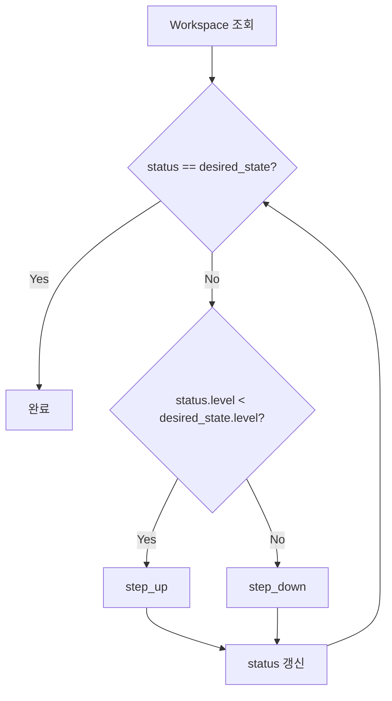

# Workspace 상태 아키텍처 (M2)

> [README.md](./README.md)로 돌아가기

---

## 상태 모델 개요

M2는 **Ordered State Machine** 패턴을 사용합니다.

```
레벨:    0         10        20        30
       PENDING → COLD → WARM → RUNNING
               ←      ←      ←
```

> 상세 스펙은 [spec_v2/states.md](../spec_v2/states.md) 참조

---

## 상태별 리소스



---

## 전체 상태 다이어그램



---

## 상태 전환 규칙

### step_up (활성화 방향)

| 현재 | 전이 상태 | 다음 | 동작 |
|------|-----------|------|------|
| PENDING | INITIALIZING | COLD | 메타데이터 초기화 |
| COLD | RESTORING | WARM | archive_key → Volume |
| WARM | STARTING | RUNNING | Container 시작 |

### step_down (비활성화 방향)

| 현재 | 전이 상태 | 다음 | 동작 |
|------|-----------|------|------|
| RUNNING | STOPPING | WARM | Container 정지 |
| WARM | ARCHIVING | COLD | Volume → Object Storage |
| COLD | - | PENDING | (일반적으로 미사용) |

---

## TTL 기반 자동 전환



| 파라미터 | 기본값 | 설명 |
|----------|--------|------|
| warm_ttl_seconds | 1800 (30분) | RUNNING → WARM |
| cold_ttl_seconds | 604800 (7일) | WARM → COLD |

---

## Reconciler 수렴 동작



### 예시: COLD → RUNNING

```
desired_state = RUNNING (Level 30)
status = COLD (Level 10)

1. COLD < RUNNING → step_up
2. COLD → RESTORING → WARM (Level 20)
3. WARM < RUNNING → step_up
4. WARM → STARTING → RUNNING (Level 30)
5. RUNNING == RUNNING → 완료
```

---

## 참조

- [ADR-008: Ordered State Machine](../adr/008-ordered-state-machine.md)
- [spec_v2/states.md](../spec_v2/states.md)
- [reconciler.md](./reconciler.md)
