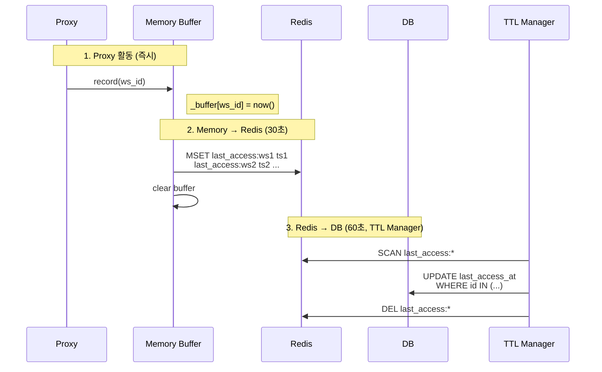
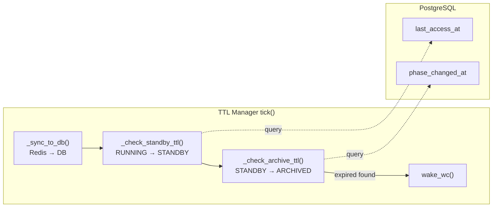
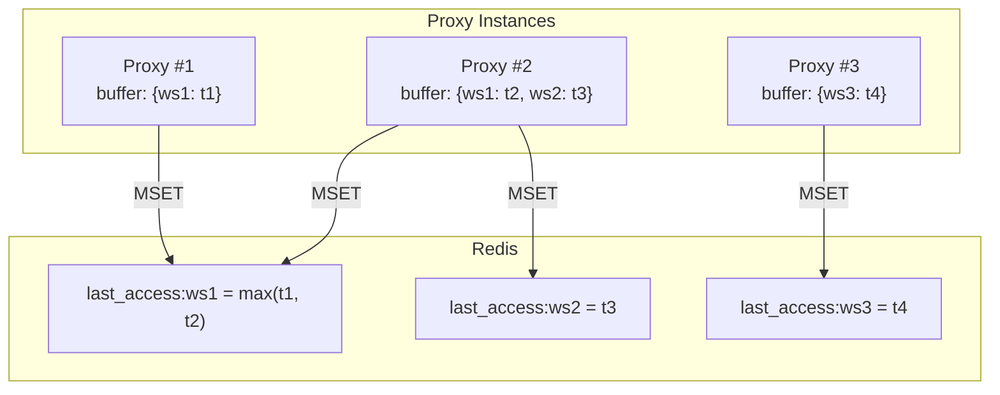
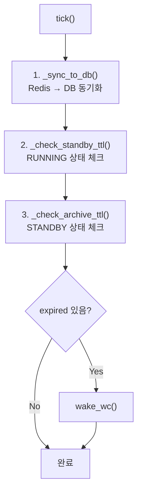
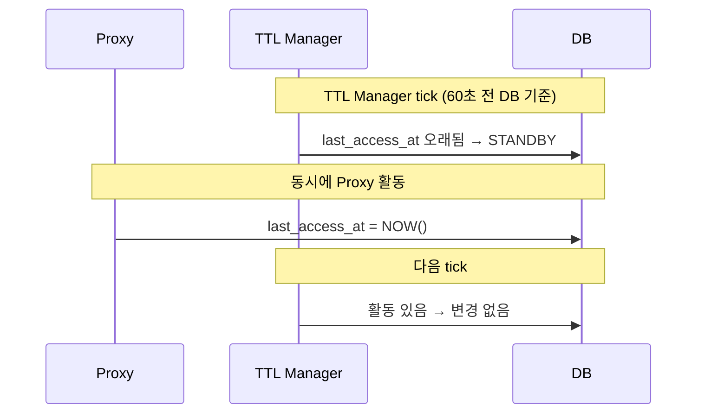

# TTL Manager

> 워크스페이스 TTL 관리: 활동 기반 STANDBY 전환, 시간 기반 ARCHIVE 전환
>
> **관련**: [wc.md](./wc.md) (WorkspaceController), [coordinator-runtime.md](./coordinator-runtime.md)

---

## 개요

TTL Manager는 두 가지 TTL을 관리합니다:

| TTL 유형 | 트리거 상태 | 기준 컬럼 | 의미 |
|----------|-------------|-----------|------|
| standby_ttl | RUNNING | `last_access_at` | 마지막 활동 후 N분 → STANDBY |
| archive_ttl | STANDBY | `phase_changed_at` | STANDBY 전환 후 N시간 → ARCHIVED |

---

## 스토리지 역할 분리

| 스토리지 | 역할 | 용도 |
|----------|------|------|
| 메모리 | 쓰기 버퍼 | Proxy 활동 즉시 기록 |
| Redis | 쓰기 버퍼 | 메모리 → Redis 벌크 전송 |
| **DB** | **TTL 판단 기준** | 모든 TTL 체크 (Single Source of Truth) |

> **핵심**: Redis는 쓰기 버퍼일 뿐, TTL 체크는 항상 DB 기준

---

## 데이터 흐름

### Activity Tracking (3단계 버퍼링)



### TTL Check Flow



---

## TTL 판단 기준

### standby_ttl (RUNNING → STANDBY)

```sql
SELECT id FROM workspaces
WHERE phase = 'RUNNING'
  AND operation = 'NONE'
  AND deleted_at IS NULL
  AND NOW() - last_access_at > make_interval(secs := standby_ttl_seconds)
```

| 필드 | 설명 |
|------|------|
| `last_access_at` | 마지막 활동 시점 (Proxy → Buffer → DB) |
| `standby_ttl_seconds` | 유휴 허용 시간 (기본: 300초) |

### archive_ttl (STANDBY → ARCHIVED)

```sql
SELECT id FROM workspaces
WHERE phase = 'STANDBY'
  AND operation = 'NONE'
  AND deleted_at IS NULL
  AND NOW() - phase_changed_at > make_interval(secs := archive_ttl_seconds)
```

| 필드 | 설명 |
|------|------|
| `phase_changed_at` | STANDBY 전환 시점 (WC 소유) |
| `archive_ttl_seconds` | STANDBY 허용 시간 (기본: 86400초 = 24시간) |

---

## 컬럼 소유자

| 컬럼 | 소유자 | 업데이트 시점 |
|------|--------|---------------|
| `last_access_at` | TTL Manager | Redis → DB 동기화 시 |
| `phase_changed_at` | WC | phase 변경 시 (CASE WHEN) |
| `desired_state` | TTL Manager | TTL 만료 시 |

### WC의 phase_changed_at 업데이트

```sql
UPDATE workspaces SET
  phase = :new_phase,
  phase_changed_at = CASE
    WHEN phase != :new_phase THEN NOW()
    ELSE phase_changed_at
  END,
  ...
WHERE id = :id AND operation = :expected_op
```

> phase가 실제로 변경될 때만 `phase_changed_at` 갱신

---

## 다중 Proxy 인스턴스



| 상황 | 동작 | 결과 |
|------|------|------|
| 같은 ws_id에 여러 Proxy가 MSET | 마지막 MSET 값이 저장 | OK (최신값 보장) |
| 순서 역전 (t2 < t1이 나중에 도착) | t2가 덮어씀 | 최대 30초 지연 |

> **허용 가능**: TTL은 분 단위, 30초 오차는 무시 가능

---

## Activity 정의

`last_access_at`는 사용자가 워크스페이스에서 **실제 작업**을 할 때 업데이트됩니다.

### 활동으로 감지되는 행동

| 행동 | 감지 여부 | 설명 |
|------|:--------:|------|
| 코드 타이핑 | ✅ | WebSocket 메시지 (키 입력) |
| 터미널 출력 | ✅ | WebSocket 메시지 (stdout/stderr) |
| 파일 저장 | ✅ | WebSocket 메시지 또는 HTTP 요청 |
| 파일 탐색 | ✅ | HTTP 요청 (파일 목록 조회) |
| 탭만 열어둠 | ❌ | 네트워크 트래픽 없음 |
| 브라우저 최소화 | ❌ | 네트워크 트래픽 없음 |

### 기록 위치

```
Proxy (router.py)
├── HTTP 요청 → record(workspace_id)
└── WebSocket
    ├── 연결 시 → record(workspace_id)
    ├── 클라이언트→백엔드 메시지 → record(workspace_id)
    └── 백엔드→클라이언트 메시지 → record(workspace_id)
```

> **요점**: WebSocket 연결만으로는 활동이 아님. 실제 메시지(타이핑, 출력 등)가 있어야 활동으로 인정

---

## TTL Manager 동작

### tick() 구조



### 단계별 동작

| 단계 | 메서드 | 동작 |
|------|--------|------|
| 1 | `_sync_to_db()` | Redis `last_access:*` → DB `last_access_at` 벌크 업데이트 |
| 2 | `_check_standby_ttl()` | RUNNING + TTL 만료 → `desired_state = STANDBY` |
| 3 | `_check_archive_ttl()` | STANDBY + TTL 만료 → `desired_state = ARCHIVED` |
| 4 | `wake_wc()` | 만료 발견 시 WC에 NOTIFY (빠른 reconcile)

---

## 주기 및 타이밍

| 컴포넌트 | 주기 | 설명 |
|----------|------|------|
| Memory → Redis flush | 30초 | Proxy 인스턴스별 |
| TTL Manager tick | 60초 | Redis → DB + TTL 체크 |

### 최악의 경우 지연

| 시나리오 | 최대 지연 |
|----------|----------|
| 활동 → DB 반영 | 30초(flush) + 60초(sync) = 90초 |
| TTL 만료 → desired_state 변경 | 60초 (tick 주기) |

---

## Edge Cases

### Redis 재시작

| 상황 | 동작 | 결과 |
|------|------|------|
| last_access:* 키 손실 | DB last_access_at 기준 | 정상 (최대 90초 지연) |

> TTL 체크는 DB 기준이므로 Redis 재시작 영향 없음

### Proxy 인스턴스 crash

| 상황 | 동작 | 결과 |
|------|------|------|
| 메모리 버퍼 손실 | Redis/DB에 이전 값 유지 | 최대 30초 지연 |

### 활동 중 TTL 만료



> **결과**: WC가 reconcile할 때 활동 감지 → RUNNING 유지

---

## 참조

- [wc.md](./wc.md) - WorkspaceController (phase 변경 주체)
- [coordinator-runtime.md](./coordinator-runtime.md) - Coordinator 공통 인프라
- [04-control-plane.md](../spec_v2/04-control-plane.md) - Control Plane 스펙
