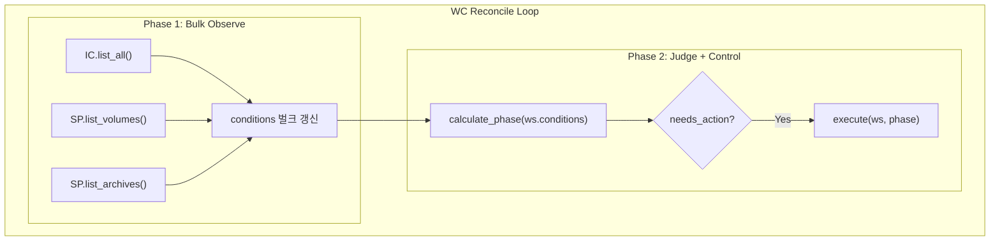

# WC Observer

> WorkspaceController의 벌크 관측 설계
>
> **동기**: 성능 최적화 (개별 관측 → 벌크 관측)

---

## 개요

WC의 Observe 단계를 벌크 방식으로 최적화합니다.

| 항목 | Before | After |
|------|--------|-------|
| 관측 방식 | workspace별 개별 호출 | 전체 리소스 벌크 스캔 |
| API 호출 | N회 (workspace 수) | 3회 (container, volume, archive) |

---

## 스펙 호환성

### 계약 #1 (Reality vs DB)

> "실제 리소스(Container/Volume)가 진실, DB는 마지막 관측치"

- Reality: Container, Volume, Archive (실제 리소스)
- DB: conditions (마지막 관측치)
- **변경 없음** - 관측 방식만 벌크로 변경

### 계약 #3 (Single Writer)

- WC 내부에서 벌크 관측 → conditions 갱신
- **Single Writer 유지**

---

## 아키텍처

---

## 성능 비교

| 지표 | Before | After |
|------|--------|-------|
| API 호출 | N+M회 | 3회 |
| 시간 (100 ws) | ~21s | ~500ms |
| 개선율 | - | **~40배** |

---

## Hint 가속화

| Channel | Publisher | Subscriber | 동작 |
|---------|-----------|------------|------|
| `wc:wake` | API, TTL, Proxy | WC | 즉시 Bulk Observe |

---

## 인터페이스 변경

### InstanceController

| 메서드 | 비고 |
|--------|------|
| `list_all()` | **신규** (벌크 조회) |

### StorageProvider

| 메서드 | 비고 |
|--------|------|
| `list_volumes()` | **신규** |
| `list_archives()` | **신규** |

---

## 참조

- [00-contracts.md](../spec_v2/00-contracts.md) - 계약 #1, #3
- [04-control-plane.md](../spec_v2/04-control-plane.md) - WC 정의
- [wc.md](./wc.md) - WC Judge/Control 로직
