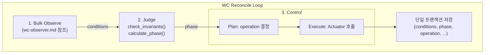
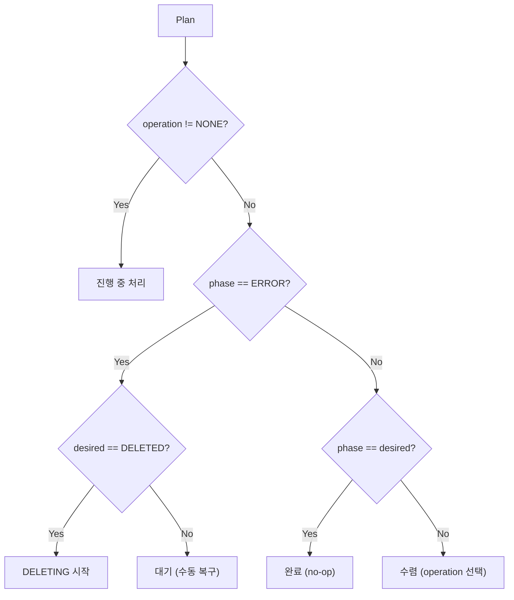
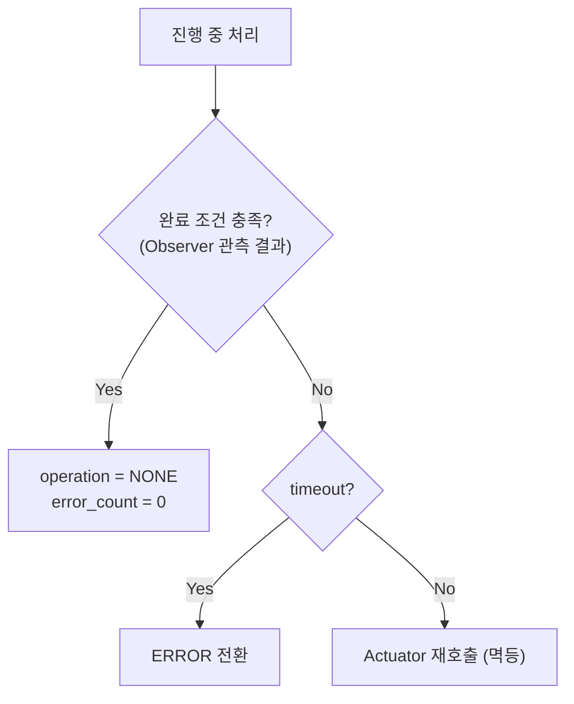

# WorkspaceController

> WorkspaceController의 Judge/Control 로직 설계
>
> **의존**: [wc-observer.md](./wc-observer.md) (Observe 단계)

---

## 개요

WC는 워크스페이스의 상태를 desired_state로 수렴시키는 컨트롤러입니다.

| 역할 | 입력 | 출력 |
|------|------|------|
| **Observer** | IC, SP | conditions |
| **Judge** | conditions, deleted_at, archive_key | phase |
| **Controller** | phase, desired_state | operation 실행 |

> **Observer 상세**: [wc-observer.md](./wc-observer.md)
> **Judge 상세**: [wc-judge.md](./wc-judge.md)

---

## Reconcile Loop



> **원자성**: 관측/판정/제어 결과를 단일 트랜잭션으로 저장

---

## Judge (판정)

> **상세**: [wc-judge.md](./wc-judge.md)

### 역할

| 입력 | 출력 |
|------|------|
| conditions, deleted_at, archive_key | phase, policy.healthy |

### 핵심 로직

| 단계 | 함수 | 역할 |
|------|------|------|
| 1 | check_invariants() | 불변식 위반 → policy.healthy 설정 |
| 2 | calculate_phase() | conditions → phase 계산 |

> **순수 함수**: 외부 I/O 없음, 같은 입력 → 같은 출력

---

## Control (제어 + 저장)

### 핵심 원칙

| 원칙 | 설명 |
|------|------|
| **Actuator 성공 ≠ 완료** | Actuator 반환값이 아닌 **Observer 관측 결과**로 완료 판정 |
| **단일 트랜잭션** | 관측/판정/제어 결과를 한 번에 저장 (원자성) |
| **멱등성** | 모든 Actuator는 멱등. 재시도해도 안전 |

> **계약 #1**: "실제 리소스가 진실, DB는 마지막 관측치"

### Plan (판단)

phase와 desired_state의 차이를 해소하기 위한 operation을 결정합니다.



#### 진행 중 처리



#### Operation 선택 (수렴)

| 현재 Phase | desired | Operation | 방향 |
|-----------|---------|-----------|------|
| PENDING | ARCHIVED | CREATE_EMPTY_ARCHIVE | step_up |
| PENDING | STANDBY+ | PROVISIONING | step_up |
| ARCHIVED | STANDBY+ | RESTORING | step_up |
| STANDBY | RUNNING | STARTING | step_up |
| RUNNING | STANDBY- | STOPPING | step_down |
| STANDBY | ARCHIVED | ARCHIVING | step_down |

> STANDBY+: STANDBY 또는 RUNNING
> STANDBY-: STANDBY 또는 ARCHIVED

### Execute (실행)

Plan에서 결정된 operation에 따라 Actuator를 호출합니다.

| Operation | Actuator | 완료 조건 (Observer 관측) |
|-----------|----------|-------------------------|
| PROVISIONING | `SP.provision()` | volume_ready == true |
| RESTORING | `SP.restore()` | volume_ready ∧ restore_marker == archive_key |
| STARTING | `IC.start()` | container_ready == true |
| STOPPING | `IC.delete()` | container_ready == false |
| ARCHIVING | `SP.archive()` → `SP.delete_volume()` | !volume_ready ∧ archive_ready ∧ archive_key |
| CREATE_EMPTY_ARCHIVE | `SP.create_empty_archive()` | archive_ready == true |
| DELETING | `IC.delete()` → `SP.delete_volume()` | !container_ready ∧ !volume_ready |

> **다단계 Operation**: ARCHIVING, DELETING은 2단계. 각 단계 멱등, 순서 보장 (계약 #8)

### Persist (저장)

모든 변경사항을 **단일 트랜잭션**으로 DB에 저장합니다.

#### 저장 대상

| 출처 | 저장 컬럼 |
|------|----------|
| Observer | conditions, observed_at |
| Judge | phase |
| Control | operation, op_started_at, op_id, archive_key, error_count, error_reason, home_ctx |

#### CAS 패턴

```sql
UPDATE workspaces
SET conditions   = $conditions,
    phase        = $phase,
    operation    = $operation,
    op_started_at = $op_started_at,
    op_id        = $op_id,
    observed_at  = NOW(),
    ...
WHERE id = $ws_id
  AND operation = $expected_op   -- CAS 조건
RETURNING id;
```

#### CAS 실패 시

| 상황 | 동작 |
|------|------|
| affected_rows == 0 | 이번 tick skip → 다음 tick 재시도 (Level-Triggered) |

> **안전망**: 파티셔닝 실패해도 CAS가 정합성 보장

---

## ERROR 처리

### ERROR 전환

WC가 에러 감지 시 단일 트랜잭션으로 원자적 전환:

| 필드 | 값 |
|------|---|
| phase | ERROR |
| operation | NONE |
| error_reason | ActionFailed, Timeout, ... |
| error_count | +1 |

> **불변식**: Phase=ERROR → operation=NONE

### ERROR 복구

관리자가 수동으로 리셋:

| 필드 | 리셋 값 |
|------|--------|
| error_reason | NULL |
| error_count | 0 |

> operation은 이미 NONE이므로 리셋 불필요
> 다음 reconcile에서 WC가 phase 재계산

---

## 주기

| 모드 | 주기 | 조건 |
|------|------|------|
| Idle | 10s | operation == NONE |
| Active | 2s | operation != NONE |
| Hint | 즉시 | Redis `wc:wake` 수신 |

---

## 인스턴스 분배 (Partitioning)

### 원칙

| 항목 | 값 |
|------|---|
| 정의 | workspace당 동시에 하나의 WC 인스턴스만 처리 |
| 목적 | Actuator 중복 호출 방지, CAS 충돌 최소화 |

### 분배 전략

| 방식 | 설명 | 비고 |
|------|------|------|
| Hash 파티셔닝 | `hash(workspace_id) % N` | 단순, 리밸런싱 시 재분배 |
| Consistent Hashing | 해시 링 기반 분배 | 노드 추가/제거 시 최소 재분배 |

> **단일 인스턴스**: 개발/소규모 배포 시 파티셔닝 불필요

### CAS와의 관계

| 상황 | 동작 |
|------|------|
| 파티셔닝 정상 | 충돌 없음 |
| 파티셔닝 실패 (동일 WS 중복 처리) | CAS가 한쪽 거부 → 다음 tick 재시도 |

> **안전망**: 파티셔닝은 최적화, CAS가 정합성 보장

---

## 소유 컬럼 (Single Writer)

| 컬럼 | 소유자 |
|------|--------|
| conditions | WC |
| observed_at | WC |
| phase | WC |
| operation | WC |
| op_started_at | WC |
| op_id | WC |
| archive_key | WC |
| error_count | WC |
| error_reason | WC |
| home_ctx | WC |

---

## 참조

- [wc-observer.md](./wc-observer.md) - Bulk Observe 설계
- [00-contracts.md](../spec_v2/00-contracts.md) - 핵심 계약
- [02-states.md](../spec_v2/02-states.md) - 상태 정의
- [04-control-plane.md](../spec_v2/04-control-plane.md) - WC 스펙
