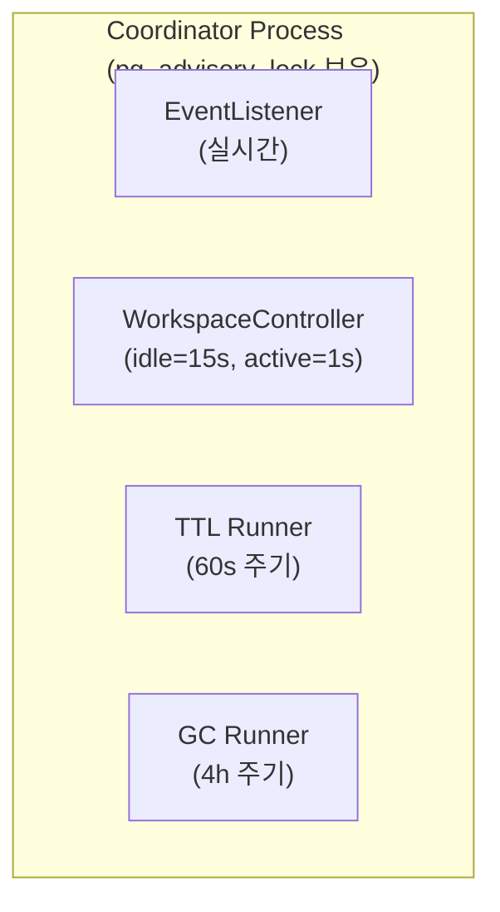
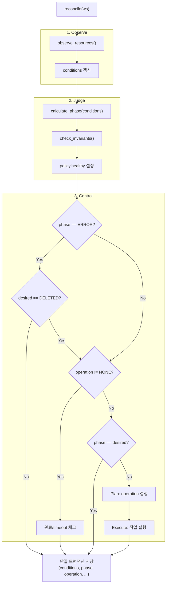
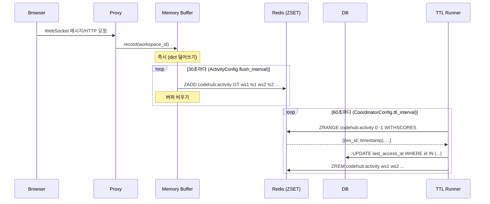
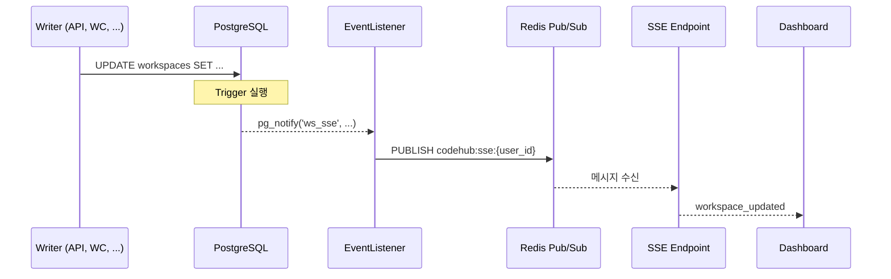
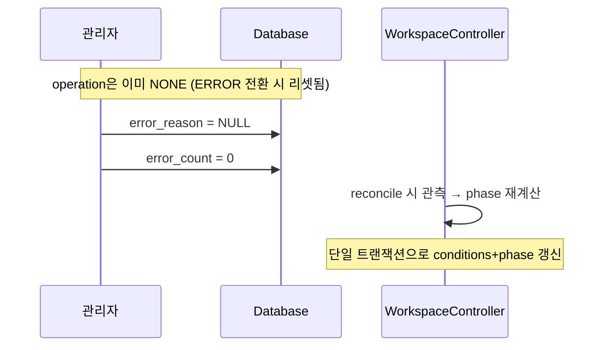

# Control Plane (M2)

> Coordinator 프로세스 내 컴포넌트 및 정책 정의
>
> **의존**: [00-contracts.md](./00-contracts.md), [01-glossary.md](./01-glossary.md), [02-states.md](./02-states.md), [03-schema.md](./03-schema.md)

---

## 목차

1. [Coordinator](#coordinator)
2. [WorkspaceController](#workspacecontroller)
3. [TTL Runner](#ttl-manager)
4. [Events](#events)
5. [Activity](#activity)
6. [Error Policy](#error-policy)
7. [Limits](#limits)

---

## Coordinator

Coordinator는 모든 백그라운드 프로세스를 관리하는 **단일 리더 프로세스**입니다.

### 불변식

1. **Single Leader**: 동시에 하나의 Coordinator만 Active
2. **Automatic Failover**: 연결 끊김 시 자동 리더십 이전
3. **Single Writer**: 컴포넌트별 담당 컬럼 분리 (계약 #3)

### 아키텍처



> **설정 위치**: `CoordinatorConfig` (config.py) - 환경변수로 오버라이드 가능

### 컴포넌트 역할

| 컴포넌트 | 역할 |
|---------|------|
| EventListener | PG NOTIFY → Redis PUBLISH (CDC) |
| WorkspaceController | 리소스 관측 → conditions/phase 갱신 → 상태 수렴 |
| TTL Runner | TTL 만료 → desired_state 변경 |
| GC Runner | orphan archive 정리 |

> **계약 #2 준수**: Level-Triggered Reconciliation ([00-contracts.md](./00-contracts.md#2-level-triggered-reconciliation))

### Leader Election (PostgreSQL Session Lock)

| 특성 | 설명 |
|-----|------|
| 락 유형 | `pg_advisory_lock` (Session Level) |
| 락 해제 | DB 연결 끊기면 즉시 해제 |
| Failover | TCP timeout (수 초) |

> **목적**: Single Writer Principle ([#3](./00-contracts.md#3-single-writer-principle))을 보장하기 위한 단일 리더 실행

### 에러 처리

| 상황 | 동작 |
|------|------|
| DB 연결 끊김 | 리더십 포기 → 재연결 → 재획득 시도 |
| 개별 컴포넌트 에러 | 해당 tick 스킵 → 다음 tick 재시도 |
| 전체 루프 에러 | 리더십 포기 → 재획득 시도 |

---

## WorkspaceController

WorkspaceController는 리소스 **관측**, 상태 **판정**, 상태 **수렴**을 담당하는 **단일 컴포넌트**입니다.

- **관측**(observe): 리소스 상태 → conditions 갱신
- **판정**(judge): conditions → phase 계산
- **제어**(control): phase ≠ desired → operation 실행

> **계약 준수**: [#1 Reality vs DB](./00-contracts.md#1-reality-vs-db-진실의-원천), [#2 Level-Triggered](./00-contracts.md#2-level-triggered-reconciliation)

### 역할: Observer + Controller + Judge

| 역할 | 입력 | 출력 |
|------|------|------|
| **Observer** | Container/Volume/Archive Provider | conditions |
| **Judge** | conditions, deleted_at, archive_key | phase |
| **Controller** | phase, desired_state | operation 실행 |

### 핵심 원칙

1. **진실(Reality) = 실제 리소스**: Container/Volume/Archive의 실제 존재 여부가 진실
2. **DB = Last Observed Truth**: DB는 마지막 관측치일 뿐
3. **단일 컴포넌트**: 관측+판정+제어를 단일 트랜잭션으로 처리 (원자성 보장)
4. **Level-Triggered**: 이벤트가 아닌 현재 DB 상태 기준

### 불변식

1. **Non-preemptive**: `operation != NONE`이면 다른 operation 시작 불가 (계약 #4)
2. **CAS 선점**: operation 시작 시 `WHERE operation = 'NONE'` 조건 사용
3. **ERROR 원자성**: 에러 시 `phase=ERROR, operation=NONE, error_reason` 단일 트랜잭션

### 입출력

**읽기**: desired_state, operation, op_started_at, error_count, archive_key, deleted_at, Container/Volume/Archive Provider

**쓰기**: conditions, observed_at, phase, operation, op_started_at, archive_op_id, archive_key, error_count, error_reason, home_ctx (Single Writer)

### 주기

| 상태 | 환경변수 | 기본값 | 이유 |
|------|----------|--------|------|
| idle | `COORDINATOR_IDLE_INTERVAL` | 15s | 일반 폴링 |
| active | `COORDINATOR_ACTIVE_INTERVAL` | 1s | 적응형 (빠른 완료 감지) |

> **활성화 조건**: wake 수신 또는 operation != NONE 시 `active_duration` (30s) 동안 active 모드 유지

### Reconcile 흐름



> **원자성**: 관측/판정/제어 결과를 단일 트랜잭션으로 저장
> **phase 기반 skip**: phase=ERROR일 때 reconcile 제외 (단, desired=DELETED는 허용)

### Conditions 갱신 규칙

| Condition | 관측 방법 | status=true 조건 |
|-----------|----------|-----------------|
| `storage.volume_ready` | Volume Provider 호출 | Volume 존재 |
| `storage.archive_ready` | S3 HEAD 요청 (archive_key 존재 시) | Archive 접근 가능 |
| `infra.container_ready` | Container Provider 호출 | Container running |
| `policy.healthy` | 불변식 확인 | 불변식 위반 없음 |

> **policy.healthy 규칙**: [03-schema.md#policy.healthy](./03-schema.md#policyhealthyfalse-조건)

### 불변식 위반 감지

| 위반 유형 | 조건 | 처리 |
|----------|------|------|
| ContainerWithoutVolume | container_ready ∧ !volume_ready | policy.healthy = {status: false, reason: "ContainerWithoutVolume"} |

### Operation 결정 규칙

> **정의**: [02-states.md#operation-선택](./02-states.md#operation-선택)
>
> **계약 준수**: [#4 Non-preemptive](./00-contracts.md#4-non-preemptive-operation), [#5 Ordered SM](./00-contracts.md#5-ordered-state-machine)

### 완료 조건

| Operation | 완료 조건 (conditions 기반) |
|-----------|---------------------------|
| PROVISIONING | volume_ready == true |
| RESTORING | volume_ready == true AND restore_marker == archive_key |
| STARTING | container_ready == true |
| STOPPING | container_ready == false |
| ARCHIVING | volume_ready == false AND archive_ready == true AND archive_key != NULL |
| CREATE_EMPTY_ARCHIVE | archive_ready == true AND archive_key != NULL |

> 완료 시: phase 재계산 → `operation = NONE`, `error_count = 0`, `error_reason = NULL`

### CREATE_EMPTY_ARCHIVE

PENDING에서 ARCHIVED로 직접 전이 시 사용 (Ordered SM 단조 경로):

1. 빈 tar.zst 생성 (메모리, ~50 bytes)
2. S3 업로드 (`{workspace_id}/{archive_op_id}/home.tar.zst`)
3. archive_key 설정
4. 관측 → `archive_ready = true`
5. conditions 확인 → phase = ARCHIVED, operation = NONE

> **단조 경로**: PENDING(0) → ARCHIVED(5) 직접 전이 (step_up)
> **결과**: 빈 Archive 생성 (복원 시 빈 Volume으로 시작)

**RESTORING 완료 조건** (계약 #7):
1. Volume 존재 관측 → `volume_ready = true`
2. `volume_ready + restore_marker == archive_key` 확인 → 복원 완료, phase = STANDBY

> **ARCHIVING 순서 보장** (계약 #8):
> 1. archive() 호출 후 archive_key를 DB에 저장
> 2. delete_volume() 호출
>
> 이 순서를 반드시 준수하여 데이터 유실 방지. ([Ordering Guarantee](./00-contracts.md#8-ordering-guarantee-역순-금지))

### Timeout / 재시도

> **원칙**: Timeout 초과 또는 재시도 3회 초과 시 단말 에러
> **구체적 값**: 코드에서 정의 (구현 세부)

### ERROR 전환 규칙 (계약 #4)

WC가 에러 감지 시 **단일 트랜잭션**으로 원자적 전환:

```sql
UPDATE workspaces SET
    phase = 'ERROR',
    operation = 'NONE',
    error_reason = 'ActionFailed',
    error_count = error_count + 1
WHERE id = ? AND operation != 'NONE'
```

| 단계 | 동작 |
|------|------|
| 1 | 에러 감지 (timeout, 재시도 초과, 불변식 위반 등) |
| 2 | `phase=ERROR, operation=NONE, error_reason, error_count` 원자적 설정 |
| 3 | `archive_op_id` 유지 (GC 보호) |

> **원자성 보장**: 크래시 시에도 에러 유실 없음 (단일 트랜잭션)
> **CAS 실패 처리**: operation 선점 CAS 실패 시 다음 reconcile 사이클에서 재시도

---

## TTL Runner

TTL Runner는 비활성 워크스페이스의 TTL을 체크하고 desired_state를 변경합니다.

### TTL 종류

| TTL | 대상 Phase | 기준 컬럼 | 환경변수 | 기본값 | 동작 |
|-----|-----------|----------|----------|--------|------|
| standby_ttl | RUNNING | last_access_at | `TTL_STANDBY_SECONDS` | 600초 (10분) | desired_state = STANDBY |
| archive_ttl | STANDBY | phase_changed_at | `TTL_ARCHIVE_SECONDS` | 1800초 (30분) | desired_state = ARCHIVED |

> **프로덕션 권장**: standby=10800초 (3시간), archive=86400초 (24시간)

### 입출력

**읽기**: DB (phase, operation, last_access_at, phase_changed_at), Redis (codehub:activity ZSET)

**쓰기**: DB (last_access_at - Redis 동기화), DB (desired_state - TTL 만료 시)

### Standby TTL 체크 규칙

| 조건 | 결과 |
|------|------|
| phase != RUNNING | skip |
| operation != NONE | skip |
| NOW() - last_access_at <= standby_ttl_seconds | skip |
| 위 조건 모두 통과 | desired_state = STANDBY |

### Archive TTL 체크 규칙

| 조건 | 결과 |
|------|------|
| phase != STANDBY | skip |
| operation != NONE | skip |
| NOW() - phase_changed_at <= archive_ttl_seconds | skip |
| 위 조건 모두 통과 | desired_state = ARCHIVED |

> **phase_changed_at**: STANDBY 전환 시점 기준 (WC가 phase 변경 시 자동 갱신)

---

## Activity

프록시를 통한 모든 WebSocket/HTTP 트래픽을 활동으로 기록합니다.

### 활동 기록 흐름



> **ZSET 패턴**: score=timestamp로 자동 정렬, GT 옵션으로 동일 ws_id는 최신 timestamp만 유지

### 3단계 버퍼링

| 단계 | 주기 | 동작 |
|------|------|------|
| 1. 메모리 | 즉시 | WebSocket 메시지/HTTP 요청 시 record() |
| 2. Redis | 30초 | 메모리 → Redis ZADD (ZSET) |
| 3. DB | 60초 | Redis → DB last_access_at UPDATE |

### 활동으로 감지되는 행동

| 행동 | 통신 유형 | 감지 |
|------|----------|------|
| 타이핑 | WebSocket 메시지 | ✅ |
| 터미널 출력 | WebSocket 메시지 | ✅ |
| 파일 저장 | WebSocket/HTTP | ✅ |
| 코드 자동완성 | WebSocket (LSP) | ✅ |
| 탭만 열어둠 | 없음 | ❌ |

### TTL 기본값

| TTL | 환경변수 | 기본값 | 프로덕션 권장 | 의미 |
|-----|----------|--------|--------------|------|
| standby_ttl | `TTL_STANDBY_SECONDS` | 600초 (10분) | 10800초 (3시간) | 마지막 활동 후 STANDBY 전환 |
| archive_ttl | `TTL_ARCHIVE_SECONDS` | 1800초 (30분) | 86400초 (24시간) | STANDBY 후 ARCHIVED 전환 |

> **설정 위치**: `TtlConfig` (config.py) - 환경변수로 오버라이드 가능

### 설계 결정

**ws_conn 방식 대신 last_access_at 방식을 선택한 이유:**

| 항목 | ws_conn (연결 수) | last_access_at (timestamp) |
|------|------------------|---------------------------|
| Redis 재시작 | 데이터 손실 위험 | DB에 영속 보장 |
| 복잡도 | INCR/DECR + idle timer | ZSET 단일 키 |
| 정확도 | 실시간 | 최대 90초 지연 |

> **선택**: 안정성과 단순함을 위해 last_access_at 방식 채택

---

## Events

상태 변경 시 UI에 실시간 알림을 전달합니다 (CDC 패턴).

> **상세 아키텍처**: [event-listener.md](../architecture/event-listener.md)

### 이벤트 전달 흐름



### 이벤트 분리

| 채널 | 트리거 칼럼 | 목적 | Redis 채널 |
|------|------------|------|-----------|
| ws_sse | phase, operation, error_reason | UI 실시간 업데이트 | codehub:sse:{user_id} |
| ws_wake | desired_state | Coordinator 즉시 깨우기 | codehub:wake:ob, codehub:wake:wc |
| ws_deleted | deleted_at (NULL→NOT NULL) | 삭제 알림 | codehub:sse:{user_id} |

> **채널 설정**: `RedisChannelConfig` (config.py) - `REDIS_CHANNEL_SSE_PREFIX`, `REDIS_CHANNEL_WAKE_PREFIX`

### SSE 엔드포인트

```
GET /api/v1/events
Accept: text/event-stream
Cookie: session=xxx
```

| 항목 | 설명 |
|------|------|
| 범위 | 현재 사용자 소유 워크스페이스 전체 |
| Heartbeat | 30초마다 |
| 재연결 | 클라이언트 자동 재연결 |

### 이벤트 타입

| 타입 | 발행 시점 | 페이로드 |
|------|----------|---------|
| workspace_updated | phase/operation 변경 | 전체 workspace 객체 |
| workspace_deleted | soft delete | `{id: string}` |
| heartbeat | 30초마다 | `{}` |

---

## Error Policy

### error_reason 값

| error_reason | is_terminal | 설명 |
|--------------|-------------|------|
| Timeout | 즉시 | 작업 시간 초과 |
| RetryExceeded | error_count 기반 | 재시도 한도 초과 |
| ActionFailed | 재시도 후 | Actuator 호출 실패 |
| DataLost | 즉시 | 복구 불가 데이터 손실 |
| Unreachable | 재시도 후 | 리소스 접근 불가 |
| ImagePullFailed | 즉시 | 컨테이너 이미지 가져오기 실패 |
| ContainerWithoutVolume | 즉시 | 불변식 위반 |
| ArchiveCorrupted | 즉시 | Archive 체크섬 불일치 |

**단말 에러(is_terminal) 판정**:
```python
TERMINAL_REASONS = {"Timeout", "DataLost", "ImagePullFailed", "ContainerWithoutVolume", "ArchiveCorrupted"}
is_terminal = error_reason in TERMINAL_REASONS or error_count >= MAX_RETRY
```

> **상세 메시지**: 로그에서 확인 (DB 미저장)
> **상세 정의**: 코드에서 enum으로 정의 (error_types.py)

### 에러 처리 흐름

WorkspaceController가 관측/판정/제어를 단일 트랜잭션으로 처리:

1. WC: 에러 감지 → `phase=ERROR, operation=NONE, error_reason, error_count` 원자적 설정

> **단일 컴포넌트**: 관측+판정+제어 통합으로 2단계 전환 제거

### 재시도 책임 분리

| 레벨 | 역할 |
|------|------|
| Job 내부 | 일시적 오류 재시도 |
| WorkspaceController | Operation 레벨 재시도 |

> 각 레벨 3회씩, 최대 9회까지 가능 (의도된 동작)

### GC 보호

| phase | GC 동작 | 이유 |
|-------|---------|------|
| ERROR | 보호 (삭제 안 함) | 복구 시 archive 필요 |
| DELETED | 삭제 대상 | soft-delete workspace |

> **계약 준수**: [#9 GC Separation & Protection](./00-contracts.md#9-gc-separation--protection)
> **phase 기반**: GC 보호는 phase=ERROR 기준

### ERROR 복구

ERROR 전환 시 operation이 이미 NONE으로 리셋되므로, 복구 시 2개 필드만 리셋:



| 필드 | 리셋 필요 | 이유 |
|------|----------|------|
| error_reason | O | 에러 정보 초기화 |
| error_count | O | 재시도 횟수 초기화 |
| operation | X | ERROR 전환 시 이미 NONE |
| archive_op_id | X | GC 보호용으로 유지 |
| phase | X | WC가 다음 reconcile에서 재계산 |
| conditions | X | WC가 reconcile에서 갱신 |

---

## Limits

동시에 실행 가능한 워크스페이스 수를 제한합니다.

### 제한 유형

| 제한 | 기본값 | 설명 |
|------|--------|------|
| max_running_per_user | 2 | 사용자당 동시 RUNNING |
| max_running_global | 100 | 시스템 전체 동시 RUNNING |

### 체크 시점

| 시점 | 동작 |
|------|------|
| API: desired_state = RUNNING | 제한 체크 후 설정 |
| Proxy: Auto-wake 트리거 | 제한 체크 후 진행 |

### 제한 초과 시 동작

| 상황 | 응답 |
|------|------|
| API 요청 | 429 Too Many Requests |
| Auto-wake | 502 + 안내 페이지 (실행 중인 워크스페이스 목록) |

> **Soft Limit**: Race condition으로 약간 초과 가능 (허용)

---

## Known Issues

1. ~~**관측 지연**: 최대 30초~~
   - **해결됨**: 단일 WC로 통합, operation 진행 중 2초 주기
2. **Operation 중단 불가**: 시작 후 취소 불가, 완료까지 대기
3. **순차적 전이**: RUNNING → ARCHIVED 직접 불가 (STOPPING → ARCHIVING 순차)
4. ~~**재시도 간격 고정**: 지수 백오프 미적용~~ → M2에서 구현 예정
5. ~~**desired_state 경쟁**: API/TTL Runner/Proxy 동시 변경 시 Last-Write-Wins~~
   - **해결됨**: 계약 #3에 따라 API만 desired_state 변경 가능
6. **ERROR 자동 복구 불가**: 관리자 수동 개입 필요 (error_reason, error_count 리셋)
7. ~~**observed_status에 ERROR 포함**: 리소스 관측과 정책 판정 혼재~~
   - **해결됨**: Conditions 패턴으로 분리 (ADR-011)
8. ~~**ERROR 전환 2단계**: OC→RO 간접 통신으로 크래시 시 에러 유실 가능~~
   - **해결됨**: WC가 phase=ERROR 원자적 설정 (단일 트랜잭션)
9. ~~**Phase 일시적 불일치**: conditions 변경 후 reconcile 전까지 phase가 stale~~
   - **해결됨**: WC가 conditions+phase를 단일 트랜잭션으로 저장

---

## 참조

- [00-contracts.md](./00-contracts.md) - 핵심 계약
- [02-states.md](./02-states.md) - 상태 정의
- [03-schema.md](./03-schema.md) - DB 스키마
- [ADR-011](../adr/011-declarative-conditions.md) - Conditions 기반 상태 표현
