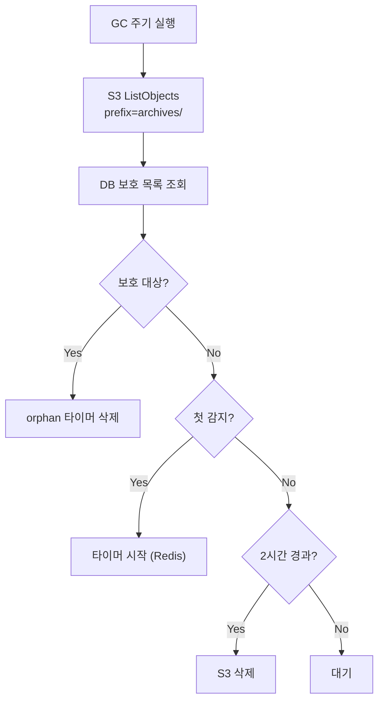

# Data Plane (M2)

> [README.md](./README.md)로 돌아가기

---

## 개요

Data Plane은 실제 리소스(Container, Volume, Archive)를 관리합니다.

| 컴포넌트 | 역할 |
|---------|------|
| InstanceController | Container 생성/삭제 |
| StorageProvider | Volume/Archive 관리 |
| Storage Job | Volume↔Archive 데이터 이동 |
| GC Runner | orphan archive 정리 |

---

## InstanceController

> Container 생성/삭제만 담당. Volume은 StorageProvider.

### 핵심 원칙

1. **DB를 모름** - Reconciler가 DB 관리
2. **Volume은 내부 계산** - `ws-{workspace_id}-home`
3. **리소스 레벨 멱등성** - 컨테이너 존재 여부로 직접 체크
4. **즉시 종료** - SIGKILL 직접 전송 (Volume 유지로 데이터 안전)
5. **계약 기반 추상화** - K8s 내부 상태 노출 안 함

> **계약 #6 준수**: Container 있으면 Volume 필수 ([00-contracts.md](./00-contracts.md#6-containervolume-invariant))

### 불변식

1. **STARTING 전에 Volume 반드시 존재**: Volume 없이 Container 생성 시도 금지
2. **Container 삭제 → Volume 삭제 순서**: 역순 금지 (계약 #8)
3. **Container는 workspace당 1개**: `ws-{workspace_id}` 이름으로 고유
4. **모든 메서드는 멱등**: 같은 입력 → 같은 결과

### 네이밍 규칙

> **정의**: [00-contracts.md#6](./00-contracts.md#6-containervolume-invariant)
>
> **Single Writer 원칙**: phase는 WorkspaceController가 변경. InstanceController는 리소스 정리만 담당.

### 인터페이스

| 메서드 | 역할 | 멱등성 |
|--------|------|--------|
| start(workspace_id, image_ref) | 컨테이너 시작 + Ready 대기 | running이면 무시 |
| delete(workspace_id) | SIGKILL + 삭제 | 없으면 무시 |
| is_running(workspace_id) | 트래픽 수신 가능 여부 | - |

### start() 계약

- 성공 반환 = 트래픽 수신 가능 (`is_running() == True`)
- not running 상태면 정리 후 재생성
- volume_key는 내부 계산 (`ws-{id}-home`)

### is_running() 계약

> "프록시가 이 컨테이너로 요청을 보내도 되는가?"

| 백엔드 | 조건 |
|--------|------|
| Docker | state.Running == true |
| K8s | containerStatuses[*].ready == true |

### Phase별 리소스

| Phase | Container | Volume |
|-------|-----------|--------|
| PENDING | - | - |
| ARCHIVED | - | - |
| STANDBY | - | ✅ |
| RUNNING | ✅ | ✅ |

### Operation별 동작

#### STARTING (STANDBY → RUNNING)

| 항목 | 값 |
|------|---|
| 전제 조건 | Phase=STANDBY, Volume 존재 |
| Actuator | start(workspace_id, image_ref) |
| 완료 조건 | is_running() == True |

#### STOPPING (RUNNING → STANDBY)

| 항목 | 값 |
|------|---|
| 전제 조건 | Phase=RUNNING |
| Actuator | delete(workspace_id) |
| 완료 조건 | is_running() == False, Volume 유지 |

> **즉시 종료 이유**: Volume 유지로 데이터 안전, IDE 자동 저장, TTL 트리거 상황

#### DELETING

**삭제 조건**:
- `Phase ∈ {PENDING, ARCHIVED, ERROR}`
- `operation = NONE` (필수)
- RUNNING/STANDBY에서 삭제 요청 시: step_down 완료 후 삭제

| 순서 | 동작 | 주체 |
|------|------|------|
| 1 | deleted_at 설정 (Soft Delete) | API |
| 2 | Container 삭제 (있는 경우) | InstanceController (via WC) |
| 3 | Volume 삭제 (있는 경우) | StorageProvider (via WC) |
| 4 | 리소스 없음 관측 → Phase=DELETED | WorkspaceController |

> Archive는 GC가 지연 후 정리 (계약 #9)

### 백엔드별 구현

| 항목 | Docker | K8s |
|------|--------|-----|
| 컨테이너 생성 | docker run + 시작 대기 | Pod 생성 + Ready 대기 |
| 컨테이너 삭제 | docker rm -f | Pod 삭제 (grace-period=0) |
| 트래픽 수신 가능 | state.Running | Ready condition |
| Volume 마운트 | -v volume:/path | PVC mount |

---

## StorageProvider

> Volume/Archive 관리. 계약 #7, #8 준수.

### 핵심 원칙

1. **Non-preemptive Operation**: workspace당 동시에 1개만 (계약 #4)
2. **Idempotent Archive**: op_id로 멱등성 확보 (계약 #7)
3. **Crash-Only Restore**: 재실행해도 같은 결과 (계약 #7)
4. **Separation of Concerns**: StorageProvider = 데이터 이동, Reconciler = DB 커밋
5. **순서 보장**: archive_key 저장 → Volume 삭제 (계약 #8)
6. **GC 분리**: DELETING은 Volume만, Archive는 GC가 정리 (계약 #9)

### 인터페이스

| 메서드 | 역할 | 멱등성 | 반환값 |
|--------|------|--------|--------|
| provision(workspace_id) | Volume 생성 | 이미 있으면 무시 | - |
| restore(workspace_id, archive_key) | Archive → Volume | Crash-Only | restore_marker |
| archive(workspace_id, op_id) | Volume → Archive | HEAD 체크 | archive_key |
| delete_volume(workspace_id) | Volume 삭제 | 없으면 무시 | - |
| volume_exists(workspace_id) | Volume 존재 확인 | - | bool |

**restore() 반환값**:
- 성공 시: `restore_marker = archive_key` 반환
- WC가 이 값을 `home_ctx.restore_marker`에 저장
- 계약 #7 완료 조건: `Phase=STANDBY AND home_ctx.restore_marker=archive_key`

### 네이밍 규칙

> **Container/Volume**: [00-contracts.md#6](./00-contracts.md#6-containervolume-invariant) 참조
> **archive_key**: `{workspace_id}/{op_id}/home.tar.zst` (계약 #7)

### Operation별 Storage 동작

| Operation | 동작 | op_id 필요 |
|-----------|------|-----------|
| PROVISIONING | 빈 Volume 생성 | - |
| RESTORING | archive → Volume | - |
| ARCHIVING | Volume → archive + Volume 삭제 | ✅ |
| DELETING | Volume 삭제 (Archive는 GC) | - |

### 완료 조건 (conditions 기반)

| Operation | Actuator | 완료 조건 |
|-----------|----------|----------|
| PROVISIONING | provision() | volume_ready == true |
| RESTORING | provision() + restore() | volume_ready == true AND restore_marker == archive_key |
| ARCHIVING | archive() + delete_volume() | volume_ready == false AND archive_ready == true AND archive_key != NULL |
| DELETING | delete() + delete_volume() | container_ready == false AND volume_ready == false |

> **계약 #1 준수**: Actuator 성공 반환 ≠ 완료. conditions 기반 완료 판정.
>
> **WC가 모든 판정**: WC가 관측 → conditions 갱신 → 완료 여부 + phase 계산 (단일 트랜잭션)

### op_id 정책

| 시점 | 상태 | 동작 |
|------|------|------|
| 첫 시도 | NULL | 생성 후 DB 저장 |
| 재시도 | NOT NULL | 기존 값 사용 |

> op_id는 archive 호출 전에 DB에 먼저 저장. 크래시 후 같은 op_id로 재시도.

### 크래시 복구 (ARCHIVING)

| 크래시 시점 | DB 상태 | 재시도 동작 |
|------------|---------|------------|
| 업로드 중 | op_id != NULL, archive_key = NULL | 같은 op_id로 재시도 (HEAD 체크) |
| archive_key 저장 후 | archive_key 일치 | 업로드 skip → delete_volume만 |
| Volume 삭제 후 | archive_key 일치, !volume_exists | 최종 커밋만 |

### DELETING 삭제 대상

| 리소스 | 삭제 주체 | 타이밍 |
|--------|----------|--------|
| Container | InstanceController | 즉시 |
| Volume | StorageProvider | Container 삭제 후 |
| Archives | GC | 지연 삭제 |

> Container/Volume = 컴퓨팅 비용 즉시 해제, Archive = GC 배치 정리 (계약 #9)

---

## Storage Job

> Volume↔Archive 데이터 이동을 담당하는 격리된 컨테이너

### 개요

| 항목 | 값 |
|------|---|
| 입력 | ARCHIVE_URL, S3 인증 정보 |
| 출력 | exit code (0=성공) |
| 의존성 | Object Storage만 (DB 없음) |
| 설계 | Crash-Only, Stateless, Idempotent |

> **격리 원칙**: Job은 DB, Reconciler, Control Plane을 모름. 매개변수만 받아 작업.

### 불변식

1. Job 실행 중 workspace 컨테이너는 실행되지 않음
2. Job 실행 중 Volume의 write-owner는 Job만
3. Job은 경로를 구성하지 않음 (전체 URL 수신)

### 마운트 구조

| 컨테이너 | 마운트 | 경로 |
|---------|--------|------|
| Job | Volume | /data |
| Job | emptyDir | /tmp (임시, 종료 시 삭제) |
| Workspace | Volume | /home/coder |

> /tmp에 tar.zst, meta, staging 저장. Job 종료 시 자동 삭제.

### Restore Job

| 단계 | 동작 |
|------|------|
| 1 | ARCHIVE_URL, ARCHIVE_URL.meta 다운로드 |
| 2 | sha256 checksum 검증 |
| 3 | staging 디렉토리에 tar 해제 |
| 4 | rsync --delete로 /data 동기화 |

> **Crash-Only**: 크래시 시 /tmp 사라짐 → 재시도하면 처음부터 재실행

### Archive Job

| 단계 | 동작 |
|------|------|
| 1 | HEAD 체크: tar.zst + meta 둘 다 있으면 skip (exit 0) |
| 2 | /data를 tar.zst 압축 (zstd) |
| 3 | sha256 checksum 생성 → .meta |
| 4 | tar.zst 업로드 → .meta 업로드 (순서 고정) |

> **멱등성**: 같은 op_id = 같은 경로 → HEAD 체크로 완료 여부 판단
>
> **커밋 마커**: meta 파일 존재를 완료 마커로 간주
> - tar.zst만 있고 meta 없음 → 미완료 → 덮어쓰기/재업로드
> - tar.zst + meta 둘 다 있음 → 완료 → skip
> - **업로드 순서**: tar.zst 먼저, meta 마지막 (원자성 보장)

### 무결성 검증

| 단계 | 방식 |
|------|------|
| Archive | tar.zst sha256 → .meta 파일 저장 |
| Restore | 다운로드 후 .meta와 비교 |

**meta 파일 형식**:
```
sha256:{hex_string}
```

### tar 안전 원칙

- 경로 탈출 방지 (절대경로, `..` 금지)
- 특수파일 제외 (socket, device)

> **구체적 옵션**: 코드에서 정의

---

## GC Runner

> orphan archive를 정리하는 컴포넌트. 계약 #9 준수.

### 개요

| 항목 | 설명 |
|------|------|
| 역할 | S3 orphan archive 탐지 및 삭제 |
| 실행 | Coordinator에서 주기적 실행 |

### DELETING vs GC

| 구분 | DELETING | GC |
|------|----------|-----|
| 트리거 | 사용자 삭제 요청 | 주기적 |
| 대상 | Volume만 | orphan Archive |
| 타이밍 | 즉시 | 지연 삭제 |
| 목적 | 컴퓨팅 리소스 해제 | 저장공간 회수 |

### Orphan 발생 원인

재아카이브, 크래시, 재시도 시 이전 archive가 orphan이 됩니다.

```
1차 Archive (op_id = aaa):
  → ws123/aaa/home.tar.zst  ← DB에 저장됨

2차 Archive (op_id = bbb):
  → ws123/bbb/home.tar.zst  ← DB 업데이트
  → ws123/aaa/...          ← orphan (GC 대상)
```

### 보호 규칙

> **SSOT**: [00-contracts.md#9 GC Separation & Protection](./00-contracts.md#9-gc-separation--protection)

Archive가 **보호 대상이 아니면** orphan입니다. 보호 판정은 **우선순위 순서**로 적용:

| 우선순위 | 조건 | archive_key 경로 | op_id 경로 |
|---------|------|-----------------|-----------|
| 1 | deleted_at != NULL | **보호 해제** | **보호 해제** |
| 2 | healthy = false | 보호 | 보호 |
| 3 | op_id 존재 | - | 보호 |

> **사용자 의도 우선**: deleted_at 설정 = 사용자가 삭제 원함 → 모든 보호 해제
>
> **op_id 보호 이유**: ARCHIVING 중 Phase=ERROR 전환되면 op_id만 있고 archive_key 없는 상태. op_id로 보호하여 복구 시 재사용 가능. (단, deleted_at 시 해제)

### 안전 지연

orphan으로 감지 후 일정 시간 대기 후 삭제 (진행 중인 작업 완료 대기).

> **구체적 값**: 코드에서 정의

### 삭제 대상

Archive 삭제 시 다음 파일을 모두 삭제합니다:

| 파일 | 설명 |
|------|------|
| `{archive_key}` | tar.zst 아카이브 파일 |
| `{archive_key}.meta` | sha256 체크섬 파일 |

### GC 흐름



### 에러 처리

| 상황 | 동작 |
|------|------|
| S3 ListObjects 실패 | GC 사이클 skip, 다음 주기 재시도 |
| S3 DeleteObject 실패 | 해당 archive skip, 다음 주기 재시도 |
| DB 조회 실패 | GC 사이클 skip (안전 우선) |

### Known Issues

1. **Redis 타이머 손실**: Redis 재시작 시 orphan 타이머 손실
   - 영향: 삭제가 2시간 더 지연될 수 있음 (데이터 손실 없음)

2. **대량 orphan 시 성능**: S3 ListObjects가 느려질 수 있음
   - 완화: prefix 기반 분할 스캔 (M2 이후)

---

## 에러 처리

> **에러 분류 및 재시도 정책**: [04-control-plane.md#error-policy](./04-control-plane.md#error-policy) 참조

| 분류 | 예시 | 복구 |
|------|------|------|
| Transient | 네트워크 일시 오류, 추출 실패 | 자동 재시도 |
| Terminal | 데이터 손실, checksum 불일치 | 관리자 개입 |

---

## 참조

- [00-contracts.md](./00-contracts.md) - 핵심 계약
- [04-control-plane.md#workspacecontroller](./04-control-plane.md#workspacecontroller) - WorkspaceController
- [02-states.md](./02-states.md) - 상태 전환
