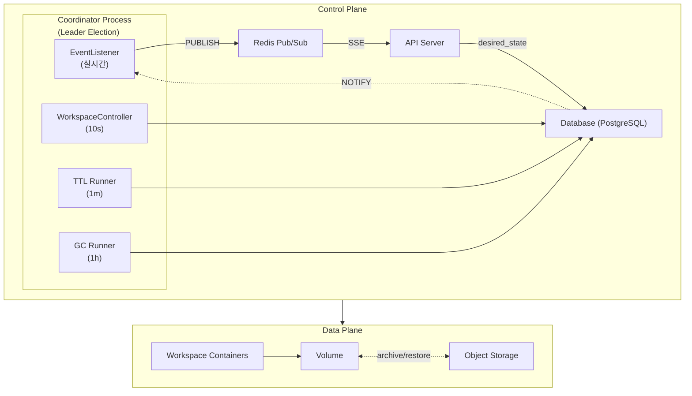

# M2 Specification

> M2 마일스톤을 위한 스펙 문서

---

## 개요

M2는 완성형 아키텍처를 구축합니다. M3에서는 Instance Controller와 Storage Provider 구현체만 교체하여 K8s에서 동작합니다.

---

## 아키텍처

---

## 핵심 원칙

| 원칙 | 설명 |
|------|------|
| Ordered State Machine | PENDING(0) < ARCHIVED(5) < STANDBY(10) < RUNNING(20) |
| Level-Triggered Reconciliation | desired ≠ observed → operation 실행 |
| Single Writer Principle | 컬럼별 단일 소유자 |
| Crash-Only Design | 어디서 실패해도 재시도로 복구 |
| CDC (Change Data Capture) | DB 변경 → 트리거 → SSE 이벤트 |

---

## 문서 구조

> **읽기 순서**: 번호가 낮은 문서를 먼저 읽어야 이해 가능

| 순서 | 문서 | 역할 |
|------|------|------|
| 0 | [00-contracts.md](./00-contracts.md) | 핵심 계약 10개 (SSOT, 충돌 시 우선) |
| 1 | [01-glossary.md](./01-glossary.md) | 용어집 |
| 2 | [02-states.md](./02-states.md) | 상태 모델 + 전이 규칙 |
| 3 | [03-schema.md](./03-schema.md) | DB 스키마 + 컬럼 소유권 |
| 4 | [04-control-plane.md](./04-control-plane.md) | Coordinator, WorkspaceController, TTL, Events, Error, Limits |
| 5 | [05-data-plane.md](./05-data-plane.md) | Instance, Storage, Storage Job, GC Runner |

---

## 문서별 내용

### 00-contracts.md (핵심 계약)

10개 핵심 계약의 SSOT. 다른 문서와 충돌 시 이 문서가 우선.

| # | 계약 |
|---|------|
| 1 | Reality vs DB (진실의 원천) |
| 2 | Level-Triggered Reconciliation |
| 3 | Single Writer Principle |
| 4 | Non-preemptive Operation |
| 5 | Ordered State Machine |
| 6 | Container↔Volume Invariant |
| 7 | Archive/Restore Contract |
| 8 | Ordering Guarantee |
| 9 | GC Separation & Protection |
| 10 | Retry Policy |

### 04-control-plane.md

| 섹션 | 주기 | 설명 |
|------|------|------|
| Coordinator | - | 리더 선출, 프로세스 관리 |
| WorkspaceController | 10s | 리소스 관측 + phase 계산 + 상태 수렴 |
| TTL Runner | 1m | TTL → desired_state 변경 |
| Events | 실시간 | CDC 기반 SSE 이벤트 |
| Activity | - | WebSocket 기반 활동 감지 |
| Error Policy | - | ERROR 상태, 재시도 정책 |
| Limits | - | RUNNING 워크스페이스 제한 |

### 05-data-plane.md

| 섹션 | 설명 |
|------|------|
| InstanceController | Container 생성/삭제 |
| StorageProvider | Volume/Archive 관리 |
| Storage Job | Volume↔Archive 데이터 이동 |
| GC Runner | orphan archive 정리 |

---

## 참조

- [ADR-011: Conditions 기반 상태 표현](../adr/011-declarative-conditions.md)
- [ADR-008: Ordered State Machine](../adr/008-ordered-state-machine.md) (Partially Superseded by ADR-011)
- [ADR-006: Reconciler 패턴](../adr/006-reconciler-pattern.md)
- [ADR-007: Reconciler 구현](../adr/007-reconciler-implementation.md)
