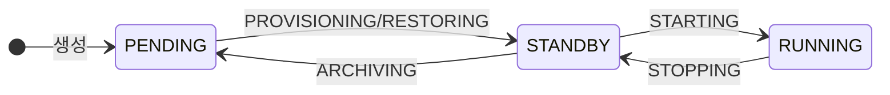
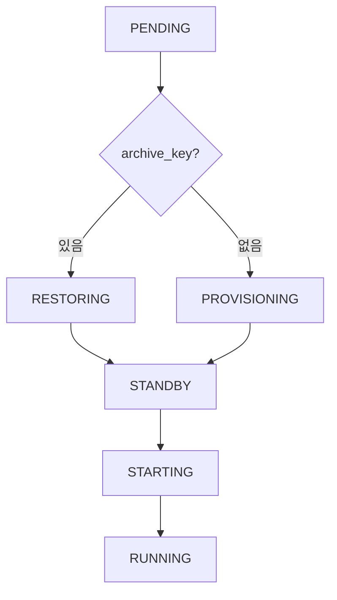
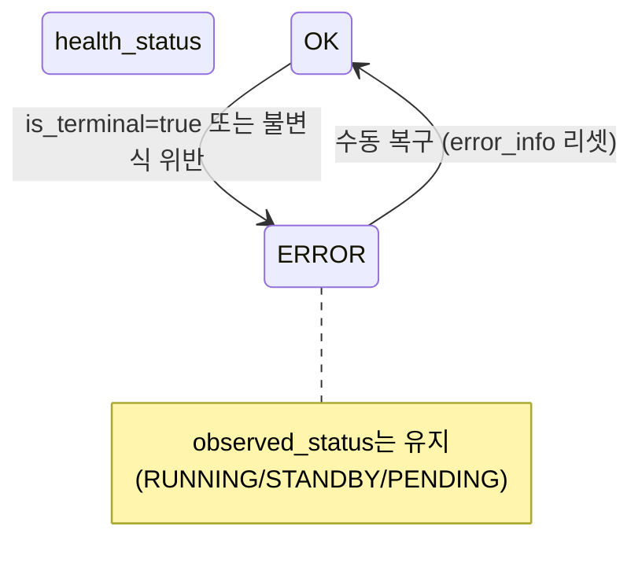
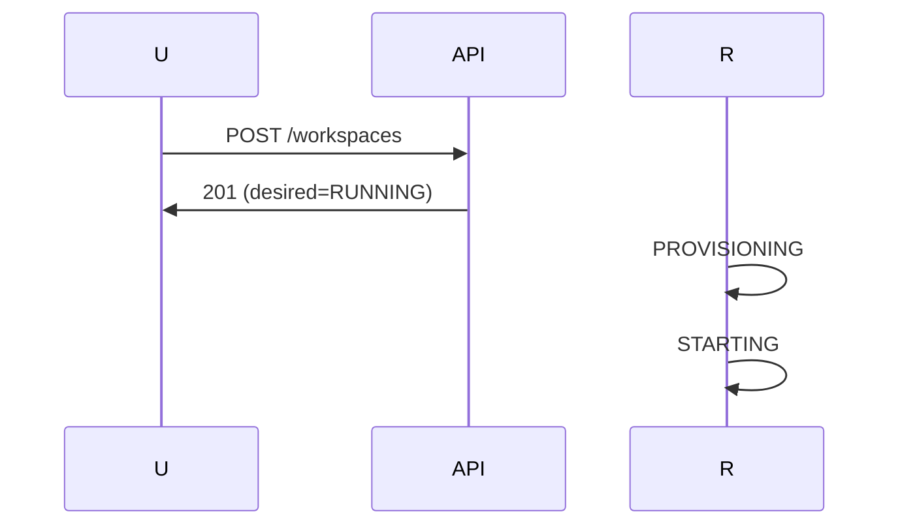
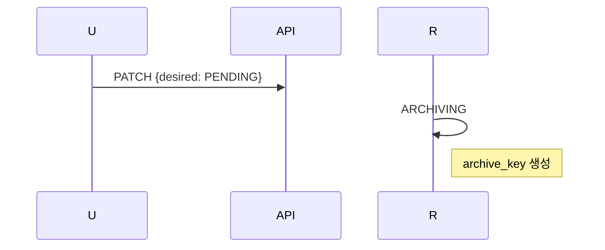

# Workspace 상태 (M2)

> [README.md](./README.md)로 돌아가기

---

## 개요

**Ordered State Machine** + **Archive 속성 분리** + **Health 분리**

| 개념 | 설명 |
|------|------|
| observed_status (Ordered) | `PENDING(0) < STANDBY(10) < RUNNING(20)` - 리소스 관측 |
| health_status | `OK / ERROR` - 정책 판정 (별도 축) |
| Archive (Flag) | `archive_key != NULL` → has_archive |
| Display (파생) | `observed_status + health_status + archive_key` 조합 |

> **계약 #1, #5 준수**: Reality vs DB, Ordered State Machine ([00-contracts.md](./00-contracts.md))

---

## 상태 정의

### observed_status (리소스 관측)

| 상태 | Level | Container | Volume | 설명 |
|------|-------|-----------|--------|------|
| PENDING | 0 | - | - | 활성 리소스 없음 |
| STANDBY | 10 | - | ✅ | Volume만 존재 |
| RUNNING | 20 | ✅ | ✅ | 컨테이너 실행 중 |
| DELETED | -1 | - | - | Soft-delete 완료 |

> **ERROR 없음**: observed_status는 순수 리소스 관측 결과만 반영

### health_status (정책 판정)

| 상태 | 설명 |
|------|------|
| OK | 정상 상태 |
| ERROR | 불변식 위반, timeout, 재시도 초과 등 |

**ERROR 판정 조건** (HM이 error_info 확인):
- `error_info.is_terminal = true`
- ContainerWithoutVolume (불변식 위반)

> **observed_status 유지**: ERROR 시에도 실제 리소스 상태 반영 (RUNNING/STANDBY/PENDING)

### 파생 상태 (Display)

| observed_status | health_status | archive_key | Display |
|-----------------|---------------|-------------|---------|
| RUNNING | OK | - | RUNNING |
| RUNNING | ERROR | - | ERROR |
| STANDBY | OK | - | STANDBY |
| STANDBY | ERROR | - | ERROR |
| PENDING | OK | NULL | PENDING |
| PENDING | OK | 있음 | **ARCHIVED** |
| PENDING | ERROR | - | ERROR |
| DELETED | - | - | DELETED |

---

## Operation 정의

| Operation | 전환 | 설명 |
|-----------|------|------|
| NONE | - | 안정 상태 |
| PROVISIONING | PENDING → STANDBY | 빈 Volume 생성 |
| RESTORING | PENDING(has_archive) → STANDBY | Archive → Volume |
| STARTING | STANDBY → RUNNING | Container 시작 |
| STOPPING | RUNNING → STANDBY | Container 정지 |
| ARCHIVING | STANDBY → PENDING | Volume → Archive |
| DELETING | → DELETED | 전체 삭제 (조건: operation=NONE, observed_status=PENDING OR health_status=ERROR) |

### 상태 × Operation 조합

| observed_status | health_status | operation | archive_key | 의미 |
|-----------------|---------------|-----------|-------------|------|
| PENDING | OK | NONE | NULL | 새 workspace |
| PENDING | OK | NONE | 있음 | ARCHIVED |
| PENDING | OK | PROVISIONING | NULL | Volume 생성 중 |
| PENDING | OK | RESTORING | 있음 | 복원 중 |
| STANDBY | OK | NONE | - | Volume 준비됨 |
| STANDBY | OK | STARTING | - | Container 시작 중 |
| STANDBY | OK | ARCHIVING | - | 아카이브 중 |
| RUNNING | OK | NONE | - | 실행 중 |
| RUNNING | OK | STOPPING | - | 정지 중 |
| * | ERROR | NONE | - | ERROR 전환 시 operation 리셋, op_id 유지 (GC 보호) |

> **health_status=ERROR 시**: observed_status는 실제 리소스 상태 유지 (RUNNING/STANDBY/PENDING)

---

## 상태 다이어그램

### 정상 흐름

### step_up 분기

### health_status 흐름

> **핵심**: health_status 전환은 observed_status와 독립적. ERROR 시에도 실제 리소스 상태 유지

---

## desired_state 설정

| observed_status | health_status | → PENDING | → STANDBY | → RUNNING | Delete |
|-----------------|---------------|-----------|-----------|-----------|--------|
| PENDING | OK | - | ✓ | ✓ | ✓ |
| STANDBY | OK | ✓ | - | ✓ | step_down 후 |
| RUNNING | OK | ✓ | ✓ | - | step_down 후 |
| * | ERROR | 복구 후 | 복구 후 | 복구 후 | ✓ |
| * (operation≠NONE) | * | 409 | 409 | 409 | 409 |

> **계약 #4 준수**: Non-preemptive Operation ([00-contracts.md](./00-contracts.md#4-non-preemptive-operation))
> **ERROR에서 삭제**: health_status=ERROR AND operation=NONE 시 바로 삭제 가능 (stuck 탈출)

---

## Operation 선택 규칙

| observed_status | health_status | desired | archive_key | → Operation |
|-----------------|---------------|---------|-------------|-------------|
| PENDING | OK | STANDBY/RUNNING | NULL | PROVISIONING |
| PENDING | OK | STANDBY/RUNNING | 있음 | RESTORING |
| STANDBY | OK | RUNNING | - | STARTING |
| STANDBY | OK | PENDING | - | ARCHIVING |
| RUNNING | OK | STANDBY/PENDING | - | STOPPING |
| PENDING | * | - | deleted_at | DELETING |
| * | ERROR | - | deleted_at | DELETING |

**삭제 조건**:
- `operation = NONE` (필수)
- `observed_status = PENDING` OR `health_status = ERROR`

> **RUNNING/STANDBY에서 삭제 요청**: step_down 완료 후 PENDING에서 삭제
> **ERROR에서 삭제**: 바로 삭제 가능 (stuck 탈출)

---

## 프록시 접속 동작

| Display | 조건 | 동작 |
|---------|------|------|
| RUNNING | observed=RUNNING, health=OK | 정상 연결 |
| STANDBY | observed=STANDBY, health=OK | Auto-wake (내부 서비스 레이어 API 호출) → 연결 |
| ARCHIVED | observed=PENDING, health=OK, archive_key | 502 + "복원 필요" |
| PENDING | observed=PENDING, health=OK, !archive_key | 502 + "시작 필요" |
| ERROR | health=ERROR | 502 + "오류 발생" |

> **계약 #3 준수**: Auto-wake 시 Proxy가 내부 서비스 레이어를 통해 API 호출 (desired_state=RUNNING)
> **health_status 우선**: health_status=ERROR면 observed_status와 무관하게 ERROR 표시

---

## TTL 자동 전환

| 전환 | 트리거 | TTL Manager 동작 |
|------|--------|-----------------|
| RUNNING → STANDBY | standby_ttl (5분) | 내부 서비스 레이어 API 호출 (desired_state=STANDBY) |
| STANDBY → ARCHIVED | archive_ttl (1일) | 내부 서비스 레이어 API 호출 (desired_state=PENDING) |

> **계약 #3 준수**: TTL Manager가 내부 서비스 레이어를 통해 API 호출
> 상세: [04-control-plane.md#ttl-manager](./04-control-plane.md#ttl-manager)

---

## 주요 시나리오

### 새 Workspace → RUNNING

### Auto-wake (STANDBY → RUNNING)

### Manual Archive

---

## Known Issues

1. ~~**desired_state 경쟁**: API/TTL Manager/Proxy가 동시 변경 시 Last-Write-Wins~~
   - **해결됨**: 계약 #3에 따라 API만 desired_state 변경 가능 (TTL Manager, Proxy는 내부 서비스 레이어 통해 API 호출)
2. **순차 전이**: RUNNING → PENDING 직접 불가 (STOPPING → ARCHIVING)
3. ~~**ERROR가 observed_status에 포함**: 리소스 관측과 정책 판정 혼재~~
   - **해결됨**: health_status를 별도 축으로 분리 (계약 #1 준수)

---

## 참조

- [00-contracts.md](./00-contracts.md) - 핵심 계약
- [03-schema.md](./03-schema.md) - DB 스키마
- [04-control-plane.md](./04-control-plane.md) - Control Plane (SR, HM, TTL)
- [ADR-008](../adr/008-ordered-state-machine.md) - Ordered State Machine
