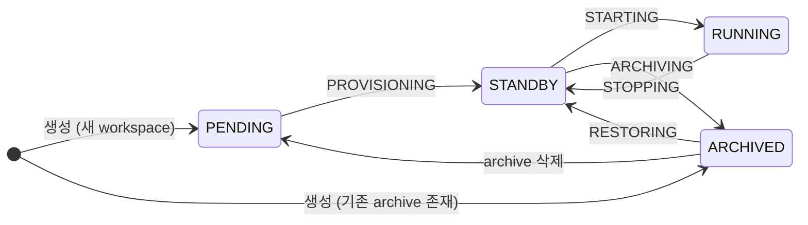
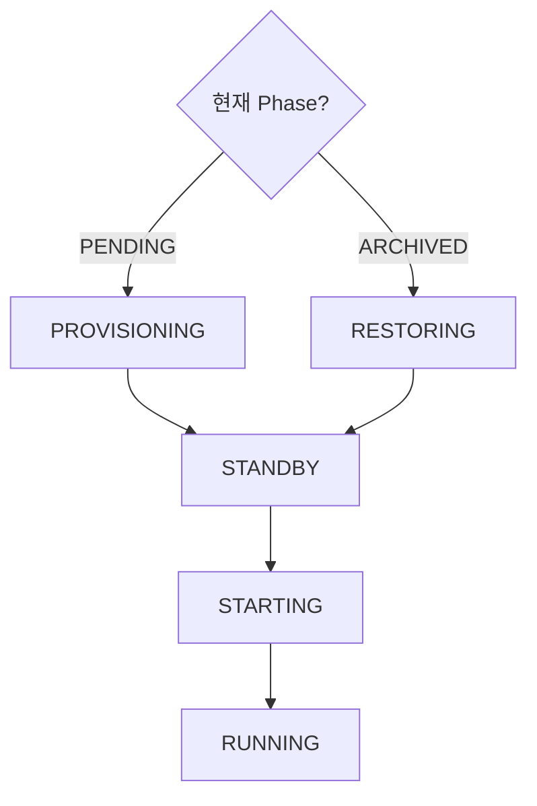
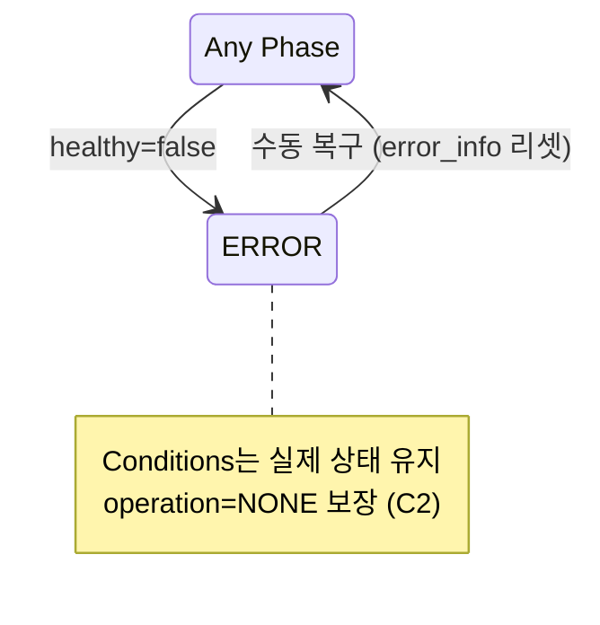
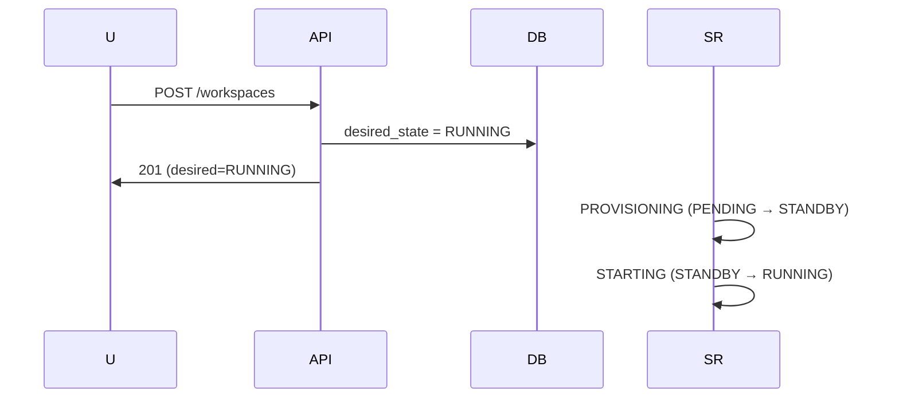
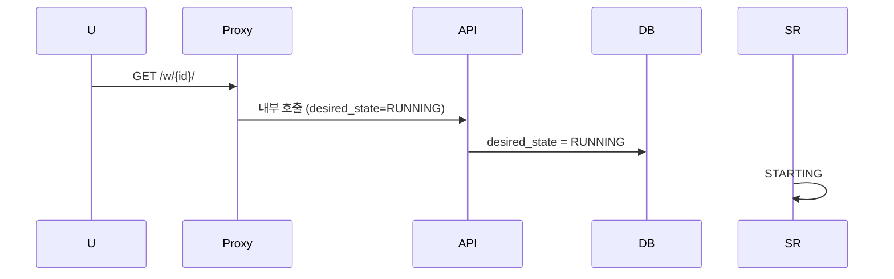
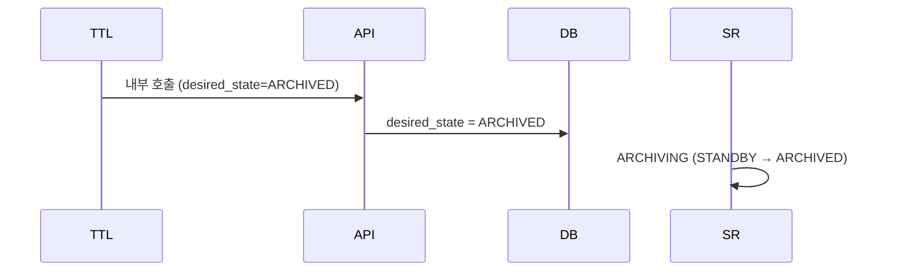
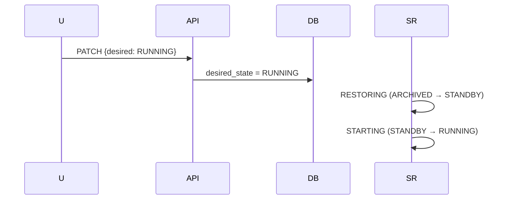

# Workspace 상태 (M2)

> [README.md](./README.md)로 돌아가기

---

## 개요

본 문서는 **State SSOT** (Single Source of Truth)입니다.

| 섹션 | 역할 |
|------|------|
| **State Language** | "지금 뭐라고 부르는가?" (Phase, Operation 정의) |
| **State Machine** | "다음에 뭘 해야 하는가?" (Level, 전이 규칙) |

> **Conditions 정의**: [03-schema.md#conditions](./03-schema.md#conditions-jsonb-구조)
> **계약/규칙**: [00-contracts.md](./00-contracts.md)

---

# State Language

> **역할**: 현재 상태를 어떻게 표현하는가 (순수 데이터)

---

## Phase (요약)

Phase는 Conditions에서 계산되는 **파생 값**입니다.

| Phase | 조건 | 의미 |
|-------|------|------|
| DELETED | `deleted_at` ∧ !resources | 삭제 완료 |
| DELETING | `deleted_at` ∧ resources | 삭제 진행 중 |
| ERROR | !healthy | 정책 위반 |
| RUNNING | healthy ∧ container ∧ volume | 실행 중 |
| STANDBY | healthy ∧ volume ∧ !container | 대기 중 |
| ARCHIVED | healthy ∧ !volume ∧ archive | 보관됨 |
| PENDING | healthy ∧ !volume ∧ !archive | 초기 |

> **resources**: `volume_ready ∨ container_ready ∨ archive_ready`
> **Phase 캐시**: HM이 conditions 변경 시 phase 컬럼도 함께 계산/저장

### calculate_phase()

```python
def calculate_phase(conditions: dict, deleted_at: datetime | None) -> Phase:
    """Phase 계산 로직 (유일한 정의)"""
    if deleted_at:
        has_resources = (
            conditions.get("storage.volume_ready", {}).get("status") or
            conditions.get("infra.container_ready", {}).get("status") or
            conditions.get("storage.archive_ready", {}).get("status")
        )
        return Phase.DELETING if has_resources else Phase.DELETED

    if not conditions["policy.healthy"]["status"]:
        return Phase.ERROR
    if conditions["infra.container_ready"]["status"] and conditions["storage.volume_ready"]["status"]:
        return Phase.RUNNING
    if conditions["storage.volume_ready"]["status"]:
        return Phase.STANDBY
    if conditions.get("storage.archive_ready", {}).get("status"):
        return Phase.ARCHIVED
    return Phase.PENDING
```

---

## Operation (진행 상태)

Operation은 **현재 진행 중인 작업**을 표현합니다.

| operation | 의미 |
|-----------|------|
| NONE | 안정 상태 |
| PROVISIONING | Volume 생성 중 |
| RESTORING | Archive → Volume 복원 중 |
| STARTING | Container 시작 중 |
| STOPPING | Container 정지 중 |
| ARCHIVING | Volume → Archive 중 |
| DELETING | 전체 삭제 중 |

> **순수 데이터**: 전이 규칙은 State Machine 섹션 참조

---

## desired_state (목표)

| desired_state | 의미 |
|---------------|------|
| DELETED | 삭제 요청 |
| PENDING | 리소스 없음 (Archive도 없음) |
| ARCHIVED | Archive만 유지 |
| STANDBY | Volume만 유지 |
| RUNNING | 실행 상태 |

> **API 소유**: desired_state는 API만 변경 가능

---

# State Machine

> **역할**: 상태 전이 규칙 (전이 순서, Operation 선택)

---

## Phase Level

Ordered State Machine에서 사용하는 레벨 정의입니다.

| Phase | Level |
|-------|-------|
| PENDING | 0 |
| ARCHIVED | 5 |
| STANDBY | 10 |
| RUNNING | 20 |

### 예외 (Ordered 미적용)

| Phase | 이유 |
|-------|------|
| ERROR | 정책 위반 (별도 축) |
| DELETING | 삭제 진행 중 |
| DELETED | 삭제 완료 |

---

## 전이 규칙

### step_up (상승)

```
PENDING(0) → ARCHIVED(5) → STANDBY(10) → RUNNING(20)
```

- 낮은 Level → 높은 Level
- 한 단계씩 순차 전이

### step_down (하강)

```
RUNNING(20) → STANDBY(10) → ARCHIVED(5) → PENDING(0)
```

- 높은 Level → 낮은 Level
- 한 단계씩 순차 전이

> **직접 전이 금지**: RUNNING → PENDING 직접 불가

---

## Operation 선택

desired_state와 현재 Phase의 불일치를 해소하기 위한 Operation 선택 규칙입니다.

| 현재 Phase | desired | → operation |
|-----------|---------|-------------|
| PENDING | STANDBY+ | PROVISIONING |
| ARCHIVED | STANDBY+ | RESTORING |
| STANDBY | RUNNING | STARTING |
| STANDBY | ARCHIVED- | ARCHIVING |
| RUNNING | STANDBY- | STOPPING |

> **STANDBY+**: STANDBY 또는 RUNNING (상승)
> **ARCHIVED-**: ARCHIVED 또는 PENDING (하강)

### 삭제 Operation

| 현재 Phase | 조건 | → operation |
|-----------|------|-------------|
| PENDING | operation=NONE | DELETING |
| ARCHIVED | operation=NONE | DELETING |
| ERROR | operation=NONE | DELETING |

> **RUNNING/STANDBY에서 삭제**: step_down으로 ARCHIVED/PENDING 도달 후 DELETING

---

## 상태 다이어그램

### 정상 흐름



### step_up 분기



### ERROR 흐름



---

## Phase × Operation 조합

유효한 조합만 정리합니다.

| Phase | operation | 의미 |
|-------|-----------|------|
| PENDING | NONE | 새 workspace |
| PENDING | PROVISIONING | Volume 생성 중 |
| ARCHIVED | NONE | Archive만 존재 |
| ARCHIVED | RESTORING | 복원 중 |
| STANDBY | NONE | Volume 준비됨 |
| STANDBY | STARTING | Container 시작 중 |
| STANDBY | ARCHIVING | 아카이브 중 |
| RUNNING | NONE | 실행 중 |
| RUNNING | STOPPING | 정지 중 |
| ERROR | NONE | 에러 상태 |
| DELETING | DELETING | 삭제 진행 중 |

> **불변식 (C2)**: `Phase=ERROR → operation=NONE`

---

## desired_state 전환

### 허용 전환

| 현재 Phase | → PENDING | → ARCHIVED | → STANDBY | → RUNNING | → DELETED |
|-----------|-----------|------------|-----------|-----------|-----------|
| PENDING | - | ✓ | ✓ | ✓ | ✓ |
| ARCHIVED | ✓ | - | ✓ | ✓ | ✓ |
| STANDBY | ✓ | ✓ | - | ✓ | step_down 후 |
| RUNNING | ✓ | ✓ | ✓ | - | step_down 후 |
| ERROR | 복구 후 | 복구 후 | 복구 후 | 복구 후 | ✓ |

### 409 Conflict

| 조건 | 결과 |
|------|------|
| operation ≠ NONE | 409 Conflict |

> **재시도 필요**: Auto-wake/TTL Manager는 409 시 exponential backoff 후 재시도

---

## 동작 시나리오

### 새 Workspace → RUNNING



### Auto-wake (STANDBY → RUNNING)



### TTL Archive (STANDBY → ARCHIVED)



### 복원 (ARCHIVED → RUNNING)



---

## 프록시 접속 동작

| Phase | 동작 |
|-------|------|
| RUNNING | 정상 연결 |
| STANDBY | Auto-wake → 연결 |
| ARCHIVED | 502 + "복원 필요" |
| PENDING | 502 + "시작 필요" |
| ERROR | 502 + "오류 발생" |

---

## TTL 자동 전환

| 전환 | TTL | 동작 |
|------|-----|------|
| RUNNING → STANDBY | standby_ttl (5분) | API 호출 |
| STANDBY → ARCHIVED | archive_ttl (1일) | API 호출 |

---

## 참조

- [00-contracts.md](./00-contracts.md) - 핵심 계약 (규칙)
- [03-schema.md](./03-schema.md) - DB 스키마 (Conditions SSOT)
- [04-control-plane.md](./04-control-plane.md) - Control Plane 구현
- [ADR-008](../adr/008-ordered-state-machine.md) - Ordered SM
- [ADR-009](../adr/009-status-operation-separation.md) - operation/op_id CAS
- [ADR-011](../adr/011-declarative-conditions.md) - Conditions 패턴
