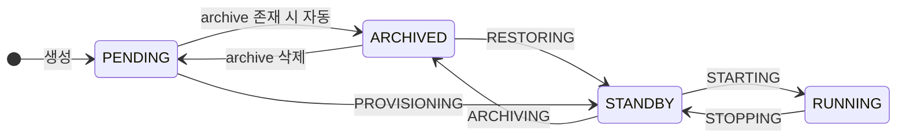
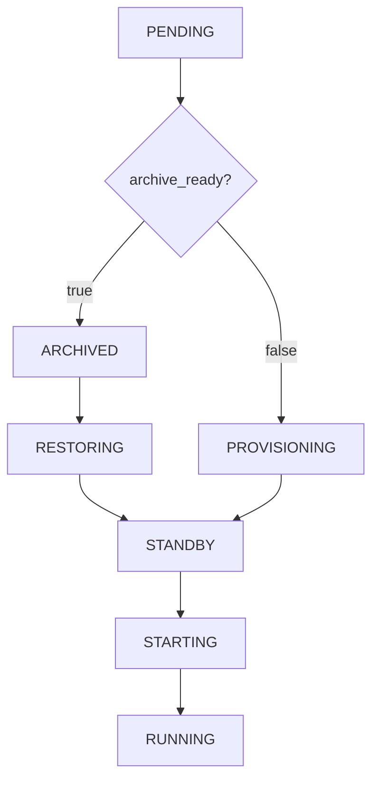
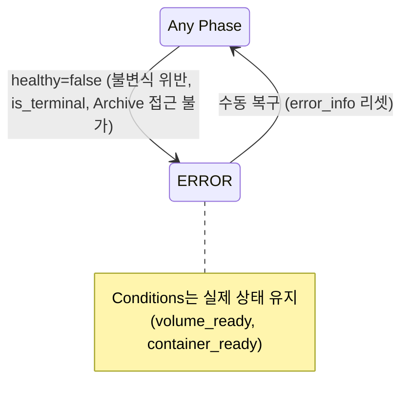
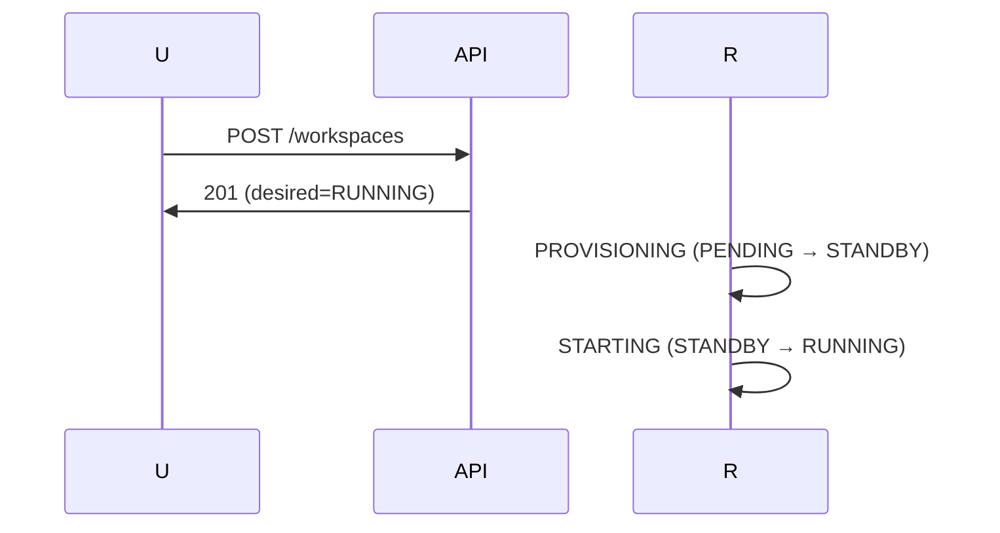
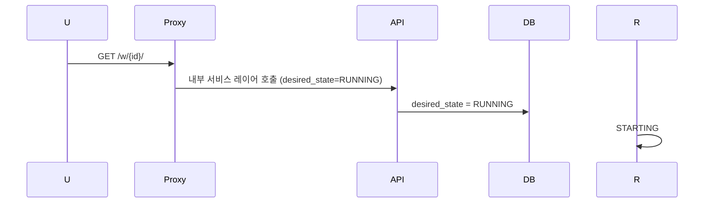
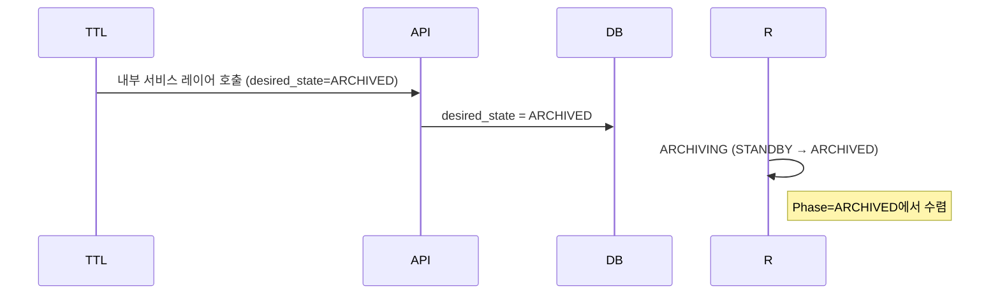
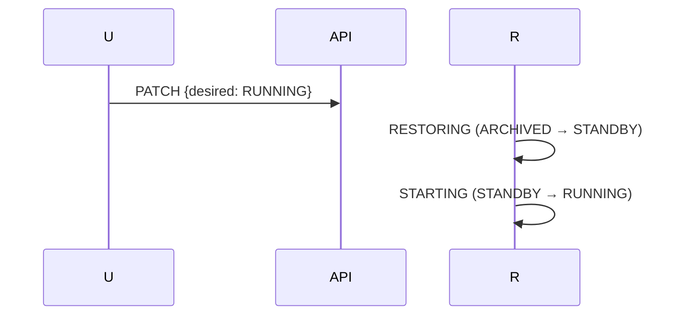

# Workspace 상태 (M2)

> [README.md](./README.md)로 돌아가기

---

## 개요

**Conditions 패턴** + **Ordered State Machine** + **Phase 파생**

| 개념 | 설명 |
|------|------|
| Conditions | JSONB에 저장된 상태 조건들 (volume_ready, archive_ready, container_ready, healthy) |
| Phase (파생) | Conditions에서 계산: `PENDING(0) < ARCHIVED(5) < STANDBY(10) < RUNNING(20)` |
| desired_state | 목표 Phase: `DELETED(-1), PENDING(0), ARCHIVED(5), STANDBY(10), RUNNING(20)` |

> **계약 #1, #5 준수**: Reality vs DB, Ordered State Machine ([00-contracts.md](./00-contracts.md))

---

## Conditions 정의

### 핵심 Conditions

| Condition | Owner | 설명 |
|-----------|-------|------|
| `storage.volume_ready` | HealthMonitor | Volume 존재 여부 |
| `storage.archive_ready` | HealthMonitor | Archive 접근 가능 여부 |
| `infra.*.container_ready` | HealthMonitor | Container running 여부 |
| `policy.healthy` | HealthMonitor | 불변식 + 정책 준수 |

### storage.archive_ready reason 값

| reason | status | 설명 |
|--------|--------|------|
| ArchiveUploaded | true | Archive 정상 접근 가능 |
| ArchiveCorrupted | false | checksum 불일치 |
| ArchiveExpired | false | TTL 만료 |
| ArchiveNotFound | false | archive_key 있지만 S3에 없음 |
| NoArchive | false | archive_key = NULL |

### policy.healthy=false 조건 (Phase=ERROR 유발)

| 우선순위 | 조건 | reason | 설명 |
|---------|------|--------|------|
| 1 | container_ready ∧ !volume_ready | ContainerWithoutVolume | 불변식 위반 |
| 2 | archive_key != NULL ∧ !archive_ready | ArchiveAccessError | Archive 접근 불가 |
| 3 | error_info.is_terminal = true | (error_info.reason) | SR 작업 실패 |

---

## Phase 정의 (파생 값)

| Phase | 조건 | Level | 설명 |
|-------|------|-------|------|
| DELETED | `deleted_at != NULL` | -1 | 삭제 완료 |
| ERROR | `!policy.healthy` | - | 정책 위반 (Ordered 미적용) |
| RUNNING | healthy ∧ container_ready ∧ volume_ready | 20 | 컨테이너 실행 중 |
| STANDBY | healthy ∧ volume_ready ∧ !container_ready | 10 | Volume만 존재 |
| ARCHIVED | healthy ∧ !volume_ready ∧ archive_ready | 5 | Archive만 존재 |
| PENDING | healthy ∧ !volume_ready ∧ !archive_ready | 0 | 활성 리소스 없음 |

> **Phase는 계산값**: conditions 변경 시 HM이 phase 컬럼도 함께 업데이트
> **ERROR 분리**: ERROR는 healthy=false로 표현, Ordered SM 미적용

### Phase 계산 로직

```python
def calculate_phase(conditions: dict, deleted_at: datetime | None) -> Phase:
    if deleted_at:
        return Phase.DELETED
    if not conditions["policy.healthy"]["status"]:
        return Phase.ERROR
    if conditions["container_ready"]["status"] and conditions["volume_ready"]["status"]:
        return Phase.RUNNING
    if conditions["volume_ready"]["status"]:
        return Phase.STANDBY
    if conditions.get("storage.archive_ready", {}).get("status"):
        return Phase.ARCHIVED
    return Phase.PENDING
```

---

## Operation 정의

| Operation | Phase 전환 | 설명 |
|-----------|-----------|------|
| NONE | - | 안정 상태 |
| PROVISIONING | PENDING → STANDBY | 빈 Volume 생성 |
| RESTORING | ARCHIVED → STANDBY | Archive → Volume |
| STARTING | STANDBY → RUNNING | Container 시작 |
| STOPPING | RUNNING → STANDBY | Container 정지 |
| ARCHIVING | STANDBY → ARCHIVED | Volume → Archive |
| DELETING | PENDING/ARCHIVED/ERROR → DELETED | 전체 삭제 |

### Phase × Operation 조합

| Phase | operation | 의미 |
|-------|-----------|------|
| PENDING | NONE | 새 workspace |
| PENDING | PROVISIONING | Volume 생성 중 |
| ARCHIVED | NONE | Archive만 존재 |
| ARCHIVED | RESTORING | 복원 중 |
| STANDBY | NONE | Volume 준비됨 |
| STANDBY | STARTING | Container 시작 중 |
| STANDBY | ARCHIVING | 아카이브 중 |
| RUNNING | NONE | 실행 중 |
| RUNNING | STOPPING | 정지 중 |
| ERROR | NONE | 에러 상태 (operation 리셋, op_id 유지) |

> **Phase=ERROR 시**: Conditions는 실제 상태 유지 (volume_ready/container_ready)

---

## 상태 다이어그램

### 정상 흐름 (Ordered SM)



### step_up 분기



### ERROR 흐름



---

## desired_state 설정

### 허용 값

| desired_state | Level | 설명 |
|---------------|-------|------|
| DELETED | -1 | 삭제 요청 |
| PENDING | 0 | 리소스 없음 (Archive도 삭제) |
| ARCHIVED | 5 | Archive만 유지 |
| STANDBY | 10 | Volume만 유지 |
| RUNNING | 20 | 실행 상태 |

### 전환 규칙

| Phase | → PENDING | → ARCHIVED | → STANDBY | → RUNNING | → DELETED |
|-------|-----------|------------|-----------|-----------|-----------|
| PENDING | - | ✓ (archive 필요) | ✓ | ✓ | ✓ |
| ARCHIVED | ✓ | - | ✓ | ✓ | ✓ |
| STANDBY | ✓ | ✓ | - | ✓ | step_down 후 |
| RUNNING | ✓ | ✓ | ✓ | - | step_down 후 |
| ERROR | 복구 후 | 복구 후 | 복구 후 | 복구 후 | ✓ |
| operation≠NONE | 409 | 409 | 409 | 409 | 409 |

> **계약 #4 준수**: Non-preemptive Operation
> **ERROR에서 삭제**: Phase=ERROR AND operation=NONE 시 바로 삭제 가능

---

## Operation 선택 규칙

| Phase | desired_state | → Operation |
|-------|---------------|-------------|
| PENDING | STANDBY/RUNNING | PROVISIONING |
| ARCHIVED | STANDBY/RUNNING | RESTORING |
| ARCHIVED | PENDING | archive 삭제 |
| STANDBY | RUNNING | STARTING |
| STANDBY | ARCHIVED/PENDING | ARCHIVING |
| RUNNING | STANDBY/ARCHIVED/PENDING | STOPPING |
| PENDING/ARCHIVED/ERROR | DELETED | DELETING |

### 삭제 조건

| 조건 | 설명 |
|------|------|
| Phase ∈ {PENDING, ARCHIVED, ERROR} | 삭제 가능 Phase |
| operation = NONE | 진행 중 작업 없음 (필수) |

> **RUNNING/STANDBY에서 삭제**: step_down으로 ARCHIVED/PENDING 도달 후 삭제

---

## 프록시 접속 동작

| Phase | 동작 |
|-------|------|
| RUNNING | 정상 연결 |
| STANDBY | Auto-wake (API 호출: desired_state=RUNNING) → 연결 |
| ARCHIVED | 502 + "복원 필요" |
| PENDING | 502 + "시작 필요" |
| ERROR | 502 + "오류 발생" |

> **계약 #3 준수**: Auto-wake 시 Proxy가 내부 서비스 레이어를 통해 API 호출

---

## TTL 자동 전환

| 전환 | 트리거 | TTL Manager 동작 |
|------|--------|-----------------|
| RUNNING → STANDBY | standby_ttl (5분) | API 호출 (desired_state=STANDBY) |
| STANDBY → ARCHIVED | archive_ttl (1일) | API 호출 (desired_state=ARCHIVED) |

> **ARCHIVED 유지**: desired_state=ARCHIVED로 설정되므로 Archive 보존
> **계약 #3 준수**: TTL Manager가 내부 서비스 레이어를 통해 API 호출

---

## 주요 시나리오

### 새 Workspace → RUNNING



### Auto-wake (STANDBY → RUNNING)



### TTL Archive (STANDBY → ARCHIVED)



### Archive에서 복원 (ARCHIVED → RUNNING)



---

## Known Issues

1. ~~**desired_state 경쟁**: API/TTL Manager/Proxy가 동시 변경 시 Last-Write-Wins~~
   - **해결됨**: 계약 #3에 따라 API만 desired_state 변경 가능
2. **순차 전이**: RUNNING → PENDING 직접 불가 (STOPPING → ARCHIVING → archive 삭제)
3. ~~**ERROR가 observed_status에 포함**: 리소스 관측과 정책 판정 혼재~~
   - **해결됨**: Conditions 패턴으로 분리 (ADR-011)

---

## 참조

- [00-contracts.md](./00-contracts.md) - 핵심 계약
- [03-schema.md](./03-schema.md) - DB 스키마
- [04-control-plane.md](./04-control-plane.md) - Control Plane (SR, HM, TTL)
- [ADR-011](../adr/011-declarative-conditions.md) - Conditions 기반 상태 표현
- [ADR-008](../adr/008-ordered-state-machine.md) - Ordered State Machine (step_up/step_down 유효)
- [ADR-009](../adr/009-status-operation-separation.md) - operation/op_id CAS (유효)
