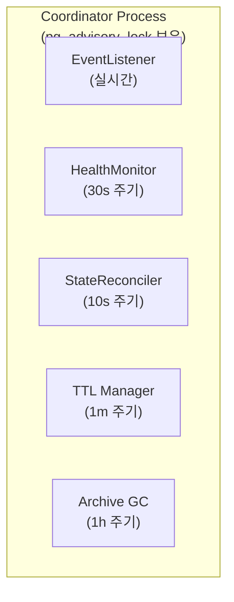
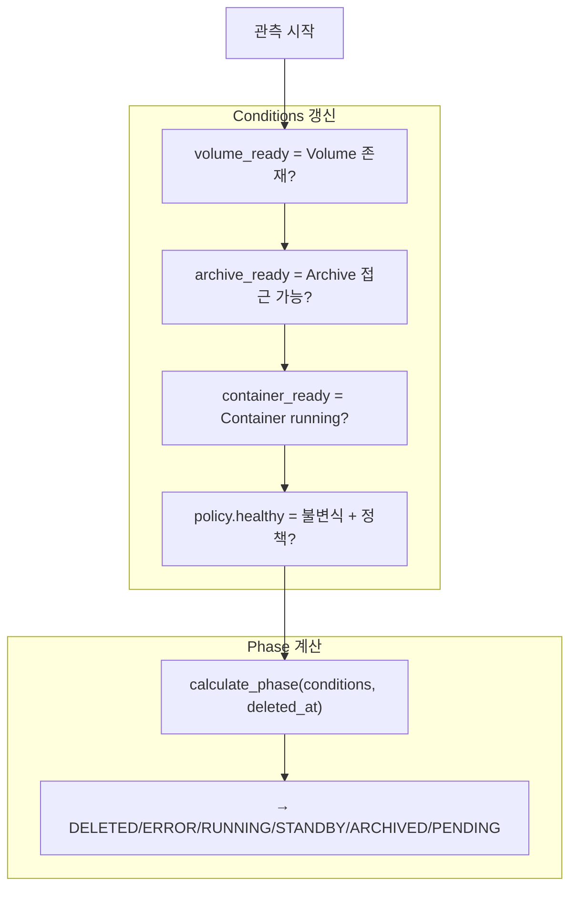
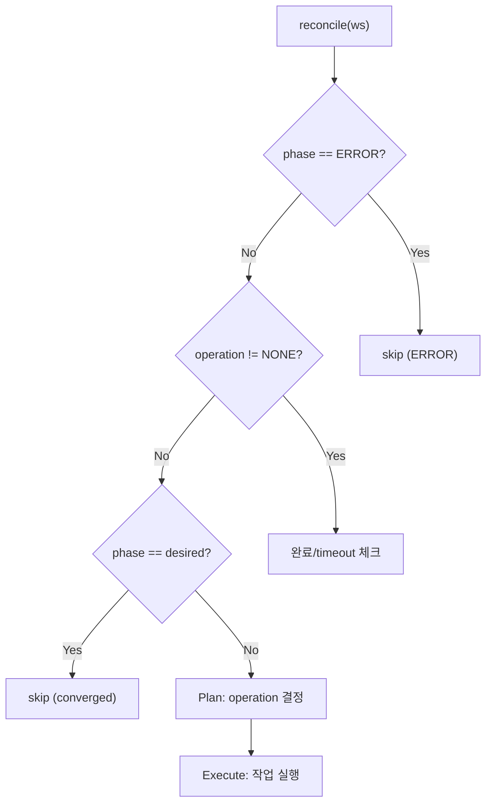
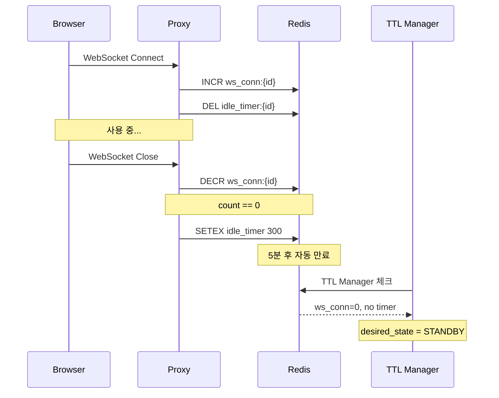
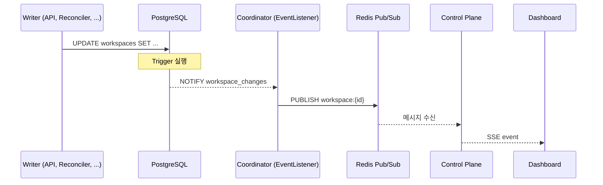
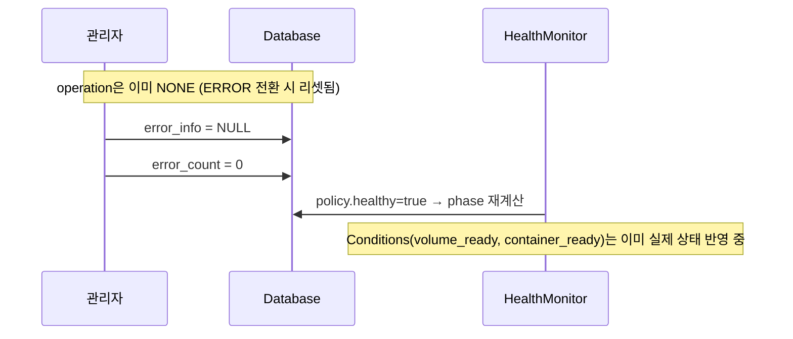

# Control Plane (M2)

> Coordinator 프로세스 내 컴포넌트 및 정책 정의
>
> **의존**: [00-contracts.md](./00-contracts.md), [01-glossary.md](./01-glossary.md), [02-states.md](./02-states.md), [03-schema.md](./03-schema.md)

---

## 목차

1. [Coordinator](#coordinator)
2. [HealthMonitor](#healthmonitor)
3. [StateReconciler](#statereconciler)
4. [TTL Manager](#ttl-manager)
5. [Events](#events)
6. [Activity](#activity)
7. [Error Policy](#error-policy)
8. [Limits](#limits)

---

## Coordinator

Coordinator는 모든 백그라운드 프로세스를 관리하는 **단일 리더 프로세스**입니다.

### 불변식

1. **Single Leader**: 동시에 하나의 Coordinator만 Active
2. **Automatic Failover**: 연결 끊김 시 자동 리더십 이전
3. **Single Writer**: 컴포넌트별 담당 컬럼 분리 (계약 #3)

### 아키텍처



### 컴포넌트 실행 주기 (적응형 Polling)

| 컴포넌트 | 기본 주기 | 가속 주기 | 역할 |
|---------|----------|----------|------|
| EventListener | 실시간 | - | PG NOTIFY → Redis PUBLISH (CDC) |
| HealthMonitor | 30초 | 2초 (operation 진행 중) | 리소스 관측 → conditions/phase 갱신 |
| StateReconciler | 30초 | 2초 (operation 진행 중), 5초 (수렴 필요) | desired ≠ phase 수렴 |
| TTL Manager | 1분 | - | TTL 만료 → desired_state 변경 (STANDBY/ARCHIVED) |
| Archive GC | 1시간 | - | orphan archive 정리 |

> **계약 #2 준수**: 적응형 Polling으로 operation 진행 중 UX 향상 ([Level-Triggered](./00-contracts.md#2-level-triggered-reconciliation))

### Leader Election (PostgreSQL Session Lock)

| 특성 | 설명 |
|-----|------|
| 락 유형 | `pg_advisory_lock` (Session Level) |
| 락 해제 | DB 연결 끊기면 즉시 해제 |
| Failover | TCP timeout (수 초) |

> **목적**: Single Writer Principle ([#3](./00-contracts.md#3-single-writer-principle))을 보장하기 위한 단일 리더 실행

### 에러 처리

| 상황 | 동작 |
|------|------|
| DB 연결 끊김 | 리더십 포기 → 재연결 → 재획득 시도 |
| 개별 컴포넌트 에러 | 해당 tick 스킵 → 다음 tick 재시도 |
| 전체 루프 에러 | 리더십 포기 → 재획득 시도 |

---

## HealthMonitor

HealthMonitor는 실제 리소스 상태를 관측하고 DB에 반영하는 **관측자** 컴포넌트입니다.

> **계약 준수**: [#1 Reality vs DB](./00-contracts.md#1-reality-vs-db-진실의-원천)

### 핵심 원칙

1. **진실(Reality) = 실제 리소스**: Container/Volume/Archive의 실제 존재 여부가 진실
2. **DB = Last Observed Truth**: DB는 마지막 관측치일 뿐
3. **HealthMonitor 중단 = DB Stale**: HM이 멈추면 DB 상태가 실제와 괴리될 수 있음
4. **Conditions 기반**: 개별 Condition 갱신 → phase 계산

### 입출력

**읽기**: DB (id, deleted_at, error_info, archive_key, operation), Container/Volume/Archive Provider

**쓰기**: conditions (JSONB), phase, observed_at (Single Writer)

### Conditions 갱신 규칙

HM은 각 Condition을 개별적으로 갱신합니다:

| Condition | 관측 방법 | status=true 조건 |
|-----------|----------|-----------------|
| `storage.volume_ready` | Volume Provider 호출 | Volume 존재 |
| `storage.archive_ready` | S3 HEAD 요청 (archive_key 존재 시) | Archive 접근 가능 |
| `infra.*.container_ready` | Container Provider 호출 | Container running |
| `policy.healthy` | 아래 규칙 참조 | 불변식 + 정책 준수 |

#### policy.healthy 결정 규칙

| 우선순위 | 조건 | status | reason |
|---------|------|--------|--------|
| 1 | container_ready ∧ !volume_ready | false | ContainerWithoutVolume |
| 2 | archive_key != NULL ∧ !archive_ready | false | ArchiveAccessError |
| 3 | error_info.is_terminal = true | false | (error_info.reason) |
| 4 | 그 외 | true | AllConditionsMet |

### Phase 계산

Conditions 갱신 후 phase를 계산하여 함께 저장:

```python
def calculate_phase(conditions: dict, deleted_at: datetime | None) -> Phase:
    if deleted_at:
        return Phase.DELETED
    if not conditions["policy.healthy"]["status"]:
        return Phase.ERROR
    if conditions["container_ready"]["status"] and conditions["volume_ready"]["status"]:
        return Phase.RUNNING
    if conditions["volume_ready"]["status"]:
        return Phase.STANDBY
    if conditions.get("storage.archive_ready", {}).get("status"):
        return Phase.ARCHIVED
    return Phase.PENDING
```

### Conditions 갱신 흐름



### 불변식 위반 감지

| 위반 유형 | 조건 | 처리 |
|----------|------|------|
| ContainerWithoutVolume | container_ready ∧ !volume_ready | policy.healthy = {status: false, reason: "ContainerWithoutVolume"} |
| ArchiveAccessError | archive_key != NULL ∧ !archive_ready | policy.healthy = {status: false, reason: "ArchiveAccessError"} |

> **계약 준수**: [#3 Single Writer](./00-contracts.md#3-single-writer-principle)
> **Single Writer 완전 준수**: error_info는 SR 소유, conditions는 HM 소유 (예외 규칙 제거)
> **Conditions 유지**: Phase=ERROR 시에도 volume_ready/container_ready는 실제 상태 반영

### 즉시 관측 (Edge Hint)

StateReconciler가 operation 완료 후 Redis `monitor:trigger` 채널로 즉시 관측 요청.

---

## StateReconciler

StateReconciler는 desired_state와 phase를 비교하여 상태를 수렴시키는 **실행자** 컴포넌트입니다.

> **계약 준수**: [#2 Level-Triggered Reconciliation](./00-contracts.md#2-level-triggered-reconciliation)

### 핵심 원칙 (Level-Triggered 4단계)

1. **DB만 읽는다**: 이벤트가 아닌 현재 DB 상태 기준
2. **Plan**: desired ≠ phase → operation 결정
3. **Execute**: operation 실행 (Actuator 호출)
4. **완료 판정**: phase == operation.target (HM이 관측 후 phase 계산)

### 불변식

1. **Non-preemptive**: `operation != NONE`이면 다른 operation 시작 불가 (계약 #4)
2. **CAS 선점**: operation 시작 시 `WHERE operation = 'NONE'` 조건 사용
3. **ERROR skip**: `phase=ERROR` workspace는 reconcile 대상에서 제외

### 입출력

**읽기**: desired_state, phase, conditions, operation, op_started_at, error_count, archive_key

**쓰기**: operation, op_started_at, op_id, archive_key, error_count, error_info, home_ctx (Single Writer)

### Operation 결정 규칙

| phase | desired | → operation |
|-------|---------|-------------|
| PENDING | STANDBY/RUNNING | PROVISIONING |
| ARCHIVED | STANDBY/RUNNING | RESTORING |
| ARCHIVED | PENDING | archive 삭제 |
| STANDBY | RUNNING | STARTING |
| STANDBY | ARCHIVED/PENDING | ARCHIVING |
| RUNNING | STANDBY/ARCHIVED/PENDING | STOPPING |
| PENDING/ARCHIVED/ERROR | DELETED | DELETING |
| ERROR | * (except DELETED) | (skip) |

> RUNNING → PENDING은 직접 불가. STOPPING → ARCHIVING 순차 진행.
>
> **계약 준수**: [#5 Ordered State Machine](./00-contracts.md#5-ordered-state-machine)
>
> **계약 #4 준수**: `operation != NONE`이면 완료/timeout 체크만 진행, 새 operation 시작 금지 ([Non-preemptive](./00-contracts.md#4-non-preemptive-operation))
>
> **phase=ERROR**: 새 operation 시작 안 함. 복구 후 reconcile 재개. (단, DELETED 요청은 허용)

### 완료 조건

| Operation | Target Phase | 완료 조건 |
|-----------|--------------|----------|
| PROVISIONING | STANDBY | phase == STANDBY |
| RESTORING | STANDBY | phase == STANDBY AND home_ctx.restore_marker == archive_key |
| STARTING | RUNNING | phase == RUNNING |
| STOPPING | STANDBY | phase == STANDBY |
| ARCHIVING | ARCHIVED | phase == ARCHIVED AND archive_key != NULL |

> 완료 시: `operation = NONE`, `error_count = 0`, `error_info = NULL`

**RESTORING 완료 조건** (계약 #7):
1. HM이 Volume 존재 관측 → `volume_ready = true` → `phase = STANDBY`
2. SR이 `home_ctx.restore_marker == archive_key` 확인 → 복원 완료

> 두 조건 모두 충족해야 RESTORING 완료. restore_marker 미설정 시 미완료 판정
>
> **완료 판정 원칙**: StateReconciler는 DB만 읽어서 판정. HealthMonitor가 실제 리소스를 관측.
>
> **ARCHIVING 순서 보장** (계약 #8):
> 1. archive() 호출 후 archive_key를 DB에 저장
> 2. delete_volume() 호출
>
> 이 순서를 반드시 준수하여 데이터 유실 방지. ([Ordering Guarantee](./00-contracts.md#8-ordering-guarantee-역순-금지))

### Timeout

| Operation | Timeout | 초과 시 |
|-----------|---------|--------|
| PROVISIONING | 5분 | is_terminal = true |
| RESTORING | 30분 | is_terminal = true |
| STARTING | 5분 | is_terminal = true |
| STOPPING | 5분 | is_terminal = true |
| ARCHIVING | 30분 | is_terminal = true |

### 재시도 정책

| 항목 | 값 |
|------|---|
| 최대 재시도 | 3회 |
| 재시도 간격 | 30초 (고정) |
| 한계 초과 | is_terminal = true |

### ERROR 전환 규칙 (계약 #4)

| 단계 | 컴포넌트 | 동작 |
|------|----------|------|
| 1 | StateReconciler | `is_terminal=true` 판정 시 `operation=NONE` 리셋 |
| 2 | StateReconciler | `error_info` 설정 (reason, message, is_terminal, context) |
| 3 | StateReconciler | `op_id` 유지 (GC 보호) |
| 4 | HealthMonitor | error_info.is_terminal 확인 → `policy.healthy = {status: false}` → phase=ERROR |

> **Single Writer 준수**: SR이 operation/op_id/error_info 설정, HM이 conditions/phase 설정
>
> **Conditions 유지**: ERROR 시에도 volume_ready/container_ready는 실제 리소스 상태 반영
>
> **CAS 실패 처리**: operation 선점 CAS 실패 시 다음 reconcile 사이클에서 재시도

### Reconcile 흐름



> **phase 기반 skip**: phase=ERROR일 때 reconcile 제외 (단, desired=DELETED는 허용)

---

## TTL Manager

TTL Manager는 비활성 워크스페이스의 TTL을 체크하고 desired_state를 변경합니다.

### TTL 종류

| TTL | 대상 Phase | 트리거 | 동작 |
|-----|-----------|--------|------|
| standby_ttl | RUNNING | WebSocket 종료 + idle 타이머 만료 | desired_state = STANDBY |
| archive_ttl | STANDBY | last_access_at 기준 경과 | desired_state = **ARCHIVED** |

> **ARCHIVED로 변경**: 기존 PENDING 대신 ARCHIVED로 설정하여 Archive 보존

### 입출력

**읽기**: DB (phase, operation, TTL 컬럼, last_access_at), Redis (ws_conn, idle_timer)

**쓰기**: (없음 - 내부 서비스 레이어를 통해 API 호출)

> **계약 #3 준수**: TTL Manager는 desired_state를 직접 변경하지 않고, 내부 서비스 레이어를 통해 API 호출

### Standby TTL 체크 규칙

| 조건 | 결과 |
|------|------|
| phase != RUNNING | skip |
| operation != NONE | skip |
| ws_conn > 0 | skip (활성 연결) |
| idle_timer 존재 | skip (5분 대기 중) |
| 위 조건 모두 통과 | API 호출: desired_state = STANDBY |

### Archive TTL 체크 규칙

| 조건 | 결과 |
|------|------|
| phase != STANDBY | skip |
| operation != NONE | skip |
| NOW() - last_access_at <= archive_ttl_seconds | skip |
| 위 조건 모두 통과 | API 호출: desired_state = **ARCHIVED** |

> **ARCHIVED 유지**: desired_state=ARCHIVED로 설정되므로 Archive 보존 (M1 해결)

---

## Activity

WebSocket 연결 기반으로 워크스페이스 활동을 추적합니다.

### Redis 키

| 키 | 타입 | 설명 |
|----|------|------|
| `ws_conn:{workspace_id}` | Integer | WebSocket 연결 수 |
| `idle_timer:{workspace_id}` | String (TTL 5분) | idle 타이머 |

### Proxy 동작

| 이벤트 | 동작 |
|--------|------|
| WebSocket Connect | INCR ws_conn, DEL idle_timer |
| WebSocket Disconnect | DECR ws_conn, count=0이면 SETEX idle_timer 300 |

### Idle 타이머 흐름



### last_access_at 갱신

| 시점 | 주체 | 값 |
|------|------|---|
| workspace 생성 | API | NOW() |
| STOPPING 완료 | StateReconciler | NOW() |

---

## Events

상태 변경 시 UI에 실시간 알림을 전달합니다 (CDC 패턴).

### 이벤트 전달 흐름



### 이벤트 발행 구조

| 구분 | 값 |
|------|---|
| 트리거 대상 | workspaces 테이블 UPDATE |
| 감시 컬럼 | observed_status, operation, error_info |
| 발행 | pg_notify('workspace_changes', payload) |

### SSE 엔드포인트

```
GET /api/v1/workspaces/{id}/events
Accept: text/event-stream
```

| 항목 | 값 |
|------|---|
| Heartbeat | 30초 주기 |
| 재연결 | 클라이언트 자동 재연결 |

### 이벤트 타입

| 타입 | 발행 시점 |
|------|----------|
| state_changed | operation 시작/완료 |
| error | 에러 발생 |
| heartbeat | 30초마다 |

---

## Error Policy

### ErrorInfo 구조

| 필드 | 타입 | 설명 |
|------|------|------|
| reason | string | 에러 유형 |
| message | string | 사람이 읽는 메시지 |
| is_terminal | bool | true면 HM이 policy.healthy=false → phase=ERROR로 설정 |
| operation | string | 실패한 operation |
| error_count | int | 연속 실패 횟수 |
| context | dict | reason별 상세 정보 |
| occurred_at | string | ISO 8601 timestamp |

### ErrorReason

| reason | 설명 | 재시도 | is_terminal |
|--------|------|--------|-------------|
| Mismatch | 상태 불일치 | 3회 | 초과 시 |
| Unreachable | API/인프라 호출 실패 | 3회 | 초과 시 |
| ActionFailed | 작업 실행 실패 | 3회 | 초과 시 |
| Timeout | 작업 시간 초과 | 0회 | 즉시 |
| RetryExceeded | 재시도 한계 초과 | - | 항상 |
| DataLost | 데이터 손실/손상 | 0회 | 즉시 |

### context 필드 예시

| reason | context 예시 |
|--------|-------------|
| Mismatch | `{"expected": "volume_exists=True", "actual": "False"}` |
| Unreachable | `{"endpoint": "k8s-api", "status_code": 503}` |
| ActionFailed | `{"action": "archive", "exit_code": 1}` |
| Timeout | `{"operation": "ARCHIVING", "elapsed_seconds": 1800}` |
| DataLost | `{"archive_key": "...", "detail": "checksum mismatch"}` |
| RetryExceeded | `{"max_retries": 3, "last_error": "..."}` |

### 에러 코드 매핑

| 기존 코드 | ErrorReason |
|----------|-------------|
| ARCHIVE_NOT_FOUND | DataLost |
| S3_ACCESS_ERROR | Unreachable |
| CHECKSUM_MISMATCH | DataLost |
| TAR_EXTRACT_FAILED | ActionFailed |
| VOLUME_CREATE_FAILED | ActionFailed |
| CONTAINER_START_FAILED | ActionFailed |
| K8S_API_ERROR | Unreachable |

### 책임 분리 (Reporter vs Judge)

| 컴포넌트 | 역할 | 책임 |
|---------|------|------|
| StateReconciler | **Reporter** (에러 사실 기록자) | error_info, error_count 설정, is_terminal 판정 |
| HealthMonitor | **Judge** (에러 상태 판정자) | is_terminal 읽고 policy.healthy=false → phase=ERROR 설정 |

**왜 SR이 에러를 기록하나?**
- SR이 Actuator를 호출하므로, 실패를 **가장 먼저 알 수 있음** (정보의 근접성)
- SR이 op_started_at을 설정하므로, 타임아웃을 **직접 계산 가능**
- 역할 과다가 아닌 **Orchestrator의 필수 책임**

**분산 에러 처리 흐름**:
1. SR: 에러 조건 감지 → error_info 기록 ("throw" 역할)
2. HM: error_info.is_terminal 확인 → policy.healthy=false → phase=ERROR ("catch" 역할)

> **Single Writer 완전 준수**: error_info는 SR 소유, conditions는 HM 소유 (예외 규칙 제거)

### 재시도 책임 분리

| 레벨 | 재시도 | 시간 |
|------|--------|------|
| Job 내부 | 3회 | 총 30~60초 |
| StateReconciler | 3회 | 30초 간격 |

> **최악의 경우**: Job 내부 3회 × SR 3회 = 9회 (의도된 동작)

### GC 보호

| phase | GC 동작 | 이유 |
|-------|---------|------|
| ERROR | 보호 (삭제 안 함) | 복구 시 archive 필요 |
| DELETED | 삭제 대상 | soft-delete workspace |

> **계약 준수**: [#9 GC Separation & Protection](./00-contracts.md#9-gc-separation--protection)
> **phase 기반**: GC 보호는 phase=ERROR 기준 (policy.healthy=false)

### ERROR 복구

ERROR 전환 시 operation이 이미 NONE으로 리셋되므로, 복구 시 2개 필드만 리셋:



| 필드 | 리셋 필요 | 이유 |
|------|----------|------|
| error_info | O | 에러 정보 초기화 → HM이 policy.healthy=true로 전환 |
| error_count | O | 재시도 횟수 초기화 |
| operation | X | ERROR 전환 시 이미 NONE |
| op_id | X | GC 보호용으로 유지 |
| conditions | X | 이미 실제 리소스 상태 반영 중 (HM이 계속 갱신) |

---

## Limits

동시에 실행 가능한 워크스페이스 수를 제한합니다.

### 제한 유형

| 제한 | 기본값 | 설명 |
|------|--------|------|
| max_running_per_user | 2 | 사용자당 동시 RUNNING |
| max_running_global | 100 | 시스템 전체 동시 RUNNING |

### 체크 시점

| 시점 | 동작 |
|------|------|
| API: desired_state = RUNNING | 제한 체크 후 설정 |
| Proxy: Auto-wake 트리거 | 제한 체크 후 진행 |

### 제한 초과 시 동작

| 상황 | 응답 |
|------|------|
| API 요청 | 429 Too Many Requests |
| Auto-wake | 502 + 안내 페이지 (실행 중인 워크스페이스 목록) |

> **Soft Limit**: Race condition으로 약간 초과 가능 (허용)

---

## Known Issues

1. ~~**관측 지연**: HM 최대 30초~~
   - **완화됨**: 적응형 Polling으로 operation 진행 중 2초 주기
2. **Operation 중단 불가**: 시작 후 취소 불가, 완료까지 대기
3. **순차적 전이**: RUNNING → PENDING 직접 불가 (STOPPING → ARCHIVING 순차)
4. **재시도 간격 고정**: 지수 백오프 미적용 (M2)
5. ~~**desired_state 경쟁**: API/TTL Manager/Proxy 동시 변경 시 Last-Write-Wins~~
   - **해결됨**: 계약 #3에 따라 API만 desired_state 변경 가능
6. **ERROR 자동 복구 불가**: 관리자 수동 개입 필요 (error_info, error_count 리셋)
7. ~~**observed_status에 ERROR 포함**: 리소스 관측과 정책 판정 혼재~~
   - **해결됨**: Conditions 패턴으로 분리 (ADR-011)

---

## 참조

- [00-contracts.md](./00-contracts.md) - 핵심 계약
- [02-states.md](./02-states.md) - 상태 정의
- [03-schema.md](./03-schema.md) - DB 스키마
- [ADR-011](../adr/011-declarative-conditions.md) - Conditions 기반 상태 표현
