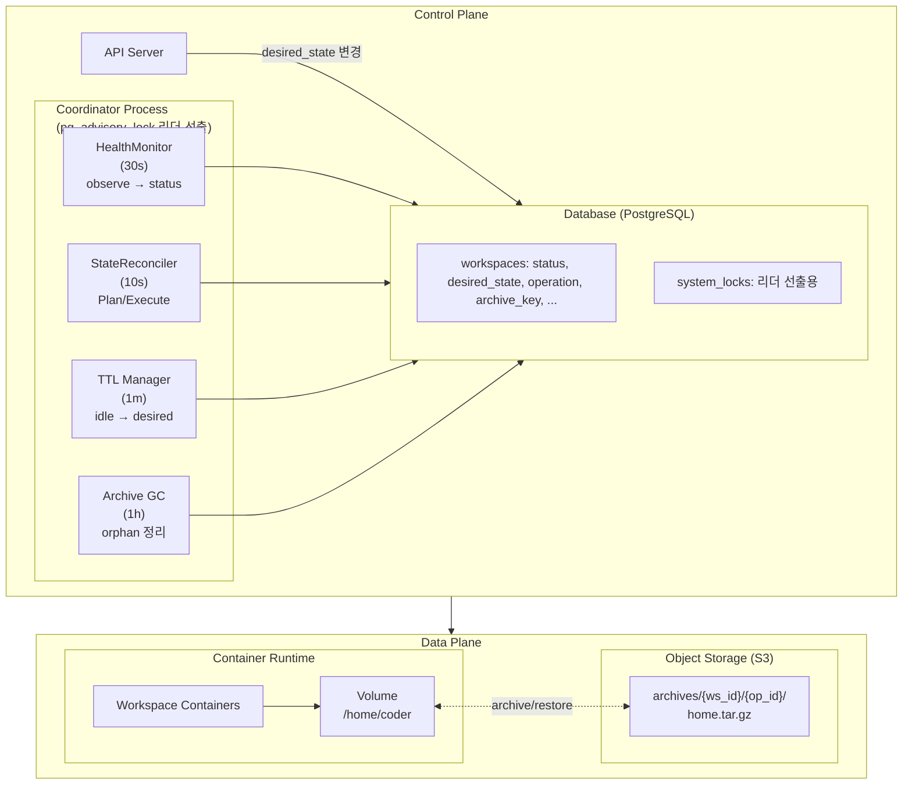

# M2 Specification

> M2 마일스톤을 위한 스펙 문서

---

## 개요

M2는 완성형 아키텍처를 구축합니다. M3에서는 Instance Controller와 Storage Provider 구현체만 교체하여 K8s에서 동작합니다.

### M1 → M2 주요 변경

| 항목 | M1 (MVP) | M2 |
|------|----------|-----|
| Storage | Bind Mount | Docker Volume + Object Storage |
| 상태 모델 | CREATED/RUNNING/STOPPED | PENDING/STANDBY/RUNNING (Ordered) + ARCHIVED (Display) |
| 상태 전환 | 명령형 (start/stop) | 선언형 (desired_state) |
| 전환 주체 | API 직접 실행 | Reconciler |
| TTL | 없음 | RUNNING→STANDBY→ARCHIVED 자동 전환 |
| Auto-wake | 없음 | STANDBY 상태에서 프록시 접속 시 자동 시작 |

---

## 아키텍처

### 컬럼 소유권 (단일 Writer 원칙)

| Writer | 컬럼 |
|--------|------|
| **HealthMonitor** | `status`, `observed_at` |
| **StateReconciler** | `operation`, `op_started_at`, `op_id`, `archive_key`, `error_count`, `error_info` |
| **API/TTL Manager** | `desired_state`, `deleted_at`, TTL 메타 |

---

## 문서 목록

### 핵심 문서

| 문서 | 설명 |
|------|------|
| [states.md](./states.md) | 상태 정의 + 주요 시나리오 (Ordered State Machine) |
| [schema.md](./schema.md) | DB 스키마 + 컬럼 소유권 |

### 컴포넌트 문서 (Coordinator 내 프로세스)

| 문서 | 주기 | 설명 |
|------|------|------|
| [components/coordinator.md](./components/coordinator.md) | - | 리더 선출, 프로세스 관리 |
| [components/health-monitor.md](./components/health-monitor.md) | 30s | 실제 리소스 관측 → status 갱신 |
| [components/state-reconciler.md](./components/state-reconciler.md) | 10s | DB만 읽고 Plan/Execute |
| [components/ttl-manager.md](./components/ttl-manager.md) | 1m | idle/archive TTL → desired_state 변경 |
| [components/archive-gc.md](./components/archive-gc.md) | 1h | orphan archive 정리 |

### 레이어별 문서

| 문서 | 설명 |
|------|------|
| [storage.md](./storage.md) | Storage 원칙, 인터페이스, Operation 플로우 |
| [storage-job.md](./storage-job.md) | Storage Job 스펙 (Crash-Only 설계) |
| [instance.md](./instance.md) | InstanceController (start/stop/delete) |
| [events.md](./events.md) | SSE 이벤트 정의 |

### 정책 문서

| 문서 | 설명 |
|------|------|
| [error.md](./error.md) | ERROR 상태, ErrorInfo, 재시도 정책 |
| [limits.md](./limits.md) | RUNNING 워크스페이스 제한 |
| [activity.md](./activity.md) | 활동 감지 (WebSocket 기반) |

---

## 참조

- [ADR-008: Ordered State Machine](../adr/008-ordered-state-machine.md)
- [ADR-006: Reconciler 패턴](../adr/006-reconciler-pattern.md)
- [ADR-007: Reconciler 구현](../adr/007-reconciler-implementation.md)
- [Roadmap: M2 Draft](../roadmap/002-m2-draft.md)
