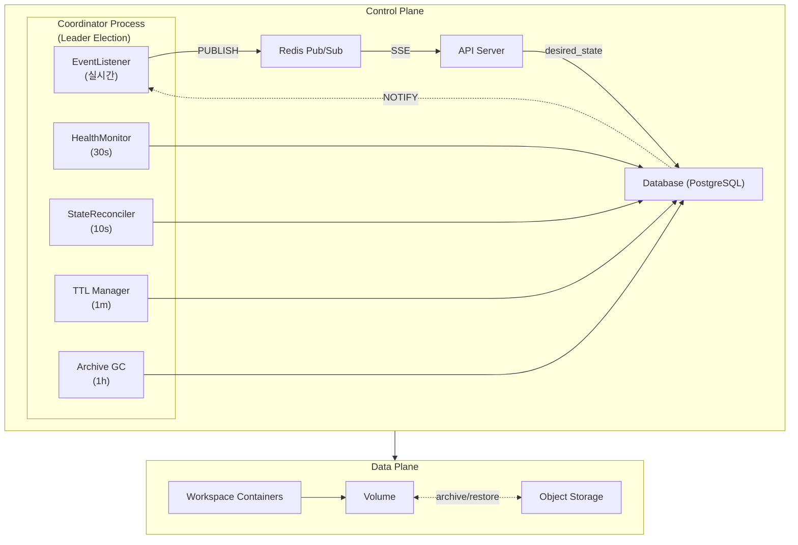

# M2 Specification

> M2 마일스톤을 위한 스펙 문서

---

## 개요

M2는 완성형 아키텍처를 구축합니다. M3에서는 Instance Controller와 Storage Provider 구현체만 교체하여 K8s에서 동작합니다.

---

## 아키텍처

---

## 핵심 원칙

| 원칙 | 설명 |
|------|------|
| Ordered State Machine | PENDING(0) < STANDBY(10) < RUNNING(20) |
| Level-Triggered Reconciliation | desired ≠ observed → operation 실행 |
| Single Writer Principle | 컬럼별 단일 소유자 |
| Crash-Only Design | 어디서 실패해도 재시도로 복구 |
| CDC (Change Data Capture) | DB 변경 → 트리거 → SSE 이벤트 |

---

## 문서 목록

### 핵심 문서

| 문서 | 설명 |
|------|------|
| [states.md](./states.md) | 상태 정의 + 주요 시나리오 |
| [schema.md](./schema.md) | DB 스키마 + 컬럼 소유권 |
| [glossary.md](./glossary.md) | 용어집 (업계 표준 용어 정의) |

### 컴포넌트 문서

| 문서 | 주기 | 설명 |
|------|------|------|
| [components/coordinator.md](./components/coordinator.md) | - | 리더 선출, 프로세스 관리 |
| [components/health-monitor.md](./components/health-monitor.md) | 30s | 실제 리소스 관측 → status 갱신 |
| [components/state-reconciler.md](./components/state-reconciler.md) | 10s | Plan/Execute로 상태 수렴 |
| [components/ttl-manager.md](./components/ttl-manager.md) | 1m | TTL → desired_state 변경 |
| [components/archive-gc.md](./components/archive-gc.md) | 1h | orphan archive 정리 |

### 레이어별 문서

| 문서 | 설명 |
|------|------|
| [storage.md](./storage.md) | Storage 원칙, 인터페이스 |
| [storage-job.md](./storage-job.md) | Storage Job 스펙 |
| [instance.md](./instance.md) | InstanceController |
| [events.md](./events.md) | CDC 기반 SSE 이벤트 |

### 정책 문서

| 문서 | 설명 |
|------|------|
| [error.md](./error.md) | ERROR 상태, 재시도 정책 |
| [limits.md](./limits.md) | RUNNING 워크스페이스 제한 |
| [activity.md](./activity.md) | 활동 감지 (WebSocket 기반) |

---

## 참조

- [ADR-008: Ordered State Machine](../adr/008-ordered-state-machine.md)
- [ADR-006: Reconciler 패턴](../adr/006-reconciler-pattern.md)
- [ADR-007: Reconciler 구현](../adr/007-reconciler-implementation.md)
