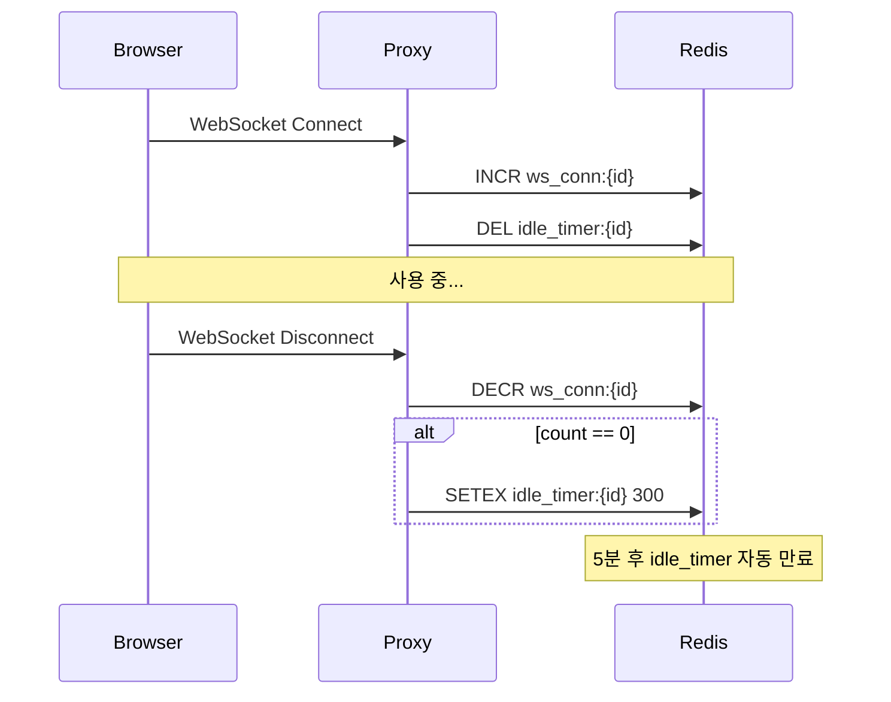

# Activity Tracking (M2)

> [README.md](./README.md)로 돌아가기

---

## 개요

WebSocket 연결 기반으로 워크스페이스 활동을 추적합니다.

| 구분 | 책임 |
|------|------|
| Proxy | WebSocket 연결 추적 (Redis) |
| TTL Manager | TTL 만료 → desired_state 변경 |
| StateReconciler | desired_state로 status 수렴 |

---

## 불변식

1. **desired_state 변경**: TTL 만료 시 `desired_state`만 변경 (status 직접 변경 금지)
2. **5분 유예**: 마지막 연결 종료 후 5분간 idle_timer 대기
3. **타이머 취소**: 새 연결 시 idle_timer 즉시 삭제

> status를 직접 변경하면 Reconciler가 다시 원래 상태로 수렴 → 무한 루프

---

## Redis 키

| 키 | 타입 | 설명 |
|----|------|------|
| `ws_conn:{workspace_id}` | Integer | WebSocket 연결 수 |
| `idle_timer:{workspace_id}` | String (TTL 5분) | idle 타이머 |

---

## Proxy 동작

| 이벤트 | 동작 |
|--------|------|
| WebSocket Connect | INCR ws_conn, DEL idle_timer |
| WebSocket Disconnect | DECR ws_conn, count=0이면 SETEX idle_timer 300 |

---

## Standby TTL 체크 (RUNNING → STANDBY)

| 조건 | 결과 |
|------|------|
| observed_status ≠ RUNNING | skip |
| operation ≠ NONE | skip |
| ws_conn > 0 | skip (활성) |
| idle_timer 존재 | skip (5분 대기 중) |
| 위 조건 모두 통과 | desired_state = STANDBY |

---

## Archive TTL 체크 (STANDBY → PENDING)

| 조건 | 결과 |
|------|------|
| observed_status ≠ STANDBY | skip |
| operation ≠ NONE | skip |
| NOW() - last_access_at ≤ archive_ttl_seconds | skip |
| 위 조건 모두 통과 | desired_state = PENDING |

> Archive TTL은 Redis가 아닌 DB (last_access_at) 기반

---

## last_access_at 갱신

| 시점 | 주체 | 값 |
|------|------|---|
| workspace 생성 | API | NOW() |
| STOPPING 완료 | StateReconciler | NOW() |

> WebSocket 연결 중에는 last_access_at 미업데이트 (STOPPING 완료 시점이 Archive TTL 기준점)

---

## 엣지 케이스

| 상황 | 동작 |
|------|------|
| 네트워크 일시 끊김 | 재연결 시 idle_timer 취소 |
| 다중 탭 | 마지막 탭 닫힐 때만 타이머 시작 |
| 노트북 절전 | STANDBY 전환 후 깨어나면 Auto-wake |

---

## Known Issues

### desired_state 경쟁 조건

TTL Manager와 API/Proxy가 동시에 desired_state 변경 시 Last-Write-Wins.

| 잠재적 해결책 | 설명 |
|--------------|------|
| CAS | `UPDATE ... WHERE desired_state = ?` |
| 우선순위 | manual_change가 TTL_change보다 우선 |
| Optimistic Locking | version 컬럼 사용 |

### HTTP-only 시나리오

WebSocket 연결 없이 HTTP API만 사용하는 경우 활동 감지 불가.

| 영향 | 완화책 |
|------|--------|
| standby_ttl이 의도보다 빨리 트리거 | HTTP 요청 시 last_access_at 업데이트 고려 (M2 이후) |

---

## 참조

- [states.md](./states.md) - TTL 기반 상태 전환
- [schema.md](./schema.md) - standby_ttl_seconds, archive_ttl_seconds
- [components/ttl-manager.md](./components/ttl-manager.md) - TTL Manager 상세
