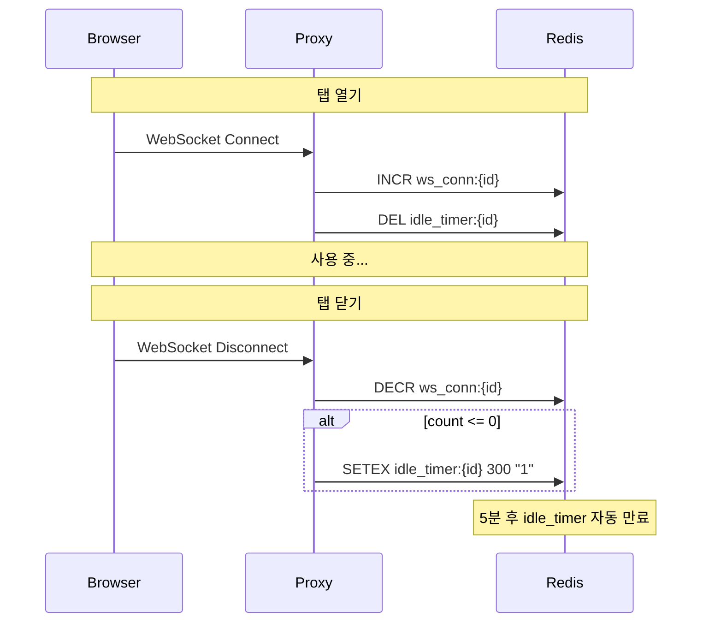
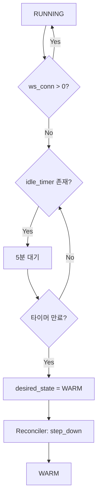

# Activity Tracking (M2)

> [README.md](./README.md)로 돌아가기

---

## 개요

워크스페이스 활동 감지 메커니즘을 정의합니다. WebSocket 연결 기반으로 사용자 활동을 추적합니다.

---

## 활동 감지 방식

### 원리

```
브라우저 탭 열림 → WebSocket 연결 → 활성
브라우저 탭 닫힘 → WebSocket 해제 → 5분 후 비활성
```

code-server는 IDE 기능을 위해 여러 WebSocket 연결을 유지합니다:
- Terminal WebSocket
- LSP (Language Server Protocol)
- File Sync

이 연결들은 탭이 열려있는 동안 유지되며, 탭을 닫으면 모두 종료됩니다.

### 장점

| 장점 | 설명 |
|------|------|
| **정확성** | 탭 열림 = IDE 사용 중 |
| **단순성** | 연결 수만 추적 |
| **ping/pong 분리** | WebSocket 라이브러리가 자동 처리 |

---

## Redis 키 구조

| 키 | 타입 | 설명 |
|----|------|------|
| `ws_conn:{workspace_id}` | Integer | WebSocket 연결 수 |
| `idle_timer:{workspace_id}` | String (TTL) | 5분 후 만료되는 타이머 |

---

## Proxy 동작

### WebSocket 연결 시

```python
async def on_websocket_connect(workspace_id: str):
    """WebSocket 연결 시 호출"""
    # 연결 수 증가
    await redis.incr(f"ws_conn:{workspace_id}")

    # 대기 중인 타이머 취소
    await redis.delete(f"idle_timer:{workspace_id}")
```

### WebSocket 해제 시

```python
async def on_websocket_disconnect(workspace_id: str):
    """WebSocket 해제 시 호출"""
    # 연결 수 감소
    count = await redis.decr(f"ws_conn:{workspace_id}")

    # 마지막 연결이 끊기면 타이머 시작
    if count <= 0:
        await redis.delete(f"ws_conn:{workspace_id}")  # 음수 방지
        await redis.setex(f"idle_timer:{workspace_id}", 300, "1")  # 5분 TTL
```

### 시퀀스 다이어그램



---

## Reconciler 동작

### TTL 만료 감지

```python
async def check_activity_ttl(workspace: Workspace):
    """활동 TTL 체크 (30초마다 폴링)"""

    # RUNNING 상태가 아니면 스킵
    if workspace.status != "RUNNING":
        return

    # operation 진행 중이면 스킵
    if workspace.operation != "NONE":
        return

    ws_conn = await redis.get(f"ws_conn:{workspace.id}")
    idle_timer = await redis.exists(f"idle_timer:{workspace.id}")

    # 연결 있음 → 활성
    if ws_conn and int(ws_conn) > 0:
        return

    # 타이머 있음 → 아직 대기 중
    if idle_timer:
        return

    # 연결도 없고 타이머도 없음 (만료됨) → 비활성
    # desired_state를 WARM으로 변경하여 step_down 트리거
    await set_desired_state(workspace.id, "WARM")
```

### 핵심 규칙

**TTL 만료 시 desired_state도 함께 변경**

```
잘못된 방식:
  TTL 만료 → status만 WARM으로 변경
  → Reconciler: status(WARM) != desired_state(RUNNING)
  → step_up 실행 → 다시 RUNNING
  → 무한 루프!

올바른 방식:
  TTL 만료 → desired_state = WARM으로 변경
  → Reconciler: step_down 실행
  → status = WARM, desired_state = WARM
  → 안정
```

---

## 흐름 요약



---

## 엣지 케이스

### 네트워크 일시 끊김

```
ws_conn = 0 → 타이머 시작
3초 후 재연결 → ws_conn = 1, 타이머 취소
→ 정상 계속 사용
```

### 다중 탭

```
탭1 열림 → ws_conn = 1
탭2 열림 → ws_conn = 2
탭1 닫힘 → ws_conn = 1 (타이머 안 시작)
탭2 닫힘 → ws_conn = 0 → 타이머 시작
```

### 노트북 절전

```
연결 끊김 → ws_conn = 0 → 타이머 시작
5분 후 → WARM
깨어나서 접속 → Auto-wake → RUNNING
```

---

## 참조

- [states.md](./states.md) - TTL 기반 상태 전환
- [schema.md](./schema.md) - warm_ttl_seconds 설정
