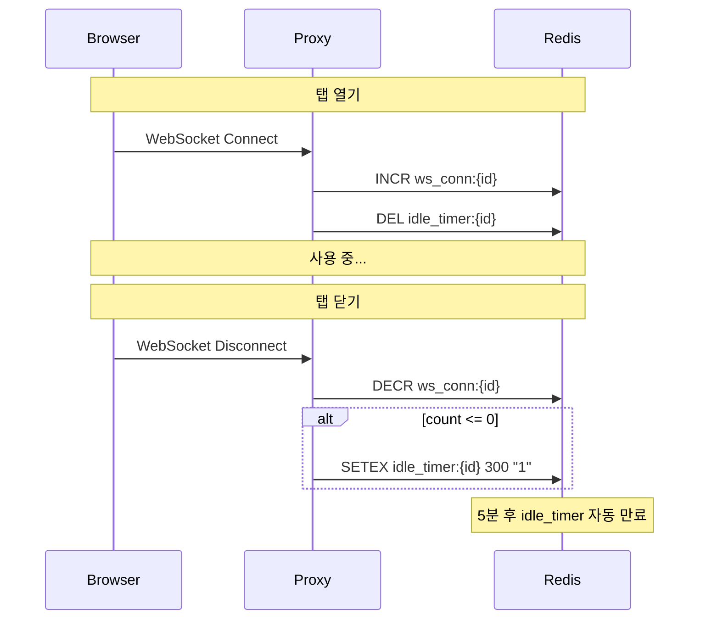
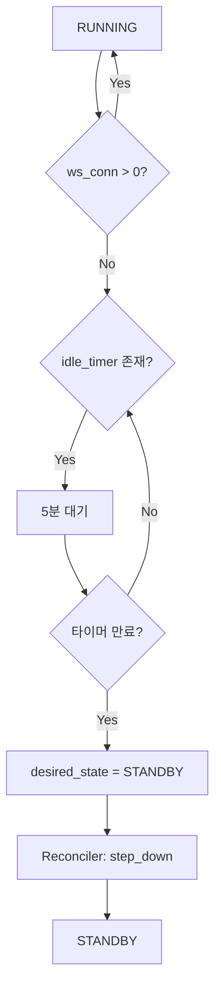

# Activity Tracking (M2)

> [README.md](./README.md)로 돌아가기

---

## 개요

워크스페이스 활동 감지 메커니즘을 정의합니다. WebSocket 연결 기반으로 사용자 활동을 추적합니다.

### 역할 분리

| 구분 | 책임 |
|------|------|
| **Proxy** | WebSocket 연결 추적 (Redis) |
| **TTL Manager** | TTL 만료 → desired_state 변경 |
| **Reconciler** | desired_state로 status 수렴 |

> **핵심**: TTL Manager가 `desired_state`를 WRITE, Reconciler는 READ만

---

## 활동 감지 방식

### 원리

```
브라우저 탭 열림 → WebSocket 연결 → 활성
브라우저 탭 닫힘 → WebSocket 해제 → 5분 후 비활성
```

code-server는 IDE 기능을 위해 여러 WebSocket 연결을 유지합니다:
- Terminal WebSocket
- LSP (Language Server Protocol)
- File Sync

이 연결들은 탭이 열려있는 동안 유지되며, 탭을 닫으면 모두 종료됩니다.

### 장점

| 장점 | 설명 |
|------|------|
| **정확성** | 탭 열림 = IDE 사용 중 |
| **단순성** | 연결 수만 추적 |
| **ping/pong 분리** | WebSocket 라이브러리가 자동 처리 |

---

## Redis 키 구조

| 키 | 타입 | 설명 |
|----|------|------|
| `ws_conn:{workspace_id}` | Integer | WebSocket 연결 수 |
| `idle_timer:{workspace_id}` | String (TTL) | 5분 후 만료되는 타이머 |

---

## Proxy 동작

### WebSocket 연결 시

```python
async def on_websocket_connect(workspace_id: str):
    """WebSocket 연결 시 호출"""
    # 연결 수 증가
    await redis.incr(f"ws_conn:{workspace_id}")

    # 대기 중인 타이머 취소
    await redis.delete(f"idle_timer:{workspace_id}")
```

### WebSocket 해제 시

```python
async def on_websocket_disconnect(workspace_id: str):
    """WebSocket 해제 시 호출"""
    # 연결 수 감소
    count = await redis.decr(f"ws_conn:{workspace_id}")

    # 마지막 연결이 끊기면 타이머 시작
    if count <= 0:
        await redis.delete(f"ws_conn:{workspace_id}")  # 음수 방지
        await redis.setex(f"idle_timer:{workspace_id}", 300, "1")  # 5분 TTL
```

### 시퀀스 다이어그램



---

## TTL Manager

TTL Manager는 **별도 프로세스**로 실행되며, TTL 만료 시 `desired_state`를 변경합니다.

### 실행 모델

| 항목 | 값 |
|------|-----|
| 실행 주기 | 1분 |
| 단일 인스턴스 | DB Lock |
| 체크 대상 | RUNNING (standby_ttl), STANDBY (archive_ttl) |

> **DB Lock**: Archive GC와 동일한 메커니즘 사용. [schema.md](./schema.md) 참조.

### standby_ttl 체크 (RUNNING → STANDBY)

| 조건 | 동작 |
|------|------|
| status ≠ RUNNING | skip |
| operation ≠ NONE | skip |
| ws_conn > 0 (Redis) | 활성 상태, skip |
| idle_timer 존재 (Redis) | 5분 대기 중, skip |
| 그 외 (idle_timer 만료) | `desired_state = STANDBY` |

### 핵심 규칙

**TTL 만료 시 `desired_state` 변경** (status 직접 변경 금지)

| 방식 | 동작 | 결과 |
|------|------|------|
| ❌ 잘못된 | status만 STANDBY 변경 | Reconciler가 다시 RUNNING으로 수렴 → 무한 루프 |
| ✅ 올바른 | desired_state = STANDBY 변경 | Reconciler가 STOPPING → STANDBY 수렴 |

---

## 흐름 요약



---

## 엣지 케이스

### 네트워크 일시 끊김

```
ws_conn = 0 → 타이머 시작
3초 후 재연결 → ws_conn = 1, 타이머 취소
→ 정상 계속 사용
```

### 다중 탭

```
탭1 열림 → ws_conn = 1
탭2 열림 → ws_conn = 2
탭1 닫힘 → ws_conn = 1 (타이머 안 시작)
탭2 닫힘 → ws_conn = 0 → 타이머 시작
```

### 노트북 절전

```
연결 끊김 → ws_conn = 0 → 타이머 시작
5분 후 → STANDBY
깨어나서 접속 → Auto-wake → RUNNING
```

---

## Archive TTL 체크 (STANDBY → PENDING)

STANDBY 상태에서 archive_ttl 경과 시 PENDING으로 전환합니다.

> **Note**: Redis 기반이 아닌 DB 기반 (last_access_at 체크)

### archive_ttl 체크

| 조건 | 동작 |
|------|------|
| status ≠ STANDBY | skip |
| operation ≠ NONE | skip |
| now() - last_access_at < archive_ttl_seconds | skip |
| 그 외 (TTL 만료) | `desired_state = PENDING` |

### 흐름


---

## Known Issues

### desired_state 경쟁 조건

TTL Manager와 다른 소스(API, Proxy)가 동시에 `desired_state`를 변경할 수 있습니다.

| 시나리오 | 문제 |
|---------|------|
| API → RUNNING, TTL → STANDBY | 사용자 의도가 덮어쓰여질 수 있음 |
| Proxy Auto-wake, TTL 만료 | 마지막 쓰기가 우선 (Last-Write-Wins) |

**현재 설계의 한계**:

```
T1: 사용자가 API로 desired_state=RUNNING 설정
T2: TTL Manager가 idle_timer 만료 감지 (동시)
T3: TTL Manager가 desired_state=STANDBY 덮어쓰기
T4: 사용자 의도(RUNNING)가 무시됨
```

**잠재적 해결책** (M2에서는 미구현):

| 방식 | 설명 |
|------|------|
| CAS | `UPDATE ... WHERE desired_state = ?` |
| 우선순위 | `last_manual_change_at > last_ttl_change_at`이면 TTL 무시 |
| 버전 | `version` 컬럼으로 Optimistic Locking |

> 상세: [schema.md](./schema.md#미래-개선-사항)

---

## 참조

- [states.md](./states.md) - TTL 기반 상태 전환
- [schema.md](./schema.md) - standby_ttl_seconds, archive_ttl_seconds, system_locks 테이블
- [components/ttl-manager.md](./components/ttl-manager.md) - TTL Manager
- [components/archive-gc.md](./components/archive-gc.md) - Archive GC (동일한 DB Lock 메커니즘)
