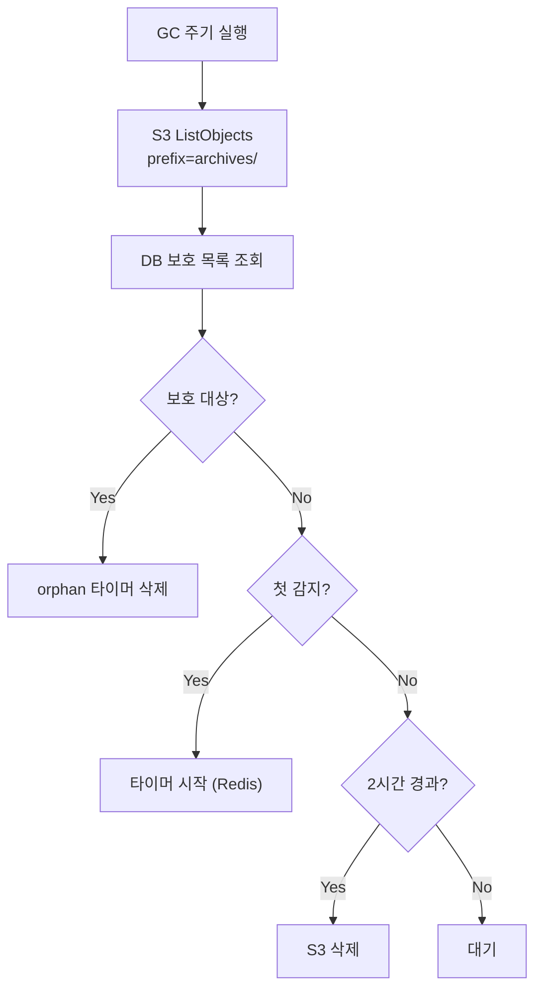

# Archive GC (M2)

> [README.md](../README.md)로 돌아가기

---

## 개요

Archive GC는 orphan archive를 정리하는 컴포넌트입니다.

| 항목 | 값 |
|------|---|
| 역할 | S3 orphan archive 탐지 및 삭제 |
| 실행 주기 | 1시간 |
| 단일 인스턴스 | Coordinator에서 실행 |

---

## 핵심 원칙

> **GC는 Archive 정리만 담당**
>
> - **Volume**: GC 불필요 (workspace당 1개 고정)
> - **Archive**: GC 필요 (op_id 변경 시 orphan 발생)

---

## DELETING vs GC

| 구분 | DELETING | GC |
|------|----------|-----|
| 트리거 | 사용자 삭제 요청 | 주기적 |
| 대상 | Volume만 | orphan Archive |
| 타이밍 | 즉시 | 2시간 지연 |
| 목적 | 컴퓨팅 리소스 해제 | 저장공간 회수 |

---

## Orphan 발생 원인

재아카이브, 크래시, 재시도 시 이전 archive가 orphan이 됩니다.

```
1차 Archive (op_id = aaa):
  → archives/ws123/aaa/home.tar.gz  ← DB에 저장됨

2차 Archive (op_id = bbb):
  → archives/ws123/bbb/home.tar.gz  ← DB 업데이트
  → archives/ws123/aaa/...          ← orphan (GC 대상)
```

---

## 보호 규칙

Archive가 **보호 대상이 아니면** orphan입니다.

| 조건 | 결과 | 이유 |
|------|------|------|
| archive_path == ws.archive_key | 보호 | 현재 사용 중 |
| ws.op_id 있고 경로가 `archives/{id}/{op_id}/`로 시작 | 보호 | 진행 중/ERROR 상태 |
| ws.deleted_at != NULL | 보호 안 함 | soft-deleted workspace |
| 그 외 | orphan | 어떤 workspace도 참조하지 않음 |

> **op_id 보호 이유**: ARCHIVING 중 ERROR 전환되면 op_id만 있고 archive_key 없는 상태. op_id로 보호하여 복구 시 재사용 가능.

---

## 안전 지연 (TTL)

| 항목 | 값 |
|------|---|
| 지연 시간 | 2시간 |
| 목적 | 진행 중인 작업 완료 대기 |
| 조건 | 2시간 연속 orphan이면 삭제 |

> **왜 2시간?**: Archive Job timeout(30분) × 3회 재시도 + 여유

---

## 삭제 대상

Archive 삭제 시 다음 파일을 모두 삭제합니다:

| 파일 | 설명 |
|------|------|
| `{archive_key}` | tar.gz 아카이브 파일 |
| `{archive_key}.meta` | sha256 체크섬 파일 |

> storage-job.md의 meta 파일 형식 참조

---

## GC 흐름



---

## 에러 처리

| 상황 | 동작 |
|------|------|
| S3 ListObjects 실패 | GC 사이클 skip, 다음 주기 재시도 |
| S3 DeleteObject 실패 | 해당 archive skip, 다음 주기 재시도 |
| DB 조회 실패 | GC 사이클 skip (안전 우선) |

---

## Known Issues

1. **Redis 타이머 손실**: Redis 재시작 시 orphan 타이머 손실
   - 영향: 삭제가 2시간 더 지연될 수 있음 (데이터 손실 없음)

2. **대량 orphan 시 성능**: S3 ListObjects가 느려질 수 있음
   - 완화: prefix 기반 분할 스캔 (M2 이후)

---

## 참조

- [coordinator.md](./coordinator.md) - Coordinator
- [../storage.md](../storage.md) - Storage 개요
- [../storage-job.md](../storage-job.md) - Archive/Restore Job
- [../error.md](../error.md) - ERROR 상태 GC 보호
