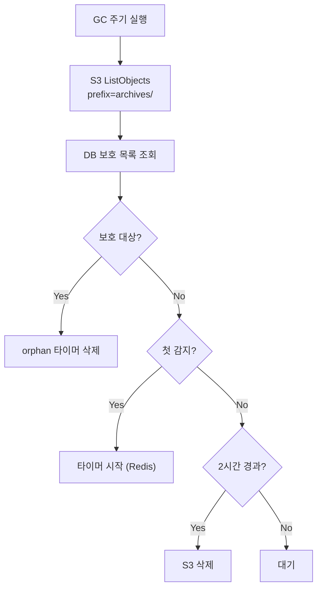

# Archive GC (M2)

> [README.md](../README.md)로 돌아가기

---

## 개요

Archive GC는 orphan archive를 정리하는 컴포넌트입니다.

| 항목 | 값 |
|------|---|
| 역할 | S3의 orphan archive 탐지 및 삭제 |
| 실행 주기 | 1시간 (기본) |
| 단일 인스턴스 | Coordinator에서 실행 |

---

## 핵심 원칙

> **GC는 Archive 정리만 담당**
>
> - **Volume**: GC 불필요 (workspace당 1개 고정)
> - **Archive**: GC 필요 (op_id 변경 시 orphan 발생)

### DELETING vs GC

| 구분 | DELETING | GC |
|------|----------|-----|
| 트리거 | 사용자 삭제 요청 | 주기적 |
| 대상 | Volume만 | orphan Archive |
| 타이밍 | 즉시 | 2시간 지연 |
| 목적 | 컴퓨팅 리소스 해제 | 저장공간 회수 |

---

## Orphan 발생 원인

```
1차 Archive (op_id = aaa):
  → archives/ws123/aaa/home.tar.gz  ← DB에 저장됨

2차 Archive (op_id = bbb):
  → archives/ws123/bbb/home.tar.gz  ← DB 업데이트
  → archives/ws123/aaa/...          ← orphan (GC 대상)
```

**발생 원인**: 크래시, 재시도, 부분 실패, 정상적인 재아카이브

---

## 입력

### DB 읽기

| 컬럼 | 용도 |
|-----|------|
| `archive_key` | 현재 사용 중인 archive 경로 |
| `op_id` | 진행 중/완료된 operation의 archive 보호 |
| `deleted_at` | soft-delete 여부 |

### S3 읽기

| 작업 | 용도 |
|-----|------|
| ListObjects | `archives/` prefix 전체 스캔 |

### Redis 읽기 (orphan 추적)

| 키 | 용도 |
|---|------|
| `orphan:{archive_path}` | 첫 orphan 감지 시점 (2시간 타이머) |

---

## 출력

### S3 쓰기

| 작업 | 설명 |
|-----|------|
| DeleteObject | orphan archive 삭제 |

### Redis 쓰기

| 키 | 설명 |
|---|------|
| `orphan:{archive_path}` | orphan 첫 감지 시점 기록 |

---

## 알고리즘

### Orphan 판단 규칙

Archive가 **보호 대상이 아니면** orphan입니다.

| 조건 | 결과 | 이유 |
|------|------|------|
| `deleted_at != NULL` | 보호 안 함 → orphan | soft-deleted workspace |
| `archive_path == ws.archive_key` | 보호 | 현재 사용 중인 archive |
| `ws.op_id` 있고 경로가 `archives/{id}/{op_id}/`로 시작 | 보호 | 진행 중/ERROR 상태 archive |
| 그 외 | orphan | 어떤 workspace도 참조하지 않음 |

> **op_id 보호 이유**: ARCHIVING 중 archive 업로드 후 archive_key 저장 전에 ERROR 전환되면, operation=NONE이지만 유효한 archive가 존재. op_id만 있으면 보호하여 복구 시 재사용 가능.

### 안전 지연

| 항목 | 값 |
|------|---|
| 지연 시간 | 2시간 |
| 목적 | 진행 중인 작업 완료 대기 |
| 조건 | 2시간 연속 orphan이면 삭제 |

> **왜 2시간?**: Archive Job timeout(30분) × 3회 재시도 + 여유. 크래시 후 재시도가 완료되기 전에 삭제 방지.

### GC 프로세스

```python
async def cleanup_orphans():
    """orphan archive 정리"""

    # 1. S3에서 모든 archive 목록 조회
    all_archives = await s3.list_objects(prefix="archives/")

    # 2. DB에서 보호 대상 목록 조회
    protected = await get_protected_archives()

    # 3. orphan 판단
    for archive_path in all_archives:
        if is_protected(archive_path, protected):
            # 보호 대상 → orphan 타이머 삭제
            await redis.delete(f"orphan:{archive_path}")
            continue

        # 4. orphan 감지 시점 확인
        first_detected = await redis.get(f"orphan:{archive_path}")

        if not first_detected:
            # 첫 감지 → 타이머 시작
            await redis.setex(
                f"orphan:{archive_path}",
                ttl=7200 + 3600,  # 2시간 + 여유
                value=datetime.now().isoformat()
            )
            logger.info(f"Orphan detected: {archive_path}")
            continue

        # 5. 2시간 경과 체크
        detected_at = datetime.fromisoformat(first_detected)
        if datetime.now() - detected_at > timedelta(hours=2):
            # 삭제!
            await s3.delete_object(archive_path)
            await redis.delete(f"orphan:{archive_path}")
            logger.info(f"Orphan deleted: {archive_path}")
```

### 보호 대상 조회

```python
async def get_protected_archives() -> Set[str]:
    """보호 대상 archive 목록 조회"""
    protected = set()

    workspaces = await db.execute("""
        SELECT id, archive_key, op_id, deleted_at
        FROM workspaces
    """)

    for ws in workspaces:
        # soft-deleted workspace는 보호하지 않음
        if ws.deleted_at:
            continue

        # 현재 archive_key 보호
        if ws.archive_key:
            protected.add(ws.archive_key)

        # op_id 기반 경로 보호 (진행 중/ERROR 상태)
        if ws.op_id:
            protected.add(f"archives/{ws.id}/{ws.op_id}/")

    return protected

def is_protected(archive_path: str, protected: Set[str]) -> bool:
    """archive가 보호 대상인지 확인"""
    # 정확히 일치
    if archive_path in protected:
        return True

    # prefix 일치 (op_id 보호)
    for p in protected:
        if p.endswith('/') and archive_path.startswith(p):
            return True

    return False
```

---

## 상태 전이 다이어그램



---

## GC와 Operation 동시성

### 동시 실행 시나리오

```
T1: GC가 DB 조회 (ws.archive_key = 'old')
T2: ARCHIVING이 archive_key = 'new' 저장
T3: GC가 S3 스캔 (T1 시점 스냅샷)
    → 'new'는 GC 대상에 없음 (T2 이후 생성)
T4: 다음 GC 사이클
    → 'new'는 DB에 있으므로 보호
    → 'old'는 orphan으로 삭제
```

### 안전성 보장

| 메커니즘 | 역할 |
|---------|------|
| op_id 보호 | 진행 중/ERROR 상태 archive 보호 |
| 2시간 지연 삭제 | 작업 완료 대기 |
| DB 스냅샷 | 일관된 보호 목록 |

> **결론**: GC와 Operation이 동시에 실행되어도 데이터 손실 없음. 최악의 경우 orphan 삭제가 다음 GC 사이클로 지연될 뿐.

---

## 에러 처리

### S3 실패

| 상황 | 처리 |
|-----|------|
| ListObjects 실패 | GC 사이클 skip, 다음 주기에 재시도 |
| DeleteObject 실패 | 해당 archive skip, 다음 주기에 재시도 |

### DB 실패

| 상황 | 처리 |
|-----|------|
| 보호 목록 조회 실패 | GC 사이클 skip (안전 우선) |

### Redis 실패

| 상황 | 처리 |
|-----|------|
| orphan 타이머 실패 | 해당 archive skip |

---

## 다른 컴포넌트와의 상호작용

### 의존

| 컴포넌트 | 의존 내용 |
|---------|---------|
| S3 | archive 목록 조회, 삭제 |
| Database | 보호 대상 목록 조회 |

### 잠재적 충돌

| 시나리오 | 영향 | 완화 |
|---------|-----|------|
| ARCHIVING 중 GC | op_id 보호로 안전 | 2시간 지연 |
| RESTORING 중 GC | archive_key 보호로 안전 | - |
| Coordinator 재시작 | Redis 타이머 유지 | 타이머 초기화 방지 |

---

## 설정

| 환경변수 | 기본값 | 설명 |
|---------|-------|------|
| `GC_INTERVAL` | 3600 | GC 주기 (초) |
| `GC_ORPHAN_DELAY` | 7200 | orphan 삭제 지연 (초) |

---

## Known Issues / Limitations

### 1. Redis 타이머 손실

- Redis 재시작 시 orphan 타이머 손실
- 영향: 삭제가 2시간 더 지연될 수 있음
- 완화: 데이터 손실 없음 (안전 방향)

### 2. 대량 orphan 시 성능

- S3 ListObjects가 느려질 수 있음
- 완화: prefix 기반 분할 스캔 (M2 이후)

---

## 참조

- [coordinator.md](./coordinator.md) - Coordinator 프로세스
- [../storage.md](../storage.md) - Storage 개요
- [../storage-job.md](../storage-job.md) - Archive/Restore Job
- [../error.md](../error.md) - ERROR 상태 GC 보호
