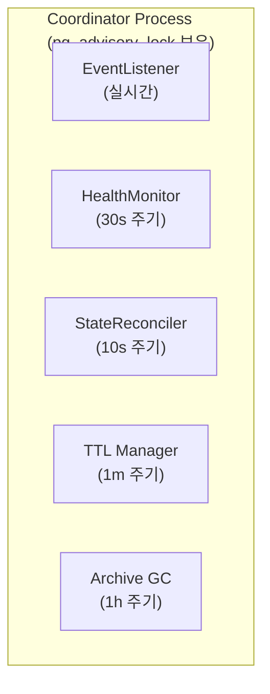
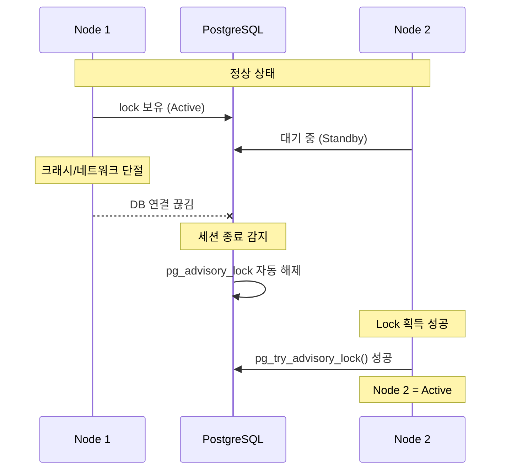

# Coordinator (M2)

> [README.md](../README.md)로 돌아가기

---

## 개요

Coordinator는 모든 백그라운드 프로세스를 관리하는 **단일 리더 프로세스**입니다.

| 항목 | 값 |
|------|---|
| 역할 | 백그라운드 컴포넌트 실행 및 조율 |
| 인스턴스 | 단일 (Leader Election) |
| 리더 선출 | PostgreSQL Session Lock (`pg_advisory_lock`) |

---

## 아키텍처

---

## 컴포넌트 실행 주기

| 컴포넌트 | 주기 | 역할 |
|---------|------|------|
| EventListener | 실시간 | PG NOTIFY → Redis PUBLISH (CDC) |
| HealthMonitor | 30초 | 리소스 관측 → observed_status 업데이트 |
| StateReconciler | 10초 | desired ≠ observed 수렴 |
| TTL Manager | 1분 | TTL 만료 체크 → desired_state 변경 |
| Archive GC | 1시간 | orphan archive 정리 |

---

## Leader Election

### 방식: PostgreSQL Session Lock

| 특성 | 설명 |
|-----|------|
| 락 유형 | `pg_advisory_lock` (Session Level) |
| 락 해제 | DB 연결 끊기면 즉시 해제 |
| Failover | TCP timeout (수 초) |
| 복잡도 | 낮음 (별도 인프라 불필요) |

### Failover 흐름

---

## 불변식

1. **Single Leader**: 동시에 하나의 Coordinator만 Active
2. **Automatic Failover**: 연결 끊김 시 자동 리더십 이전
3. **Single Writer**: 컴포넌트별 담당 컬럼 분리

---

## 컴포넌트 동시성

5개 컴포넌트가 동시 실행됩니다. 같은 workspace에 대해 동시 접근 가능하나 **Single Writer Principle**로 안전합니다.

### 컬럼 소유권

| 컴포넌트 | 쓰기 컬럼 |
|---------|----------|
| EventListener | (읽기 전용, DB 쓰기 없음) |
| HealthMonitor | observed_status, observed_at |
| StateReconciler | operation, op_started_at, op_id, archive_key, error_count, error_info |
| TTL Manager | desired_state (API와 공유) |
| Archive GC | (S3 only, DB 미변경) |

> 상세: [schema.md](../schema.md#컬럼-소유권-single-writer-principle)

---

## 에러 처리

| 상황 | 동작 |
|------|------|
| DB 연결 끊김 | 리더십 포기 → 재연결 → 재획득 시도 |
| 개별 컴포넌트 에러 | 해당 tick 스킵 → 다음 tick 재시도 |
| 전체 루프 에러 | 리더십 포기 → 재획득 시도 |

---

## 참조

- [../events.md](../events.md) - EventListener (CDC 기반 SSE)
- [health-monitor.md](./health-monitor.md) - HealthMonitor
- [state-reconciler.md](./state-reconciler.md) - StateReconciler
- [ttl-manager.md](./ttl-manager.md) - TTL Manager
- [archive-gc.md](./archive-gc.md) - Archive GC
- [../schema.md](../schema.md) - system_locks 테이블
