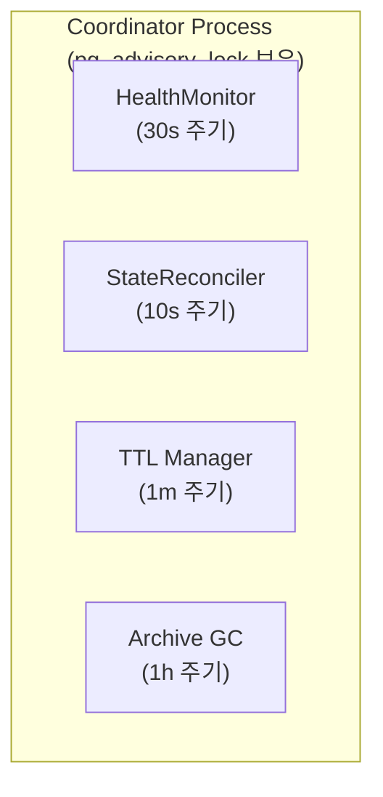
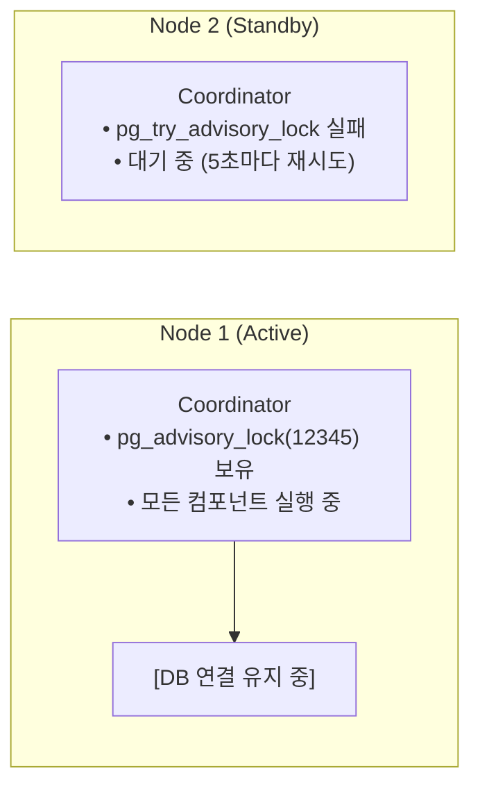
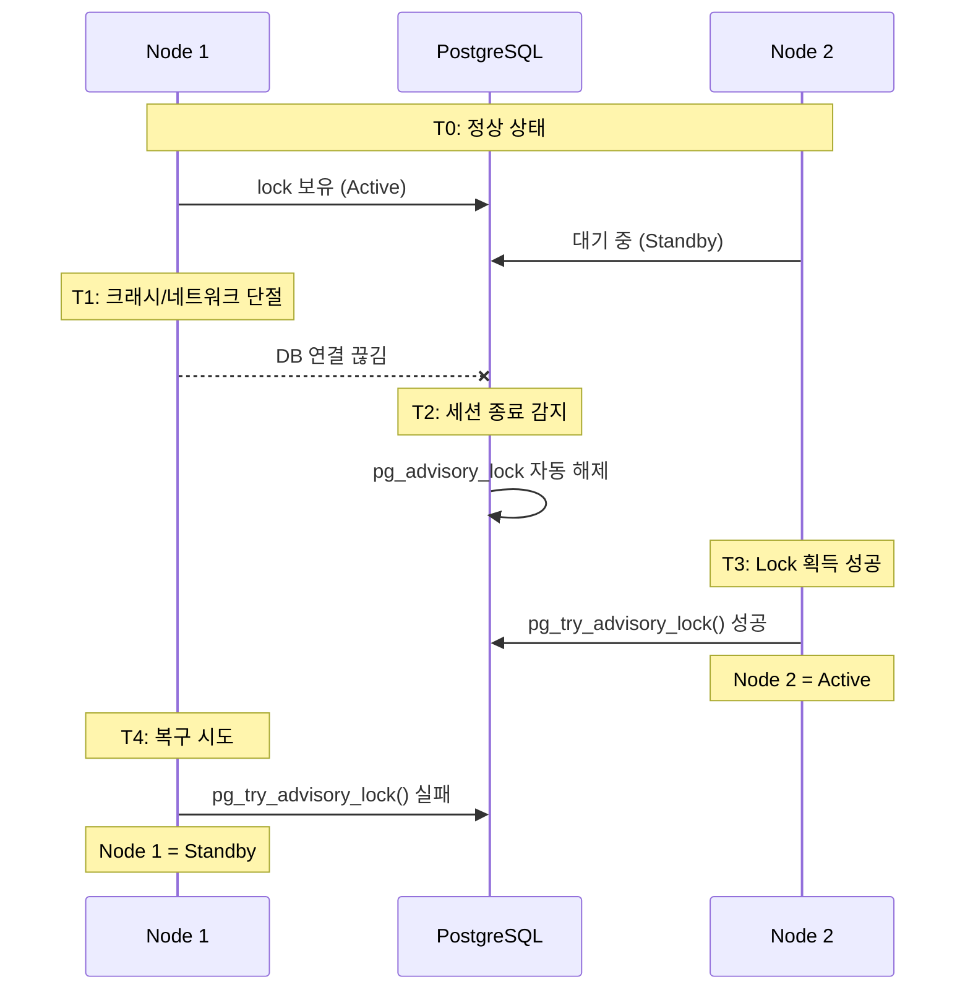
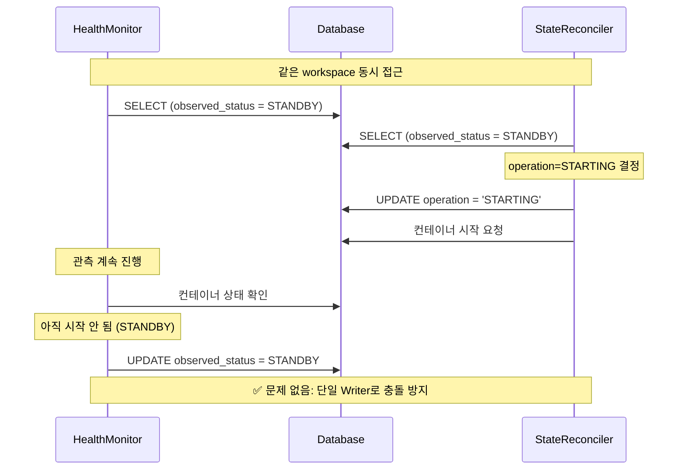

# Coordinator (M2)

> [README.md](../README.md)로 돌아가기

---

## 개요

Coordinator는 모든 백그라운드 프로세스를 관리하는 **단일 리더 프로세스**입니다.

| 항목 | 값 |
|------|---|
| 역할 | 백그라운드 컴포넌트 실행 및 조율 |
| 인스턴스 | 단일 (리더 선출) |
| 리더 선출 | PostgreSQL Session Lock |

---

## 아키텍처



---

## 리더 선출: Session Lock

### 방식

PostgreSQL의 `pg_advisory_lock`을 사용한 세션 기반 리더 선출.

| 특성 | 설명 |
|-----|------|
| 락 해제 | DB 연결 끊기면 즉시 해제 |
| Failover | TCP timeout (수 초) |
| 복잡도 | 낮음 (별도 인프라 불필요) |

### 동작 원리



### Failover 시나리오



---

## 구현

### Lock ID

```python
COORDINATOR_LOCK_ID = 12345  # 고유 식별자
```

> **주의**: Lock ID는 시스템 전체에서 고유해야 합니다.

### 리더 획득

```python
import asyncpg

class Coordinator:
    LOCK_ID = 12345

    def __init__(self, node_id: str):
        self.node_id = node_id
        self.lock_conn = None  # 락 전용 연결
        self.is_leader = False

    async def try_become_leader(self) -> bool:
        """리더 획득 시도. 성공하면 True."""
        try:
            # 락 전용 연결 생성 (이 연결이 살아있는 동안 락 유지)
            self.lock_conn = await asyncpg.connect(DATABASE_URL)

            # Session lock 시도 (non-blocking)
            acquired = await self.lock_conn.fetchval(
                "SELECT pg_try_advisory_lock($1)",
                self.LOCK_ID
            )

            if acquired:
                self.is_leader = True
                return True
            else:
                await self.lock_conn.close()
                self.lock_conn = None
                return False

        except Exception as e:
            logger.error(f"Lock acquisition failed: {e}")
            return False
```

### 메인 루프

```python
async def run(self):
    """Coordinator 메인 루프"""
    while True:
        if not self.is_leader:
            # 리더 획득 시도
            if await self.try_become_leader():
                logger.info(f"{self.node_id}: Became leader")
                await self.run_as_leader()
            else:
                # 대기 후 재시도
                await asyncio.sleep(5)
        else:
            # 이미 리더면 계속 실행
            await self.run_as_leader()

async def run_as_leader(self):
    """리더로서 모든 컴포넌트 실행"""
    try:
        await asyncio.gather(
            self.health_monitor_loop(),
            self.state_reconciler_loop(),
            self.ttl_manager_loop(),
            self.archive_gc_loop(),
        )
    except asyncpg.ConnectionDoesNotExistError:
        # 연결 끊김 = 락 자동 해제
        self.is_leader = False
        logger.warning(f"{self.node_id}: Lost leadership (connection lost)")
    except Exception as e:
        logger.error(f"Leader loop error: {e}")
        self.is_leader = False
```

### 컴포넌트 루프

```python
async def health_monitor_loop(self):
    """HealthMonitor 주기 실행"""
    while self.is_leader:
        try:
            workspaces = await db.get_all_active_workspaces()
            for ws in workspaces:
                await health_monitor.observe_and_update(ws)
        except Exception as e:
            logger.error(f"HealthMonitor error: {e}")
        await asyncio.sleep(30)

async def state_reconciler_loop(self):
    """StateReconciler 주기 실행"""
    while self.is_leader:
        try:
            workspaces = await db.get_all_active_workspaces()
            for ws in workspaces:
                await state_reconciler.reconcile(ws)
        except Exception as e:
            logger.error(f"StateReconciler error: {e}")
        await asyncio.sleep(10)

async def ttl_manager_loop(self):
    """TTL Manager 주기 실행"""
    while self.is_leader:
        try:
            await ttl_manager.check_and_update()
        except Exception as e:
            logger.error(f"TTL Manager error: {e}")
        await asyncio.sleep(60)

async def archive_gc_loop(self):
    """Archive GC 주기 실행"""
    while self.is_leader:
        try:
            await archive_gc.cleanup_orphans()
        except Exception as e:
            logger.error(f"Archive GC error: {e}")
        await asyncio.sleep(3600)
```

---

## 모니터링

### system_locks 테이블 (선택사항)

리더 상태를 모니터링하기 위해 DB에 기록할 수 있습니다.

```sql
CREATE TABLE system_locks (
    lock_name VARCHAR(50) PRIMARY KEY,
    holder_id VARCHAR(100) NOT NULL,
    acquired_at TIMESTAMP NOT NULL DEFAULT NOW()
);
```

```python
async def try_become_leader(self) -> bool:
    # ... lock 획득 후 ...
    if acquired:
        # 모니터링용 기록
        await db.execute("""
            INSERT INTO system_locks (lock_name, holder_id, acquired_at)
            VALUES ('coordinator', $1, NOW())
            ON CONFLICT (lock_name) DO UPDATE
            SET holder_id = $1, acquired_at = NOW()
        """, self.node_id)
```

### 헬스체크 엔드포인트

```python
@app.get("/health/coordinator")
async def coordinator_health():
    return {
        "is_leader": coordinator.is_leader,
        "node_id": coordinator.node_id,
        "uptime_seconds": coordinator.uptime_seconds
    }
```

---

## 설정

| 환경변수 | 기본값 | 설명 |
|---------|-------|------|
| `COORDINATOR_NODE_ID` | hostname | 노드 식별자 |
| `COORDINATOR_LOCK_ID` | 12345 | Advisory lock ID |
| `COORDINATOR_RETRY_INTERVAL` | 5 | 리더 획득 재시도 간격 (초) |

---

## 에러 처리

### DB 연결 끊김

```
연결 끊김 감지 → is_leader = False → 컴포넌트 루프 종료
→ 메인 루프에서 재연결 시도 → 리더 획득 재시도
```

### 컴포넌트 에러

```
개별 컴포넌트 에러 → 해당 tick 스킵 → 다음 tick에 재시도
전체 루프 에러 → 리더십 포기 → 재획득 시도
```

---

## 컴포넌트 동시 실행 주의사항

4개 컴포넌트가 `asyncio.gather()`로 동시 실행됩니다.
같은 workspace에 대해 HealthMonitor와 StateReconciler가 동시 접근할 수 있습니다.

### 안전성 보장

| 메커니즘 | 설명 |
|---------|------|
| **단일 Writer 원칙** | 각 컴포넌트가 쓰는 컬럼이 분리됨 |
| **PostgreSQL 원자성** | UPDATE 문 내 `previous_status = observed_status`는 원자적 |

```
HealthMonitor: observed_status, observed_at
StateReconciler: operation, op_started_at, op_id, archive_key, error_count, error_info
TTL Manager: desired_state (API와 공유)
```

### 잠재적 충돌 시나리오



### 주의 필요 케이스

| 케이스 | 위험 | 완화 |
|--------|-----|------|
| `previous_status = observed_status` | 동시 변경 | SQL 원자성으로 안전 |
| error_info 읽기/쓰기 | 중간 상태 읽기 | 허용 (다음 tick에 정상화) |
| operation 중간 tick | 재시도 위험 | timeout/execute 실패만 재시도 |

---

## 참조

- [health-monitor.md](./health-monitor.md) - HealthMonitor 컴포넌트
- [state-reconciler.md](./state-reconciler.md) - StateReconciler 컴포넌트
- [ttl-manager.md](./ttl-manager.md) - TTL Manager 컴포넌트
- [archive-gc.md](./archive-gc.md) - Archive GC 컴포넌트
