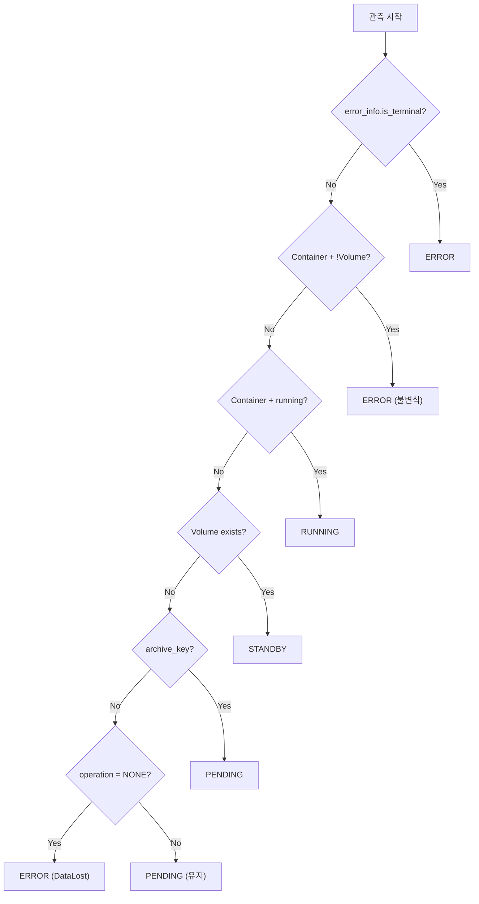

# HealthMonitor (M2)

> [README.md](../README.md)로 돌아가기

---

## 개요

HealthMonitor는 실제 리소스 상태를 관측하고 DB에 반영하는 **관측자** 컴포넌트입니다.

| 항목 | 값 |
|------|---|
| 역할 | 실제 리소스 관측 → observed_status 갱신 |
| 실행 주기 | 30초 |
| 단일 인스턴스 | Coordinator에서 실행 |

---

## 핵심 원칙

> **진실(Reality)** = 실제 리소스 (Container, Volume)
>
> **DB** = Last Observed Truth
>
> ⚠️ **HealthMonitor가 멈추면 DB는 stale 상태가 된다**

---

## 입출력

### 읽기

| 소스 | 항목 |
|------|------|
| DB | id, error_info, archive_key, operation |
| Container Provider | exists, running |
| Volume Provider | exists |

### 쓰기 (Single Writer)

| 컬럼 | 설명 |
|------|------|
| observed_status | 관측된 상태 |
| observed_at | 관측 시점 |

---

## 상태 결정 규칙

| 우선순위 | 조건 | → observed_status |
|---------|------|-------------------|
| 1 | `error_info.is_terminal = true` | ERROR |
| 2 | Container 있음 + Volume 없음 | ERROR (불변식 위반) |
| 3 | Container 있음 + running | RUNNING |
| 4 | Volume 있음 (Container 없음) | STANDBY |
| 5 | Volume 없음 + archive_key 있음 | PENDING |
| 6 | Volume 없음 + archive_key 없음 + **operation = NONE** | ERROR (DataLost) |
| 7 | Volume 없음 + archive_key 없음 + **operation ≠ NONE** | PENDING (유지) |

> 우선순위 순서대로 평가, 첫 번째 매칭 조건 적용
>
> **우선순위 6,7 분리 이유**: 새 workspace는 operation=PROVISIONING 진행 중이므로 ERROR 판정 유보

---

## 불변식 위반 감지

| 위반 유형 | 조건 | 처리 |
|----------|------|------|
| ContainerWithoutVolume | Container 있음 + Volume 없음 | error_info 설정 → ERROR |
| DataLost | Volume 없음 + archive_key 없음 + **operation = NONE** | error_info 설정 → ERROR |

> 불변식 위반 시 HealthMonitor가 예외적으로 error_info 설정 (기존 error_info 없을 때만)
>
> **DataLost 조건**: operation이 진행 중이면 중간 상태이므로 DataLost 판정 유보

---

## 상태 결정 흐름

---

## 즉시 관측 (Edge Hint)

StateReconciler가 operation 완료 후 빠른 반영을 위해 Redis로 즉시 관측 요청.

| 채널 | 용도 |
|------|------|
| `monitor:trigger` | workspace_id 전송 → 즉시 관측 |

---

## 에러 처리

| 상황 | 동작 |
|------|------|
| Container API 실패 | 해당 workspace skip, 다음 tick 재시도 |
| Volume API 실패 | 해당 workspace skip, 다음 tick 재시도 |
| DB 업데이트 실패 | 해당 workspace skip, 다음 tick 재시도 |

> 개별 실패가 전체 루프를 중단시키지 않음

---

## Known Issues

1. **관측 지연**: 최대 30초 (폴링 주기)
   - 완화: Redis hint로 즉시 관측 요청

2. **부분 상태**: operation 진행 중 중간 상태 관측 가능
   - 영향 없음: Level-Triggered Reconciliation으로 다음 tick에 수렴

3. **ERROR 복구**: 자동 복구 불가
   - 관리자가 error_info 초기화 필요

---

## 참조

- [coordinator.md](./coordinator.md) - Coordinator
- [state-reconciler.md](./state-reconciler.md) - StateReconciler
- [../error.md](../error.md) - 에러 정책
- [../schema.md](../schema.md) - DB 스키마
