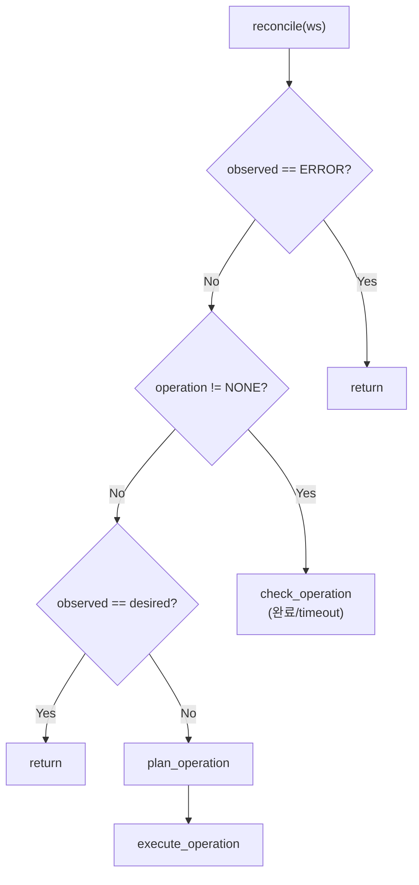

# StateReconciler (M2)

> [README.md](../README.md)로 돌아가기

---

## 개요

StateReconciler는 desired_state와 observed_status를 비교하여 상태를 수렴시키는 **실행자** 컴포넌트입니다.

| 항목 | 값 |
|------|---|
| 역할 | DB만 읽고 Plan/Execute로 상태 수렴 |
| 실행 주기 | 10초 (기본) |
| 단일 인스턴스 | Coordinator에서 실행 |

---

## 핵심 원칙

> **Level-Triggered Control Loop**
>
> 1. DB만 읽는다 (직접 관측 안 함)
> 2. desired ≠ observed → operation 결정 (Plan)
> 3. operation 실행 (Execute)
> 4. 완료 판정: observed == operation.target

---

## 입력

### DB 읽기

| 컬럼 | 용도 |
|-----|------|
| `desired_state` | 목표 상태 |
| `observed_status` | 현재 관측된 상태 |
| `operation` | 진행 중인 작업 |
| `op_started_at` | 작업 시작 시점 (timeout 계산) |
| `error_count` | 재시도 횟수 |
| `error_info` | 에러 정보 |
| `archive_key` | 아카이브 경로 |

---

## 출력

### DB 쓰기 (단일 Writer 원칙)

| 컬럼 | 설명 |
|-----|------|
| `operation` | 진행 중인 작업 |
| `op_started_at` | 작업 시작 시점 |
| `op_id` | 작업 고유 ID (멱등성) |
| `archive_key` | 아카이브 경로 (ARCHIVING 완료 시) |
| `error_count` | 재시도 횟수 |
| `error_info` | 에러 정보 |
| `previous_status` | ERROR 전환 전 상태 |

### Redis 발행

| 채널 | 용도 |
|-----|------|
| `monitor:trigger` | 즉시 관측 요청 |
| `workspace:{id}` | SSE 상태 변경 알림 |

### 외부 시스템 호출

| 시스템 | 호출 |
|-------|------|
| Container Provider | start, stop |
| Storage Provider | archive, restore |

---

## 알고리즘

### Operation 결정 테이블

| observed_status | desired_state | operation |
|-----------------|---------------|-----------|
| PENDING | RUNNING | RESTORING |
| PENDING | STANDBY | RESTORING |
| STANDBY | RUNNING | STARTING |
| STANDBY | PENDING | ARCHIVING |
| RUNNING | STANDBY | STOPPING |
| RUNNING | PENDING | STOPPING |
| ERROR | * | (skip) |

> **참고**: RUNNING → PENDING은 먼저 STOPPING으로 STANDBY까지 간 후 ARCHIVING

### Operation Target 정의

| Operation | Target Status | 추가 조건 |
|-----------|---------------|----------|
| STARTING | RUNNING | - |
| STOPPING | STANDBY | - |
| ARCHIVING | PENDING | archive_key != NULL |
| RESTORING | STANDBY | - |

### 메인 로직

```python
async def reconcile(ws: Workspace):
    """단일 워크스페이스 reconcile"""

    # 1. ERROR면 skip
    if ws.observed_status == ERROR:
        return

    # 2. operation 진행 중이면 완료/timeout 체크
    if ws.operation != NONE:
        await check_operation_status(ws)
        return

    # 3. 이미 수렴됨
    if ws.observed_status == ws.desired_state:
        return

    # 4. Plan: operation 결정
    operation = plan_operation(ws.observed_status, ws.desired_state)
    if not operation:
        return

    # 5. Execute: operation 실행
    await execute_operation(ws, operation)
```

### Plan Phase

```python
def plan_operation(observed: Status, desired: Status) -> Optional[Operation]:
    """observed → desired로 가기 위한 operation 결정"""

    # 순서: PENDING(0) < STANDBY(10) < RUNNING(20)
    current_level = STATUS_LEVEL[observed]
    target_level = STATUS_LEVEL[desired]

    if current_level < target_level:
        # Step Up
        if observed == PENDING:
            return RESTORING
        elif observed == STANDBY:
            return STARTING
    else:
        # Step Down
        if observed == RUNNING:
            return STOPPING
        elif observed == STANDBY:
            return ARCHIVING

    return None
```

### Execute Phase

```python
async def execute_operation(ws: Workspace, operation: Operation):
    """operation 실행"""

    # 1. operation 선점 (CAS)
    op_id = str(uuid4())
    updated = await db.execute("""
        UPDATE workspaces
        SET operation = $1, op_started_at = NOW(), op_id = $2
        WHERE id = $3 AND operation = 'NONE'
        RETURNING id
    """, operation, op_id, ws.id)

    if not updated:
        # 다른 프로세스가 먼저 선점
        return

    # 2. 실제 작업 실행
    try:
        if operation == STARTING:
            await container_provider.start(ws.id)
        elif operation == STOPPING:
            await container_provider.stop(ws.id)
        elif operation == RESTORING:
            await storage_provider.restore(ws.id, ws.archive_key)
        elif operation == ARCHIVING:
            archive_key = await storage_provider.archive(ws.id, op_id)
            await db.execute("""
                UPDATE workspaces SET archive_key = $1 WHERE id = $2
            """, archive_key, ws.id)

        # 3. HealthMonitor에 즉시 관측 요청
        await redis.publish("monitor:trigger", ws.id)

    except Exception as e:
        logger.error(f"Execute failed for {ws.id}: {e}")
        await handle_execute_error(ws, e)
```

### 완료 판정

```python
async def check_operation_status(ws: Workspace):
    """operation 완료/timeout 체크"""

    operation = ws.operation
    target = OPERATION_TARGET[operation]

    # 1. 완료 체크
    if ws.observed_status == target:
        # 추가 조건 체크 (ARCHIVING의 경우 archive_key 필요)
        if operation == ARCHIVING and not ws.archive_key:
            return  # 아직 완료 아님

        # 완료!
        await db.execute("""
            UPDATE workspaces
            SET operation = 'NONE', error_count = 0, error_info = NULL
            WHERE id = $1
        """, ws.id)
        logger.info(f"Workspace {ws.id}: {operation} completed")
        return

    # 2. Timeout 체크
    timeout = OPERATION_TIMEOUT[operation]
    elapsed = datetime.now() - ws.op_started_at
    if elapsed > timeout:
        await handle_timeout(ws)
        return

    # 3. 재시도 필요 여부 체크
    if should_retry(ws):
        await retry_operation(ws)
```

### Timeout 처리

```python
OPERATION_TIMEOUT = {
    STARTING: timedelta(minutes=5),
    STOPPING: timedelta(minutes=5),
    RESTORING: timedelta(minutes=30),
    ARCHIVING: timedelta(minutes=30),
}

async def handle_timeout(ws: Workspace):
    """Timeout 발생 시 처리"""
    await db.execute("""
        UPDATE workspaces
        SET error_info = $1
        WHERE id = $2
    """, {
        "reason": "Timeout",
        "operation": ws.operation,
        "elapsed_seconds": (datetime.now() - ws.op_started_at).total_seconds(),
        "is_terminal": True,
        "occurred_at": datetime.now().isoformat()
    }, ws.id)

    # operation은 유지 (HealthMonitor가 ERROR로 전환하면 StateReconciler가 skip)
    logger.error(f"Workspace {ws.id}: {ws.operation} timeout")
```

### 재시도 로직

```python
MAX_RETRIES = 3
RETRY_BACKOFF = timedelta(seconds=30)

def should_retry(ws: Workspace) -> bool:
    """재시도 필요 여부 판단"""
    if ws.error_count >= MAX_RETRIES:
        return False

    # Backoff 체크
    if ws.last_retry_at:
        elapsed = datetime.now() - ws.last_retry_at
        if elapsed < RETRY_BACKOFF:
            return False

    return True

async def retry_operation(ws: Workspace):
    """operation 재시도"""
    await db.execute("""
        UPDATE workspaces
        SET error_count = error_count + 1, last_retry_at = NOW()
        WHERE id = $1
    """, ws.id)

    # 실제 재시도
    try:
        if ws.operation == STARTING:
            await container_provider.start(ws.id)
        elif ws.operation == STOPPING:
            await container_provider.stop(ws.id)
        # ... 기타 operation

        # 즉시 관측 요청
        await redis.publish("monitor:trigger", ws.id)

    except Exception as e:
        logger.error(f"Retry failed for {ws.id}: {e}")
        await handle_retry_exceeded(ws, e)

async def handle_retry_exceeded(ws: Workspace, error: Exception):
    """재시도 한계 초과"""
    if ws.error_count >= MAX_RETRIES:
        await db.execute("""
            UPDATE workspaces
            SET error_info = $1, previous_status = observed_status
            WHERE id = $2
        """, {
            "reason": "RetryExceeded",
            "operation": ws.operation,
            "error_count": ws.error_count,
            "last_error": str(error),
            "is_terminal": True,
            "occurred_at": datetime.now().isoformat()
        }, ws.id)

        logger.error(f"Workspace {ws.id}: Retry exceeded ({ws.error_count})")
```

---

## 상태 전이 다이어그램



---

## 에러 처리

### Execute 실패

| 상황 | 처리 |
|-----|------|
| Container API 실패 | error_count++, 다음 tick에 재시도 |
| Storage API 실패 | error_count++, 다음 tick에 재시도 |
| 재시도 한계 초과 | error_info.is_terminal = true |
| Timeout | error_info.is_terminal = true |

### Error Info 구조

```python
ErrorInfo = {
    "reason": str,          # Timeout, RetryExceeded, ActionFailed 등
    "operation": str,       # 실패한 operation
    "is_terminal": bool,    # true면 HealthMonitor가 ERROR로 전환
    "error_count": int,     # 재시도 횟수
    "last_error": str,      # 마지막 에러 메시지
    "occurred_at": str      # ISO 8601 timestamp
}
```

---

## 다른 컴포넌트와의 상호작용

### 의존

| 컴포넌트 | 의존 내용 |
|---------|---------|
| HealthMonitor | observed_status 읽기 |
| Container Provider | start, stop 호출 |
| Storage Provider | archive, restore 호출 |

### 의존받음

| 컴포넌트 | 의존 내용 |
|---------|---------|
| API Server | desired_state 변경 트리거 |
| TTL Manager | desired_state 변경 트리거 |

### 잠재적 충돌

| 시나리오 | 영향 | 완화 |
|---------|-----|------|
| 여러 Reconciler 인스턴스 | 중복 실행 | CAS로 operation 선점 |
| operation 중 desired 변경 | 현재 operation 완료 후 재계획 | 정상 동작 |
| HealthMonitor 지연 | 완료 판정 지연 | Redis hint로 즉시 관측 요청 |

---

## 설정

| 환경변수 | 기본값 | 설명 |
|---------|-------|------|
| `RECONCILER_INTERVAL` | 10 | reconcile 주기 (초) |
| `RECONCILER_MAX_RETRIES` | 3 | 최대 재시도 횟수 |
| `RECONCILER_RETRY_BACKOFF` | 30 | 재시도 간격 (초) |
| `RECONCILER_STARTING_TIMEOUT` | 300 | STARTING timeout (초) |
| `RECONCILER_STOPPING_TIMEOUT` | 300 | STOPPING timeout (초) |
| `RECONCILER_ARCHIVING_TIMEOUT` | 1800 | ARCHIVING timeout (초) |
| `RECONCILER_RESTORING_TIMEOUT` | 1800 | RESTORING timeout (초) |

---

## Known Issues / Limitations

### 1. Operation 중단 불가

- operation 시작 후 취소 불가
- 완료되어야 새 desired_state 반영

### 2. 순차적 상태 전이

- RUNNING → PENDING은 직접 불가
- RUNNING → STANDBY → PENDING 순차 진행

### 3. 재시도 간격 고정

- 지수 백오프 미적용 (M2)
- 필요 시 추후 개선

---

## 참조

- [coordinator.md](./coordinator.md) - Coordinator 프로세스
- [health-monitor.md](./health-monitor.md) - HealthMonitor (observed_status 제공)
- [../storage.md](../storage.md) - Storage Provider 인터페이스
- [../instance.md](../instance.md) - Container Provider 인터페이스
- [../error.md](../error.md) - 에러 정책
