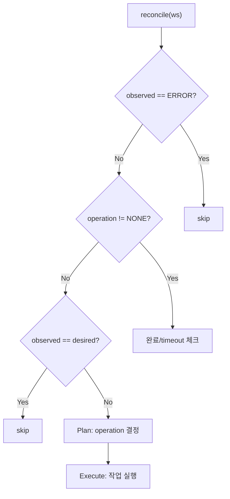

# StateReconciler (M2)

> [README.md](../README.md)로 돌아가기

---

## 개요

StateReconciler는 desired_state와 observed_status를 비교하여 상태를 수렴시키는 **실행자** 컴포넌트입니다.

| 항목 | 값 |
|------|---|
| 역할 | DB만 읽고 Plan/Execute로 상태 수렴 |
| 실행 주기 | 10초 |
| 단일 인스턴스 | Coordinator에서 실행 |

---

## 핵심 원칙

> **Level-Triggered Reconciliation**
>
> 1. DB만 읽는다 (직접 관측 안 함)
> 2. desired ≠ observed → operation 결정 (Plan)
> 3. operation 실행 (Execute)
> 4. 완료 판정: observed == operation.target

---

## 입출력

### 읽기

| 컬럼 | 용도 |
|------|------|
| desired_state | 목표 상태 |
| observed_status | 현재 관측된 상태 |
| operation | 진행 중인 작업 |
| op_started_at | timeout 계산 |
| error_count | 재시도 횟수 |
| archive_key | RESTORING/ARCHIVING 판단 |

### 쓰기 (Single Writer)

| 컬럼 | 설명 |
|------|------|
| operation | 진행 중인 작업 |
| op_started_at | 작업 시작 시점 |
| op_id | 작업 고유 ID (Idempotency Key) |
| archive_key | ARCHIVING 완료 시 설정 |
| error_count, error_info | 에러 정보 |
| previous_status | ERROR 전환 전 상태 |

---

## 불변식

1. **Non-preemptive**: `operation != NONE`이면 Plan skip
2. **CAS 선점**: `WHERE operation = 'NONE'`으로 동시성 제어 (Optimistic Locking)
3. **ERROR skip**: ERROR 상태는 reconcile 대상에서 제외

---

## Operation 결정 규칙

| observed | desired | archive_key | → operation |
|----------|---------|-------------|-------------|
| PENDING | STANDBY/RUNNING | NULL | PROVISIONING |
| PENDING | STANDBY/RUNNING | 있음 | RESTORING |
| STANDBY | RUNNING | - | STARTING |
| STANDBY | PENDING | - | ARCHIVING |
| RUNNING | STANDBY/PENDING | - | STOPPING |
| ERROR | * | - | (skip) |

> RUNNING → PENDING은 직접 불가. STOPPING → ARCHIVING 순차 진행.

---

## 완료 조건

| Operation | Target Status | 추가 조건 |
|-----------|---------------|----------|
| PROVISIONING | STANDBY | - |
| RESTORING | STANDBY | - |
| STARTING | RUNNING | - |
| STOPPING | STANDBY | - |
| ARCHIVING | PENDING | archive_key != NULL |

> 완료 시: `operation = NONE`, `error_count = 0`, `error_info = NULL`

---

## Timeout

| Operation | Timeout | 초과 시 |
|-----------|---------|--------|
| PROVISIONING | 5분 | error_info.is_terminal = true |
| RESTORING | 30분 | error_info.is_terminal = true |
| STARTING | 5분 | error_info.is_terminal = true |
| STOPPING | 5분 | error_info.is_terminal = true |
| ARCHIVING | 30분 | error_info.is_terminal = true |

---

## 재시도 정책

| 항목 | 값 |
|------|---|
| 최대 재시도 | 3회 |
| 재시도 간격 | 30초 (고정) |
| 트리거 | Execute 실패 또는 Timeout |
| 한계 초과 | error_info.is_terminal = true |

> 재시도 대기 중 tick에서는 대기만 함 (재실행 안 함)

---

## Reconcile 흐름

---

## 에러 처리

| 상황 | 처리 |
|------|------|
| Execute 실패 | error_count++, 다음 tick 재시도 |
| 재시도 한계 초과 | error_info.is_terminal = true |
| Timeout | error_info.is_terminal = true |

> is_terminal = true → HealthMonitor가 ERROR로 전환 → StateReconciler skip

---

## Known Issues

1. **Operation 중단 불가**: 시작 후 취소 불가, 완료까지 대기 필요

2. **순차적 전이**: RUNNING → PENDING 직접 불가 (STOPPING → ARCHIVING)

3. **재시도 간격 고정**: 지수 백오프 미적용 (M2)

---

## 참조

- [coordinator.md](./coordinator.md) - Coordinator
- [health-monitor.md](./health-monitor.md) - HealthMonitor
- [../storage.md](../storage.md) - Storage Provider
- [../instance.md](../instance.md) - Container Provider
- [../error.md](../error.md) - 에러 정책
