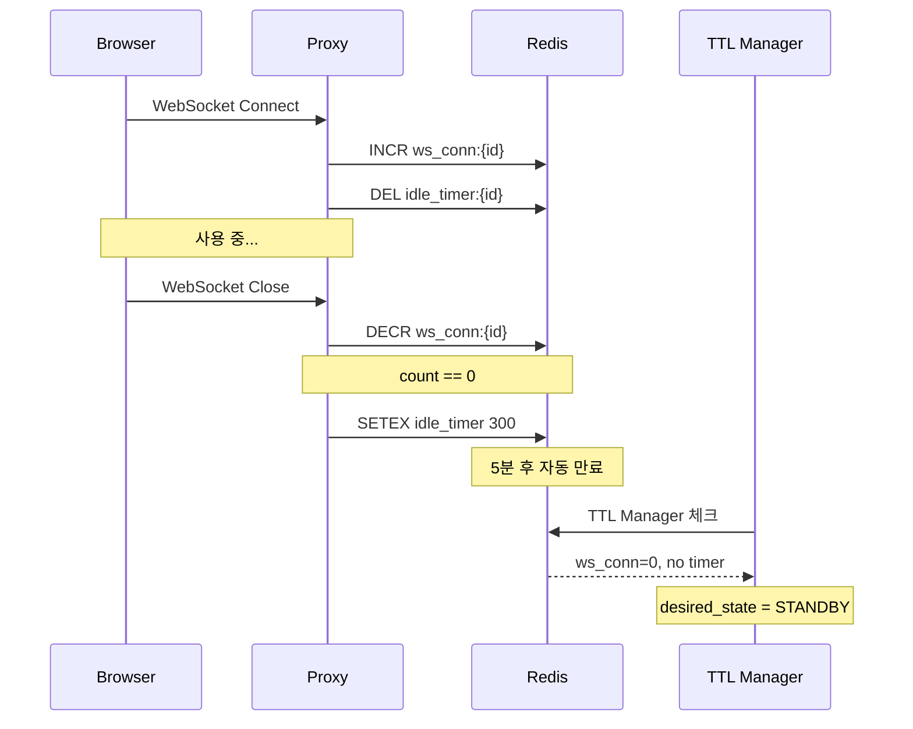

# TTL Manager (M2)

> [README.md](../README.md)로 돌아가기

---

## 개요

TTL Manager는 비활성 워크스페이스의 TTL을 체크하고 desired_state를 변경하는 컴포넌트입니다.

| 항목 | 값 |
|------|---|
| 역할 | TTL 만료 시 desired_state 변경 |
| 실행 주기 | 1분 |
| 단일 인스턴스 | Coordinator에서 실행 |

---

## 핵심 원칙

> **TTL Manager는 desired_state만 변경한다**
>
> TTL 만료 → desired_state 변경 → StateReconciler가 수렴

---

## TTL 종류

| TTL | 대상 | 트리거 | 동작 |
|-----|------|--------|------|
| **standby_ttl** | RUNNING | WebSocket 연결 종료 + idle 타이머 만료 | desired_state = STANDBY |
| **archive_ttl** | STANDBY | last_access_at 기준 경과 | desired_state = PENDING |

---

## 입출력

### 읽기

| 소스 | 항목 |
|------|------|
| DB | observed_status, operation, standby_ttl_seconds, archive_ttl_seconds, last_access_at |
| Redis | ws_conn:{id} (연결 수), idle_timer:{id} (5분 타이머) |

### 쓰기 (API와 공유)

| 컬럼 | 설명 |
|------|------|
| desired_state | 목표 상태 |

> **Known Issue**: API와 공유하므로 경쟁 조건 가능 (Last-Write-Wins)

---

## Standby TTL 체크 규칙

| 조건 | 결과 |
|------|------|
| observed_status != RUNNING | skip |
| operation != NONE | skip |
| ws_conn > 0 | skip (활성 연결) |
| idle_timer 존재 | skip (5분 대기 중) |
| 위 조건 모두 통과 | desired_state = STANDBY |

### Idle 타이머 흐름

---

## Archive TTL 체크 규칙

| 조건 | 결과 |
|------|------|
| observed_status != STANDBY | skip |
| operation != NONE | skip |
| NOW() - last_access_at <= archive_ttl_seconds | skip |
| 위 조건 모두 통과 | desired_state = PENDING |

### last_access_at 업데이트 시점

| 상황 | 업데이트 주체 |
|------|-------------|
| STOPPING 완료 | StateReconciler |

> **한계**: WebSocket 연결 중에는 last_access_at 미업데이트

---

## 에러 처리

| 상황 | 동작 |
|------|------|
| Redis 읽기 실패 | 해당 workspace skip, 다음 tick 재시도 |
| DB 업데이트 실패 | 해당 workspace skip, 다음 tick 재시도 |

---

## Known Issues

1. **desired_state 경쟁 조건**: API/TTL Manager 동시 변경 시 Last-Write-Wins
   - 잠재적 해결: CAS, 우선순위 컬럼

2. **last_access_at 정확도**: WebSocket 연결 중 업데이트 안 됨
   - STOPPING 완료 시점이 Archive TTL 기준점

---

## 참조

- [coordinator.md](./coordinator.md) - Coordinator
- [state-reconciler.md](./state-reconciler.md) - StateReconciler
- [../activity.md](../activity.md) - 활동 추적 상세
- [../schema.md](../schema.md) - DB 스키마
